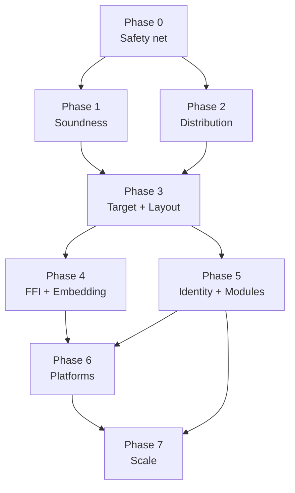

# Dream Compiler: Combined Audit and Phased Remediation Plan

This document merges two read-only reviews of the Dream compiler and turns them into a phased plan.

- **Audit 1 (deep code review):** correctness, ARC/RC, the runtime, optimization passes, layout, identity, and CI.
- **Audit 2 (architecture review):** FFI/C ABI, targets and platforms, the compiler–runtime ABI, distribution, mobile, freestanding, and the toolchain.

**Evidence tags**

- **[C]** Confirmed by reading the code.
- **[A]** Architectural risk.
- **[R]** Needs a runtime or build test to confirm how reachable it is or how much it matters.

**Severity**

- **P0:** memory unsafety, a silent data race, or a broken core promise.
- **P1:** wrong behavior, or a major architectural blocker.
- **P2:** latent risk, or a gap in scale or maintainability.
- **P3:** cleanup.

**Note on IDs:** Audit 2's FFI-ownership findings are renamed `FOWN-*` so they don't clash with Audit 1's `OWN-*` IDs.

---

## 0. Progress Tracker

**Status values**

- `Not started`
- `In progress`
- `Blocked` (give the reason in Notes)
- `Review` (PR open)
- `On hold` (explicitly deferred by the user; give the planned scope in Notes)
- `Done` (merged, and the phase gate passes)

**How to update**

- Change a step's row when you start it, when its PR opens, and when it merges.
- A phase is `Done` only when all its steps are `Done`, its exit criteria are met, and its deletion-ledger items are gone (see §4).
- Step details are in §4, finding details in §2.

**Task 7.9 completed (2026-10-05): minimal native packaging (BLD-3).**
Merged in [#46](https://github.com/sps014/dream/pull/46) as `90c474b1` after all
platform gates passed. Tasks 7.3 and 7.4 also merged in #49, and 7.6 merged in #50; two Phase 7 tasks remain, with 7.7 under review in #51. Android/iOS validation stays on hold.

### Phase summary

| Phase | Title | Steps | Done | Status | Blocked by |
|---|---|---|---|---|---|
| 0 | Safety net and quick wins | 11 | 11 | Done | —; [#8](https://github.com/sps014/dream/pull/8) merged as `b3492dec`; all required CI gates passed |
| 1 | Memory and concurrency soundness | 18 | 18 | Done | All tasks and cleanup items merged; final task 1.7 merged in #26 as `743fee2c`. Final-head native/Node corpus verified locally at user request; macOS/Linux and hygiene CI passed; original branch protection restored after merge. |
| 2 | Distribution correctness | 10 | 10 | Done | #34 merged as `9fe2dfb2` on 2026-10-02 after all five required CI checks passed, including Windows workspace gates and full native corpus. Follow-up Windows portability and CI caching improvements merged in [#35](https://github.com/sps014/dream/pull/35) as `87037e0d`, with all five checks green. Warm Windows CI measured 11m13s versus the prior 33m22s; the initial cold-cache run took 38m41s. |
| 3 | Target and layout foundation | 11 | 11 | Done | #41 merged as `01b1e976` on 2026-10-03. Manual run [37106486399](https://github.com/sps014/dream/actions/runs/37106486399) on implementation `0469ddb4` passed Ubuntu, macOS and Windows workspace gates, macOS runtime sanitizers, hygiene, Linux native 638/638, Windows native 638/638, and Node 539 passed/99 expected skips/0 failures. Local workspace tests: 1151 passed, 21 expected ignored. Paired optimization evidence is in `docs/internals/12-native-pointer-migration.md`. Automatic CI remains disabled. |
| 4 | FFI completion and embedding API | 10 | 10 | Done | #42 merged as `04d5c085` on 2026-10-03; panic source locations (4.4) completed in a follow-up PR. Local gates: workspace tests, native probe 640/640, Node 539 passed/101 expected skips/0 failures. |
| 5 | Identity, modules and symbols | 12 | 12 | Done | Merged in #44 and #45; detailed tracker, exit criteria and deletion ledger verified below. |
| 6 | Platform expansion | 9 | 9 | On hold | All implementation steps and cleanup deliverables completed in [3b9f8529](https://github.com/sps014/dream/commit/3b9f8529849edb36e3a0dbf5ba7b3e98583766d5) (direct main commit). Workspace build, strict Clippy, 1,220 tests, native 653/653 and Node 583 passed/70 native-only skips/zero failures pass (2026-10-04). iOS/Android end-to-end validation and release readiness are on hold for a future version at the user's request (2026-10-04); they are not verified or claimed complete. |
| 7 | Scale, performance and long-term work | 9 | 7 | In progress | Tasks 7.1–7.6 and 7.9 are complete. Repair-pass deletion merged in [#50](https://github.com/sps014/dream/pull/50) as `33f29c34`, after all five exact-head [CI jobs](https://github.com/sps014/dream/actions/runs/37335347657) passed, including full native/WASM parity and the full Windows corpus. Task 7.7 is under review in [#51](https://github.com/sps014/dream/pull/51); task 7.8 waits for Phase 6 completion. Mobile validation stays on hold. |

### Phase 0: Safety net and quick wins

| Step | Title | Findings | Status | Owner | PR | Notes |
|---|---|---|---|---|---|---|
| 0.1 | Re-enable CI | TEST-1 | Done | | [#8](https://github.com/sps014/dream/pull/8) | Push/PR triggers restored; macOS/Linux build, clippy and tests plus full native/Node corpus; pinned LLVM+wasi-sdk cached. All four checks required on `main`, including admins, with strict up-to-date checking. CI run `36829994804` green; merged as `b3492dec` |
| 0.2 | Run the verifier in release builds | MIR-1, LLVM-2 | Done | | 3c38e698 | `DREAM_VERIFY_MIR=1` enables `verify::enabled()` and is set for every CI job; final full native probe green with it on (625/625), Node 528 passed / 97 native-only or trap skips / zero failures |
| 0.3 | Remove the "sink" heuristic; add `@noinline` | LLVM-1 | Done | | 3c38e698 / [#8](https://github.com/sps014/dream/pull/8) | `InlineHint` on HIR/MIR replaces `prefer_inline`; MIR inliner and LLVM both respect it; `noinline_attribute` golden plus optimized-IR assertion proves `kitchenSink` is inlined |
| 0.4 | Reject `@c_call("stdcall")` | FFI-4 | Done | | 3c38e698 | Golden `c_call_stdcall_rejected`; docs updated |
| 0.5 | Reject C structs passed by value; fix the docs | FFI-1 | Done | | 5fee2124 | `CShape::StructPtr` deleted; `@cpp` desugar passes value structs via `ref` copy; golden `c_struct_by_value_rejected` |
| 0.6 | Harden the `libdream` search | BLD-1 | Done | | 3358cb84 | Order: exe dir (canonical/raw/deps parent) → `DREAM_HOME` → `DREAM_BIN` parent → `~/.dream/bin`; absolute canonical path only; cwd and `CARGO_TARGET_DIR` probes removed |
| 0.7 | Remove `HashMap`/`HashSet` from output-affecting code | OPT-5 | Done | | 524b25ac | Initial RC/region conversion and full-corpus determinism test passed previously; 0.C1 now removes remaining standard hash collections throughout sema/MIR and migrates compiler/LSP call sites |
| 0.C1 | Lint guardrails (`clippy.toml`, unwrap/panic lints) | — | Done | | 66c6e2c6 | Per-crate disallowed-type configs; syntax denies panic/unwrap/expect and sema denies unwrap/expect outside tests; existing hits removed |
| 0.C2 | Hygiene CI ratchet | — | Done | | 66c6e2c6 / [#8](https://github.com/sps014/dream/pull/8) | `scripts/check_hygiene.py` caps large production Rust files at 56 and rejects new name-string patterns |
| 0.C3 | Record baseline metrics | — | Done | | 66c6e2c6 / [#8](https://github.com/sps014/dream/pull/8) | Baseline recorded below; vendored PCRE2/sljit excluded from runtime file-size metric; touched-concern splits reduce large Rust files to 56 (>600) and 18 (>1,000) |
| 0.C4 | Remove the dead `c_call_convention` path | FFI-4 | Done | | 3c38e698 | Helper deleted; validator is the only consumer |

Phase 0 completed on 2026-10-01: initial implementation `66c6e2c6`, followed by
[#8](https://github.com/sps014/dream/pull/8), squash-merged as `b3492dec`.
[CI run 36829994804](https://github.com/sps014/dream/actions/runs/36829994804) passed hygiene,
macOS/Linux workspace build, Clippy (`-D warnings`), workspace tests, all 625 native goldens,
and Node (528 passed, 97 native-only/trap skips, zero failures), with `DREAM_VERIFY_MIR=1`.
All four checks are required on `main`, including admins, with strict up-to-date checking.
The merged tree exactly matches the tested PR tree; local `main` is synced and clean.

The restored gates exposed and fixed Bash 3.2 extraction, headless GPU portability, signed-byte
CPU/GPU packing parity, and stale nested-reference cleanup after temporary value-argument sink
transfers. New unit/golden coverage locks ownership, GPU host-error cleanup, and attribute-driven
inlining. Four native libc/libm fixtures are explicitly native-only; compile-error goldens still
run on both targets. Shader calls, value ownership, and RC tests were split along touched concerns;
the Rust-file baseline is now 56 over 600 lines and 18 over 1,000. Temporary debugger scaffolding
and the duplicate focused CI probe were removed.

Only focused new/bug regressions ran locally; the full gates ran automatically in CI, without a
duplicate local full-suite run. This plan remains local under its existing `.gitignore` rule.
Phase 1 is now authorized and proceeds task by task.

### Phase 1: Memory and concurrency soundness

| Step | Title | Findings | Status | Owner | PR | Notes |
|---|---|---|---|---|---|---|
| 1.1 | Fix `publish` recursion | RT-2 | Done | Codex | [#9](https://github.com/sps014/dream/pull/9) | Merged `e2f9340a`; CI `36836220851` passes all four gates: native 626/626, Node 529 passed/97 valid skips/0 failures. Worker stress (1k cycle, 10k DAG, 1M chain) and TSan pass. Includes native array/capture offsets, worker-only WASM export preserving arithmetic size gate, and isolated concurrent native test artifacts. Typed traversal remains later work. |
| 1.2 | Growable heap map index | RT-3 | Done | Codex | [#10](https://github.com/sps014/dream/pull/10) | Merged `73f1efb3`; dedicated sorted utarray registry and binary-search range lookup. >520 MiB publication, boundary checks, TSan and leak checks passed. CI `36837690480` green: native 626/626; Node 529 passed, 97 valid skips, zero failures. |
| 1.3 | Fix the weak reference race | RT-1 | Done | Codex | [#11](https://github.com/sps014/dream/pull/11) | Merged into main through #15 (`dff5b896`); all required workspace, hygiene and full native/Node CI gates passed. Synchronize slots and CAS-retain live targets; unique-drop claims count zero and clears slots before destructor revival. `Weak<T>(target)` is the sole construction API; `get()` returns Option<T>. Node CI exposed a chain-hop use-after-free corrected in `7c535cfb`. CI `36846450832` now passes all required gates, including full native/Node corpus. |
| 1.4 | Regions never abort | RT-4 | Done | Codex | [#12](https://github.com/sps014/dream/pull/12) | Merged into main through #15 (`dff5b896`); all required workspace, hygiene and full native/Node CI gates passed. Shared chained-region allocator replaces both capped implementations; depth beyond eight falls back to the heap. TSan chunk/rewind stress and 2,097,151-node/20-level golden passed. Corrected stack CI `36846479406` passes all required gates, including full native/Node corpus. |
| 1.5 | Sound `region_safe` (SCC-based) | OPT-1 | Done | Codex | [#13](https://github.com/sps014/dream/pull/13) | Merged into main through #15 (`dff5b896`); all required workspace, hygiene and full native/Node CI gates passed. Iterative Tarjan SCC evaluation reaches a monotone fixed point before caching; constructor instances checked conservatively. Recursive escape/order regressions and native/Node mutual-recursion golden pass. CI `36846502835` passes all required gates, including full native/Node corpus. |
| 1.6 | Destructor as a typed fact | OPT-2 | Done | Codex | [#14](https://github.com/sps014/dream/pull/14) | Merged into main through #15 (`dff5b896`); all required workspace, hygiene and full native/Node CI gates passed. Commit `2df9ee84`: layouts persist resolved destructor DefIds, preserved by native relayout and consumed by pruning, ARC effects, region safety, promotion and glue. Renamed-symbol/decoy-name emission test and generic golden pass. CI `36847140469` passes all required gates, including full native/Node corpus. |
| 1.7 | Verifier invariants for RC and regions | OPT-3, OWN-2 | Done | Codex | [#15](https://github.com/sps014/dream/pull/15), [#16](https://github.com/sps014/dream/pull/16), [#24](https://github.com/sps014/dream/pull/24), [#25](https://github.com/sps014/dream/pull/25), [#26](https://github.com/sps014/dream/pull/26) | Merged #26 as `743fee2c40ff742c0e5d0e0e5e2ee4e80f59dd9d` (validated head `49555a3e`). Independent insertion-boundary RC token balances across CFG joins, loops, borrow/take parameters, calls, duplicate arguments, container moves, returns and async handoffs/cancellation; taken projections/globals become explicit locals. Independent final alias-death and shared CFG region proof cover alias mutations, caller/global escape, constructor/call capture and reference-bearing inline values. Debug assertion and logged release fallback share this proof. Exposed async cancellation and discarded JS-result ownership bugs fixed. Final-head local native probe: 636 passed/0 skipped/0 failed; Node: 537 passed/99 expected skips/0 failed. All nine ARC goldens, three formerly failing JS tests, 55 verifier regressions and two release fallback tests pass. CI `36908780333` passed macOS/Linux build, Clippy, workspace tests, runtime stress and hygiene; corpus job stuck in dependency installation. User authorized local corpus verification and merge: only the corpus requirement was temporarily removed and immediately restored after merge; all original protections verified restored. No unresolved reviews or conflicts. Field-sensitive precision, optimizer-rewrite proofs and removal of containment fallbacks remain Phase 7 work. |
| 1.8 | Fix the lock registry | RT-5 | Done | Codex | [#17](https://github.com/sps014/dream/pull/17) | Merged `34d8bb82`; native registry keyed by owning object, using uthash and per-entry conditions; cleanup before shared-object recycle, wrong-owner release panic, timed waits with one deadline. Four C runtime harnesses, six focused native cases, four focused Node cases, emission regression and local TSan pass. CI `36858442831` passes all four required gates: native 634/634, Node 535 passed/99 valid skips/0 failures, Ubuntu/macOS workspace build, clippy and tests, hygiene and macOS TSan. |
| 1.9 | Worker cap | RT-6 | Done | Codex | [#18](https://github.com/sps014/dream/pull/18) | Merged `3b1a48da`; fixed 64-slot native registry replaced with object-stable uthash entries; allocation, thread-start and ID exhaustion fail explicitly. C stress covers 100 live workers over three rounds, concurrent registration of 100 pool members, posting/replies, teardown and injected failures; local TSan and focused native/Node probes pass. CI `36860650200` passes all four required gates: native 635/635, Node 536 passed/99 valid skips/0 failures, Ubuntu/macOS workspace build, clippy and tests, hygiene and macOS worker TSan. |
| 1.10 | Messages instead of silent aborts | ABI-1, ERR-1 | Done | Codex | [#19](https://github.com/sps014/dream/pull/19) | Merged #19 as `8d29eb82`; CI `36868043052` passes all required gates: native 636/636, Node 536 passed/100 valid skips/0 failures, macOS/Linux build, Clippy and workspace tests. Allocation-width migration tracked separately in 6.4. |
| 1.11 | Releases from foreign threads | FFI-5, FOWN-2 | Done | Codex | [#23](https://github.com/sps014/dream/pull/23) | Exact callback owner identity, foreign releases queued without non-atomic ARC, owner scheduler/worker/shutdown drains and lifetime-pinned wakers. Original and combined-head CI passed; final run `36893211162` passed hygiene, macOS/Linux build/Clippy/tests and full native/Node corpus. No unresolved review threads. Squash-merged to main as `63fe01fad570ab0f9cde1c19646a50dd0cbedb54`, including validated #24/#25 increments. |
| 1.C1 | One shared publish and region implementation | RT-2, RT-4 | Done | Codex | [#12](https://github.com/sps014/dream/pull/12) | Merged into main through #15 (`dff5b896`); all required workspace, hygiene and full native/Node CI gates passed. Shared publication merged in #9; native/WASM region consolidation in #12 has all required CI green and is merged. |
| 1.C2 | Delete the fixed-size runtime tables | RT-2, RT-3 | Done | Codex | [#10](https://github.com/sps014/dream/pull/10) | Seen cap and recursive copies removed in #9; heap-map/chunk caps and silent-drop branches removed in merged #10. Required CI green. |
| 1.C3 | Split `unique_region.rs` | OPT-1 | Done | Codex | [#13](https://github.com/sps014/dream/pull/13) | Merged into main through #15 (`dff5b896`); all required workspace, hygiene and full native/Node CI gates passed. Deleted the 1,467-line file; candidates, safety, rewriting, escaped-region stripping and tests have separate modules. |
| 1.C4 | Delete `has_del` | OPT-2 | Done | Codex | [#14](https://github.com/sps014/dream/pull/14) | Merged into main through #15 (`dff5b896`); all required workspace, hygiene and full native/Node CI gates passed. `has_del`, `find_del`, suffix-based destructor sets and name-based pruning deleted; typed facts are the only path. |
| 1.C5 | Split `rc/insertion.rs` | OWN-2 | Done | Codex | [#20](https://github.com/sps014/dream/pull/20) | Merged as `ca3e8139`; CI `36876478422` passed all four required gates, including Ubuntu/macOS workspace build, Clippy and tests, full native/Node corpus and hygiene. Preparation, block rewriting, exits, async resume releases and ownership helpers live in rc/insertion; sibling tests preserved. |
| 1.C6 | Remove `ReleaseUnique` | OWN-4 | Done | Codex | [#22](https://github.com/sps014/dream/pull/22), [#21](https://github.com/sps014/dream/pull/21) | #22 merged into the allocation branch as `920347d9`; #21 now merged into main as `da9baffc1d24d47a6cff42b469c37ae689e0ae31` after CI `36884379458` passed all four required gates. Disabled MIR/emitter/verifier/analysis paths and unused bookkeeping deleted; ordinary Release is the sole counted drop. |
| 1.C7 | One way to abort (`dream_panic`) | ERR-1 | Done | Codex | [#19](https://github.com/sps014/dream/pull/19) | Merged #19 as `8d29eb82`; CI `36868043052` passes all required gates: native 636/636, Node 536 passed/100 valid skips/0 failures, macOS/Linux build, Clippy and workspace tests. Allocation-width migration tracked separately in 6.4. |

### Phase 2: Distribution correctness

CI follow-up de67d23f aligns CI dev/test optimization at O1, shares dependency caches
across same-platform jobs with a canonical workspace writer, runs strict Clippy first,
and preserves Cargo timings for seven days. All checks and timeout limits remain intact;
actionlint, hygiene, probe regressions and Cargo artifact-reuse verification pass locally.
Final #34 CI now targets de67d23f; hosted cold/warm timing improvement is not yet measured.

| Step | Title | Findings | Status | Owner | PR | Notes |
|---|---|---|---|---|---|---|
| 2.1 | Bundle `libdream` in `pack` | PLT-1 | Done | Codex | [#27](https://github.com/sps014/dream/pull/27) | Merged as `2b4a24b2`; all CI gates passed, including Linux/macOS build, Clippy and tests, hygiene, and full native/Node corpus. Bundled libdream beside flat executables and in macOS Contents/Frameworks; macOS @rpath install name and ad-hoc re-signing, Linux $ORIGIN, Windows adjacent DLL. Ordinary build/run lookup unchanged; mode included in freshness stamp. Local full native corpus 636/636; 59 Dreamer unit tests, three link/staging tests, moved-binary and pack e2e checks passed. Windows execution unverified. Task 2.2 adds strict metadata/clean-home checks and corrects Zig's automatic build-directory rpath. |
| 2.2 | Portability e2e (`otool`/`readelf`) | PLT-1 | Done | Codex | [#28](https://github.com/sps014/dream/pull/28) | Merged as `847e66fc`; all CI gates passed, including Linux readelf/SONAME and macOS otool clean-home portability regressions, build/Clippy/tests, hygiene and full native/Node corpus. Local full native probe 636/636 with zero skips/failures; macOS pack portability passes with both Zig and Apple cc. Fixed Zig automatic builder rpaths through direct library linkage and stable Linux SONAME. Windows execution outside this test scope. |
| 2.3 | Split out a `dream-host` crate | GUI-1 | Done | Codex | [#29](https://github.com/sps014/dream/pull/29), [#30](https://github.com/sps014/dream/pull/30) | Merged extraction #29 as 35b8cfa0 and capability split #30 as 06c9662f. Core/net/gpu/webview cdylibs and distribution features implemented; monolith deleted. Core exclusively owns guest callbacks/icon state; other libraries dynamically call its C ABI. Compiler/packaging/install/release/probe paths migrated. Local workspace build/Clippy/default tests, 40 host tests, shared-library ABI and clean-home pack regressions pass; native corpus 636/636. All four CI gates passed on final head cb7fd392 (run 36977501388): Linux/macOS build/Clippy/default workspace tests, hygiene and native/Node corpus. No unresolved reviews. Live-use selection remains 2.4. |
| 2.4 | Link host capabilities by use | CAP-1 | Done | Codex | [#31](https://github.com/sps014/dream/pull/31) | Implemented as fa2d789d against merged main. Embedded stdlib package capabilities are filtered by the existing live-import inventory; canonical mandatory ABI manifests drive native linking/staging, run/debug lookup and Dreamer packing. Core-only hello-world, unused capability imports and CPU-only GPU helpers omit optional libraries; live HTTP/WebAPI, GPU and WebView/desktop calls select their hosts. Removed obsolete ABI opt-out, migrated dream test and included ABI/schema/registry in JSON harness cache fingerprints. Initial probe caught stale generator manifests and WebAPI mapping; initial workspace check caught test-runner opt-out; all fixed without compatibility fallbacks or altered checks/timeouts. Final local workspace build, strict Clippy, default workspace tests and full native probe pass (636/636, zero skips/failures). Capability/partial-toolchain/pack portability regressions pass. Third-party lockfile pins preserved; oversized production Rust remains 54. Merged as 8bd30d56 after all macOS/Linux, full native/Node corpus and hygiene CI passed; no unresolved reviews. |
| 2.5 | Binary size: dead-strip and a CI budget | BIN-1 | Done | Codex | [#32](https://github.com/sps014/dream/pull/32) | Implemented as f8ee3e88, now based on main after #31 merged; refreshed head 526115c7. macOS dead_strip/Linux gc-sections and Linux per-function/data LLVM object sections; both policies invalidate native cache stamps. Linux/macOS CI size gate compiles/runs an Os hello against the release core library, enforcing independent raw-byte limits (hello 96 KiB, core 3 MiB) and publishing JSON reports. Local macOS arm64: hello 54,408 bytes, core 1,922,512 bytes. Workspace build/strict Clippy, new foreign-code dead-strip regression, 3 budget tests, 5 LLVM integrations, PGO round trip and 2 pack portability checks pass; full native corpus 636/636 with zero skips/failures. Six extra ignored C/C++ interop tests pass; existing C sample fails before linking because its tracked native directory has a header but no C implementation, unrelated to this link-only change. Existing CI/test settings not weakened. Production Rust oversized count remains 54. All four required CI gates green on 526115c7; no unresolved review threads. Linux CI measured hello 27,888 bytes and core 2,737,264 bytes, both within budget. Merged #32 as 9ddda589 on 2026-10-02 with all four required checks green and no unresolved reviews. |
| 2.C1 | Remove the host code from the compiler crate | GUI-1 | Done | Codex | [#29](https://github.com/sps014/dream/pull/29) | Merged as 35b8cfa0 with all required CI green. Host implementations and guest exports are outside root; no host re-export shims. Compiler C-library discovery stays in native/c_link.rs. No host/GUI/network dependencies in compiler cargo tree; boundary regressions pass. Separate capability artifacts follow in #30. |
| 2.C2 | Split `execution/native/abi.rs` | GUI-1 | Done | Codex | [#29](https://github.com/sps014/dream/pull/29), [#30](https://github.com/sps014/dream/pull/30) | Merged #29 as 35b8cfa0 and #30 as 06c9662f; all required final-head CI green (run 36977501388). Replaced 1398-line ABI with shared payload helpers (150), core-only binding (52), core (196), net (400) and GPU (592) exports, plus desktop/webview modules. Core owns binding/icon state across dynamic libraries. Oversized production Rust count remains 54, enforced by hygiene. |
| 2.C3 | Split `native/host.c` | FS-1 | Done | Codex | [#33](https://github.com/sps014/dream/pull/33) | Merged as 5a55fb65 on 2026-10-02 after all four checks passed on refreshed head 3ce4ee51; no unresolved review threads. Replaced 1178-line host.c with nine focused C units (largest 318 lines), private shared string/name helpers and a Windows header. Guest ABI and all 71 original function bodies preserved; no old host.c path remains. Workspace build/strict Clippy, registry tests, focused native goldens, runtime ABI-signature and LLVM determinism tests pass. All nine C units compile for macOS, Linux and Windows. Hygiene remains 54 oversized production Rust files. Full native probe passes 636/636 with zero skips/failures. Redundant post-merge main-push suite cancelled; existing required checks/timeouts unchanged. |
| 2.C4 | One `ToolchainConfig` | BLD-1 | Done | Codex | [#34](https://github.com/sps014/dream/pull/34) | Merged as `9fe2dfb2` on 2026-10-02 after all five required checks passed on `de67d23f` (run `37025447529`), including Windows build, strict Clippy, workspace tests and full native corpus. Driver-owned environment snapshot shared by compiler, generators, LLVM/runtime builds, native links, packing and debugger; per-configuration caches replace global resolution, and execution/MIR catalogs no longer read environment variables. Local full native probe 636/636 with zero skips/failures. Windows portability/CI caching follow-up #35 merged as `87037e0d`, with all five checks green. |
| 2.C5 | Delete the cwd-relative `target/*` probes | BLD-1 | Done | Codex | [#34](https://github.com/sps014/dream/pull/34) | Merged as `9fe2dfb2` on 2026-10-02 after all five required checks passed (run `37025447529`). Removed cwd ancestor walks and Cargo-file-dependent runtime/generator cache selection. Explicit configuration, PATH and executable-sibling discovery remain; caches use the configured installation prefix. Process-isolated project/ancestor-target and independent cache-location regressions pass. `feat/audit-p2-cwd-discovery` is already contained in main with no separate unmerged diff. |

### Phase 3: Target and layout foundation

| Step | Title | Findings | Status | Owner | PR | Notes |
|---|---|---|---|---|---|---|
| 3.1 | `TargetSpec` | TGT-1, TGT-2 | Done | Codex | [#36](https://github.com/sps014/dream/pull/36) | Merged as `ac7496b3` on 2026-10-02. One LLVM target/spec; target-lexicon triple/pointer facts; target-driven future headers; explicit runtime/linker propagation; triple-isolated runtime caches; configurable macOS minimum OS. Linux/macOS workspace gates, hygiene and full native/Node corpus passed; local Windows workspace and native/Node corpus validation also passed. Runtime ABI validation and aggregate layouts remained 3.2/3.3. |
| 3.2 | Check the runtime against the target | ABI-2 | Done | Codex | [#38](https://github.com/sps014/dream/pull/38) | Merged as `cdfc17d9` on 2026-10-02. Runtime tables validate parsed target identity and address-space-zero pointer size/alignment before codegen; Clang's MSVC version suffix is canonicalized without weakening target checks. Missing runtime functions/globals and stale/malformed tables are `CompileError::Toolchain` errors naming the exact cache path. Built-in wasm target now names wasip1. Workspace build, strict Clippy, workspace tests and native probe pass (636/636, zero skips/failures). Automatic hosted CI remains paused during audit development. |
| 3.3 | One layout authority (`LayoutTable`) | LAY-1, LAY-3 | Done | Codex | [#39](https://github.com/sps014/dream/pull/39) | Target-parameterized HIR layouts cover structs, tuples, unions, nesting and packing. LLVM, debugger views and induction-variable element sizing consume the same table. Heap payloads retain word alignment for trailing atomic lock words. Full local build, strict Clippy, workspace tests, hygiene and native/Node probes pass. |
| 3.4 | `sizeof` and `.abi.json` read the `LayoutTable` | LAY-2 | Done | Codex | [#39](https://github.com/sps014/dream/pull/39) | `SizeOf(TypeId)` folds in MIR from the completed table; ABI field offsets, sizes and alignment read that table. Switch-label constant and duplicate checks are deferred when layout is needed. Nested-struct native/wasm goldens and ABI agreement tests pass; native 637/637, Node 538 passed/99 expected skips/0 failures. |
| 3.5 | Pointer-sized integers and C aliases | FFI-2 | Done | Codex | [#40](https://github.com/sps014/dream/pull/40) | Distinct target-sized `isize`/`usize`; target-aware folding, LLVM widths, boxing, async values and LSP validation. CPtr, qsort and memchr signatures migrate to target-sized integers; optional C aliases deferred. Native 638/638 (interrupted run + continuation), Node 539 passed/99 expected skips/0 failures. |
| 3.6 | Cross emission with `--target` | TGT-1 | Done | Codex | [#41](https://github.com/sps014/dream/pull/41) | Checked IR and target objects without host linking or host CPU selection; Linux AArch64, Linux i686 and Windows x64 cross emission verified. Runtime-selection flag migrated to `--runtime-target`, with no compatibility alias. Workspace and corpus gates pass. |
| 3.7 | Native LLVM pointers and proven optimization facts | LLVM-3 | Done | Codex | [#41](https://github.com/sps014/dream/pull/41) | Merged as `01b1e976` on 2026-10-03. Coordinated LLVM/C/Rust pointer ABI v2, typed nulls, target-correct literal headers, numeric weak discriminators and stale artifact rejection. Six structural pointer tests plus runtime stress, macOS sanitizers, determinism and native/Node corpus pass. Paired benchmark artifacts and comparison are recorded in `docs/internals/12-native-pointer-migration.md`; no blanket alias attributes or native compatibility path. Windows execution closed by run `37106486399`: workspace build, strict Clippy, tests and native corpus 638/638 with zero skips/failures. |
| 3.C1 | Delete the old layout authorities | LAY-1 | Done | Codex | [#39](https://github.com/sps014/dream/pull/39) | Deleted semantic size/offset fields, interner value-size storage, string-keyed `value_size_align`, semantic union offset computation and backend `native_layout.rs`; stale-authority search and hygiene pass. |
| 3.C2 | Delete the host-derived target code | TGT-1 | Done | Codex | [#36](https://github.com/sps014/dream/pull/36) | Verified covered by merged `ac7496b3`: `Target::Llvm(TargetSpec)` is the only variant, `TargetAbi` and `FutureLayout` use `for_target`, and runtime Clang target selection reads `spec.triple`. No `size_of::<usize>()` remains in MIR. Remaining runtime host `cfg!` checks select local tools, not the emitted target. |
| 3.C3 | Replace `is_wasm32()` with capability queries | TGT-1, CAP-1 | Done | Codex | [#41](https://github.com/sps014/dream/pull/41) | Old query deleted; branches name linear memory, C/JS interop, native entry or pointer width. Workspace gates pass; stale-query search returns no production hits. |
| 3.C4 | One source for the ABI constants | ABI-2 | Done | Codex | [#41](https://github.com/sps014/dream/pull/41) | One Rust registry generates C and JS constants; builds reject stale generated files. Generator, JS unit, freshness, ABI synchronization and integrated gates pass. |

### Phase 4: FFI completion and embedding API

| Step | Title | Findings | Status | Owner | PR | Notes |
|---|---|---|---|---|---|---|
| 4.1 | Structs by value (shim or classifier) | FFI-1 | Done | Cursor agent | [#42](https://github.com/sps014/dream/pull/42) | Generated C shim compiled by the pinned clang owns struct classification. Plain-data value structs pass and return by value; the Phase 0 error is deleted. `native_interop` covers two floats, three `int64_t`s and a 32-byte mixed struct at -O0 and -O2; golden `c_struct_by_value` uses libc `div`/`lldiv`. |
| 4.2 | Width-aware narrow scalars | FFI-3 | Done | Cursor agent | [#42](https://github.com/sps014/dream/pull/42) | `CScalar` (dream-types) spells `bool`/`char`/`uint8_t` with real C types; the shim re-extends to Dream's i32 carrier. `native_interop` checks a `bool` return with garbage upper bits at -O2 (on Darwin arm64 the C ABI makes the callee zero-extend, so garbage is injected only where legal). |
| 4.3 | Embedding API and `dream_embed.h` | FFI-6 | Done | Cursor agent | [#42](https://github.com/sps014/dream/pull/42) | `dream_abi::c_abi::EMBED_EXPORTS` (`dream_thread_attach`/`_detach`, `dream_retain`/`_release`, `dream_set_panic_hook`) always survive internalize. Public header `runtime/c/include/dream_embed.h` is on every `native/` source's include path. Attached foreign threads may call plain `fun` pointers; `NativeCallback` stays owner-bound. The 1.11 message now names `dream_thread_attach()`/`dream_embed.h`. The old internal `dream_thread_detach(dream_thread)` is renamed `dream_thread_release`. |
| 4.4 | Panic ABI and hook | ERR-1 | Done | Cursor agent | [#42](https://github.com/sps014/dream/pull/42) + follow-up | Abort by default, never unwinds. `dream_set_panic_hook(fn(message, location))` runs on the panicking thread with a heap-free UTF-8 copy; abort follows when it returns; a re-entrant panic skips the hook. Every compiler-emitted panic (bounds, overflow, division, casts, `System.panic`) calls `dream_panic_at(msg, "file:line")`: the backend tracks `Statement::SourceLine` per block and interns one constant string per location. The default stderr adds an `  at file:line` line; runtime-internal panics pass NULL. |
| 4.5 | `@owned` for `@c` `CPtr` | FOWN-1 | Done | Cursor agent | [#42](https://github.com/sps014/dream/pull/42) | `@c @owned("free_fn") extern fun f(...): OwnedCPtr` builds a `system.OwnedCPtr` whose `del` calls `free_fn(ptr)`; `get()`/`take()`. Sema checks via `dream_abi` constants (`OWNED_C_PTR_TYPE`, `owned_result`, `is_c_identifier`); prune keeps the class live from the import. Golden `c_owned_rejected`; `native_interop` checks the finalizer and `take()`. |
| 4.6 | Implement `stdcall` | FFI-4 | Done | Cursor agent | [#42](https://github.com/sps014/dream/pull/42) | `@c_call("stdcall")` emits `__attribute__((stdcall))` in the shim (clang lowers it to `x86_stdcallcc` on 32-bit x86 Windows only). Unknown conventions are rejected. Goldens `c_call_stdcall`, `c_call_unknown_convention_rejected`. |
| 4.C1 | One FFI shim generator for `@c` and `@cpp` | FFI-1 | Done | Cursor agent | [#42](https://github.com/sps014/dream/pull/42) | `src/driver/cpp_bridge` → `src/driver/ffi_shim` (`c_shim.rs` + `cpp_shim.rs`, shared `CScalar` vocabulary). Hand-written C ABI in `c_marshal.rs` deleted; reverse adapters (`glue/c_reverse.rs`) are defined in C with real types. |
| 4.C2 | One ownership vocabulary in `dream-abi` | FOWN-1 | Done | Cursor agent | [#42](https://github.com/sps014/dream/pull/42) | `dream_abi::attributes::ownership` (`CONSUMING`, `OWNED`, `is_consuming`, `OwnedResult`); sema and the `@cpp` model read it; no string-matched ownership attributes remain. |
| 4.C3 | Split `attributes.rs` | — | Done | Cursor agent | [#42](https://github.com/sps014/dream/pull/42) | `crates/dream-abi/src/attributes/` split by family, joined by `all_specs()`. |
| 4.C4 | Replace the old `CShape::Scalar` | FFI-3 | Done | Cursor agent | [#42](https://github.com/sps014/dream/pull/42) | `CShape::Scalar(CScalar)` plus `Struct` and `OwnedPtr`; `HImport.c_stdcall`. |

### Phase 5: Identity, modules and symbols

| Step | Title | Findings | Status | Owner | PR | Notes |
|---|---|---|---|---|---|---|
| 5.1 | Module-scoped `DefId` | TY-1 | Done | Codex / Cursor agent | [#44](https://github.com/sps014/dream/pull/44) | DefIds carry ModuleId and a module-local index; source resolution follows module imports. Same-named nominal definitions in different modules stay distinct (`module_receiver_identity`, `generic_identity_collision` goldens). |
| 5.2 | `ModuleGraph` | MOD-1 | Done | Codex / Cursor agent | [#44](https://github.com/sps014/dream/pull/44), [#45](https://github.com/sps014/dream/pull/45) | Driver keeps per-file ASTs, module edges, export signatures and content/interface hashes. The CLI build cache (`src/driver/compiler/cache.rs`) keys a build by every `ModuleGraph` module key and file source, the compiler binary, the C runtime tree, compile and link options, toolchain config, `DREAM_*` env and `dream.toml`; an unchanged rebuild skips analysis, IR emission, LLVM and linking after verifying artifact hashes (`tests/build_cache.rs`). Builds with native C/C++ sets, PGO, `--emit-mir` or any diagnostic are never cached. Per-module analysis reuse is out of scope: whole-program monomorphization makes analysis ~20% of a build, so the build is the reuse unit. |
| 5.3 | Remove string-keyed type paths | TY-2 | Done | Codex / Cursor agent | [#44](https://github.com/sps014/dream/pull/44), [#45](https://github.com/sps014/dream/pull/45) | Function, method, generic and inference identity is typed (`FunctionIdentity = (DefId, Vec<TypeId>)`, `TypeCtx::register_method`, `method_candidates`/`select_method_overload`). The unused per-function `SymbolTable` map and the borrow checker's unread string field-type map are deleted; IDE summaries, `IdeTarget` and `TypeSummary` are keyed by `TypeId`, with names rendered only for display. |
| 5.4 | Structural symbol mangling | GEN-1 | Done | Codex / Cursor agent | [#44](https://github.com/sps014/dream/pull/44) | Methods, generics, overload keys and C callback adapters use one structural encoding (`s0_3_Box_0_get`, `s0_3_Box_1_6_p3_5fint_get`); symbols are unique by construction with no downstream dedupe. Collision, cross-module and unrelated-edit stability covered. |
| 5.5 | Parameter modes as HIR facts | OWN-1 | Done | Codex / Cursor agent | [#44](https://github.com/sps014/dream/pull/44) | HParam carries Borrow/Share/Sink/Ref; MIR lowering consumes these facts directly. |
| 5.6 | LSP resolves by `DefId` | TY-1 | Done | Codex / Cursor agent | [#44](https://github.com/sps014/dream/pull/44) | References carry resolved DefIds and source locations; navigation uses source identity across documents, including generic method templates. Typed LSP tests in `tooling/dream-lsp/tests/typed_lsp_tests.rs`. String-keyed IDE summaries tracked under 5.3. |
| 5.C1 | Delete the name-keyed identity paths | TY-1, TY-2 | Done | Codex / Cursor agent | [#44](https://github.com/sps014/dream/pull/44) | Numeric mangling, `DefTable` name lookup, `lower_str`, name-keyed struct/enum/interface tables and mangled method lookups deleted. Residual non-identity string maps tracked under 5.3. |
| 5.C2 | Delete the MIR parameter-mode inference | OWN-1 | Done | Codex / Cursor agent | [#44](https://github.com/sps014/dream/pull/44) | MIR ParamModes pass deleted; lexical sink metadata respects shadowing. |
| 5.C3 | Split the analyzer hotspots | — | Done | Codex / Cursor agent | [#44](https://github.com/sps014/dream/pull/44) | Topic splits landed; all analyzer production files below 800 lines. |
| 5.C4 | Split the LSP hotspots | — | Done | Codex / Cursor agent | [#44](https://github.com/sps014/dream/pull/44) | Builder/query/request-family splits landed; no hand-built async type strings remain; all LSP production files below 800 lines. |
| 5.C5 | Turn analyzer `unwrap()` into `internal_error!` | — | Done | Codex / Cursor agent | [#44](https://github.com/sps014/dream/pull/44) | No non-test `unwrap()` in sema. |
| 5.C6 | Split `driver/compiler.rs` into stages | MOD-1 | Done | Codex / Cursor agent | [#44](https://github.com/sps014/dream/pull/44) | `src/driver/compiler/{load,analyze,lower,optimize,emit,pipeline,diagnostics}.rs`, with the module graph as input. |

Validation for #44 (2026-10-04): full native corpus 648/648 on the merged code (zero skips,
failures or guest leak reports). Validation for #45: workspace build, strict Clippy, workspace
tests and the full native corpus (649/649, including the new `let_void_value` golden).
Production files over 600 lines: 38 (baseline 53).

**Phase 5 is complete** (merged in #44 and #45). Every step and cleanup deliverable is done, the
exit criteria are met, and the Phase 5 deletion list is verified empty: no `DefTable.by_name`,
`lower_str`, name-keyed sema tables, `TypeId`-number mangling, MIR parameter-mode inference,
name-compared sink parameters (sink metadata is a scoped symbol-table lookup), analyzer
`.unwrap()` on internal state, or hand-built LSP type strings. Binding a `void` call result
(`let r = f();`) is now a sema diagnostic instead of a backend ICE. Follow-ups that need
separate compilation (per-module analysis reuse, Dream-to-Dream prebuilt library linking) are
outside Phase 5; the build cache already makes unchanged rebuilds skip analysis and LLVM.

### Phase 6: Platform expansion

| Step | Title | Findings | Status | Owner | PR | Notes |
|---|---|---|---|---|---|---|
| 6.1 | Library outputs (`staticlib`/`dylib`) | MOB-1 | Done | Codex | [18b3f5f7](https://github.com/sps014/dream/commit/18b3f5f76b0c8e879db63998ca19756f97db3c5d) (direct main commit) | Implementation landed on remote main: typed `@export` roots, plain ABI wrappers, native archive/shared linking, generated C headers, package-relative panic paths and C-consumer/reproducibility regressions. macOS workspace build, strict Clippy, tests (1,218 passed), native corpus (652/652) and Node corpus (548 passed, 104 skipped, zero failures) passed. Fixed preexisting HEAD `struct_container_rc` duplicate-drop bug by registering value-struct identity before enum representation; recursive inline payload cycles now report diagnostics. Windows C-consumer, library panic-location and archive reproducibility regressions now pass locally with the pinned MSVC-compatible clang after local fixes to PIC/export flags and non-debug CodeView stripping. Remote main ancestry verified on 2026-10-04 at `31ffaef5`; no PR was used. Windows follow-up fixes and Zig cross-linking to Linux executable/staticlib/cdylib outputs are completed and validated in [3b9f8529](https://github.com/sps014/dream/commit/3b9f8529849edb36e3a0dbf5ba7b3e98583766d5) (direct main commit). The Linux fixtures validate linking, binary architecture and ABI rejection; native Linux execution remains unverified locally. |
| 6.2 | iOS xcframework and Android `.aar` | MOB-1 | Done | Codex | [18b3f5f7](https://github.com/sps014/dream/commit/18b3f5f76b0c8e879db63998ca19756f97db3c5d) (direct main commit) | Packaging implementation on remote main consumes prebuilt target slices with matching C headers and typed ABI metadata; generates Objective-C/JNI bridges and assembles XCFramework/AAR outputs. All four mobile targets emit verified architecture-specific objects; generated bridges compile against macOS Foundation and JDK JNI. Workspace build, strict Clippy, tests (1,218 passed), native corpus (652/652) and Node corpus (548 passed, 104 skipped, zero failures) passed. Full iOS/Android assembly awaits SDK-equipped validation (iOS SDKs/NDK unavailable locally); target-aware runtime/host library linking is implemented under 6.6; Remote main ancestry verified on 2026-10-04 at `31ffaef5`; no PR was used. SDK-equipped end-to-end validation is on hold for a future version at the user's request (2026-10-04). |
| 6.3 | Layered runtime (core/sys/host) | FS-1 | Done | Codex | [3b9f8529](https://github.com/sps014/dream/commit/3b9f8529849edb36e3a0dbf5ba7b3e98583766d5) (direct main commit) | Implementation completed in the linked main commit. Portable core uses an injected allocator/map, abort, encoded write, lock and object-drop table; native/WASI defaults live in sys, and existing host capability crates remain separate. Deleted the stdio constructor. CI now includes a freestanding compile/link gate; locally all 17 core units link without OS/libc imports. Custom-platform regressions cover allocation exhaustion, mapping/index-resize failures, panic hooks, Unicode and embedded NUL output. Library selection is the scalar `[lib].output-type` in dream.toml (`staticlib` or `cdylib`); old CLI output selection deleted. |
| 6.4 | 64-bit sizes on native | ABI-1 | Done | Codex | [#21](https://github.com/sps014/dream/pull/21) | Merged into main as `da9baffc1d24d47a6cff42b469c37ae689e0ae31`; CI `36884379458` passed hygiene, Ubuntu/macOS workspace gates and full native/Node corpus. Native allocation uses machine-width unsigned size_t; wasm32 ABI and language int counts remain unchanged; native headers +16 bytes. GCC signedness fixed in `029039a1`; includes #22 cleanup. |
| 6.5 | Native/wasm parity suite | PAR-1 | Done | Codex | [3b9f8529](https://github.com/sps014/dream/commit/3b9f8529849edb36e3a0dbf5ba7b3e98583766d5) (direct main commit) | Node probe now executes panic/exit-status goldens and checks every expected compile diagnostic; timeouts cannot satisfy trap goldens. Added deterministic rejected-allocation coverage and live/dead C-import regressions; native C bindings remain unsupported on wasm32 and docs explain pruning. Local gates pass: workspace build, strict Clippy, 1,220 workspace tests (15 expected ignores), native 653/653 and Node 583 passed/70 native-only skips/zero failures, with MIR verification enabled. Native allocator exhaustion is covered through the 6.3 platform table; a bounded imported-memory regression now verifies WASI page-growth exhaustion reaches the allocation-free platform panic path. |
| 6.6 | Cross-linking and `toolchain doctor` | BLD-2, TGT-2 | Done | Codex | [3b9f8529](https://github.com/sps014/dream/commit/3b9f8529849edb36e3a0dbf5ba7b3e98583766d5) (direct main commit) | Implemented target-aware runtime/C-source compilation and linking through Zig or an explicitly configured compiler. `dream --target` links executable/staticlib/cdylib outputs; `--object` provides SDK-free object emission. Capability libraries resolve only from the selected target directory and are checked for architecture, format and ABI marker; no host fallback. Doctor prints actual tools, SDK arguments, runtime/library paths and configuration hash without installing components. Config/tool/library identities invalidate frontend caches and `.flags`; desktop pack supports cross targets/all with separate target build and bundle directories. Implementation and all required gates complete on 2026-10-04: workspace build, strict Clippy, 1,220 tests (15 expected ignores), native 653/653 and Node 583 passed/70 native-only skips/zero failures, with MIR verification enabled. Cross executable/staticlib/cdylib linking, stale ABI rejection, foreign pack, doctor, and Windows icon-pack regressions pass. SDK-equipped Apple/Android end-to-end validation is on hold for a future version (user request, 2026-10-04). |
| 6.C1 | Runtime directory layout by layer | FS-1 | Done | Codex | [3b9f8529](https://github.com/sps014/dream/commit/3b9f8529849edb36e3a0dbf5ba7b3e98583766d5) (direct main commit) | Core moved to runtime/c/core; native OS services and WASI adapters moved to sys/native and sys/wasi. Registry lists core and sys units separately; all build/install/test consumers migrated. Native POSIX/Win32 share the existing platform abstraction; host capabilities remain separate dream-host crates. Cleanup complete: deleted unused WASI printf/libc code, moved required allocation bridges into allocation.c, replaced sync_stub.c with the actual sync.c module, and removed its unused JS trap shim. Shared scheduling lives in sys/shared; heap page growth/metadata live in heap_memory.c; heap locks use the platform table. Every first-party runtime C unit is under 600 lines, enforced by the freestanding CI gate (vendored PCRE2/SLJIT excluded). |
| 6.C2 | One `OutputKind` abstraction | MOB-1 | Done | Codex | [3b9f8529](https://github.com/sps014/dream/commit/3b9f8529849edb36e3a0dbf5ba7b3e98583766d5) (direct main commit) | Reviewed native and wasm link pipelines: manifest/module exports supply public roots; wasm uses `--no-entry`, with no `main` assumption. Deleted the remaining `native_bin_path` helper and migrated cached launches to `OutputKind::artifact_path`. Windows library consumer, panic-location and moved-package reproducibility tests pass after fixing MSVC DLL export flags, native-source PIC flags and path-bearing CodeView metadata in non-debug builds. Implementation and all gates complete on 2026-10-04: workspace build, strict Clippy, 1,220 workspace tests (15 expected ignores), native 653/653 and Node 583 passed/70 native-only skips/zero failures. |
| 6.C3 | Shared packaging interface | MOB-1 | Done | Codex | [3b9f8529](https://github.com/sps014/dream/commit/3b9f8529849edb36e3a0dbf5ba7b3e98583766d5) (direct main commit) | macOS `.app`, Linux `.desktop`, iOS XCFramework and Android AAR packaging share BundleWriter staging, path validation and locked publication. Existing products are backed up and restored on publication failure; failed rollback preserves the recovery directory. Desktop bundle assembly moved out of app_icon.rs. Implementation and all required gates complete on 2026-10-04: workspace build, strict Clippy, 1,220 tests (15 expected ignores), native 653/653 and Node 583 passed/70 native-only skips/zero failures. Replacement/path validation and locked-file publication rollback tests pass, as do foreign desktop and Windows icon-pack regressions. Freestanding core (17 units) and structural hygiene gates pass. |

Windows validation on 2026-10-04 uses the pinned MSVC-compatible `clang.exe` for both `DREAM_CC` and `DREAM_CXX` (C++ source extensions select C++ compilation), plus `DREAM_VERIFY_MIR=1`. Native interop fixtures now reuse the existing `dream_thread.h` platform abstraction and shared stdout normalization; LSP path assertions compare filesystem components. Nine probe-runner regression tests and the hygiene gate pass. Validation logs are under `target/audit-validation/`. Native allocator fault injection and the 17-unit freestanding core link gate pass; the bounded-memory WASI exhaustion regression now passes too. The linked main commit completes the remaining implementation steps; SDK-equipped mobile sample-app validation is on hold for a future version at the user's request.

Mobile validation preparation is committed in `7b21e2cf` and `1454306f`: real sample apps, SDK build/packaging scripts and the manual `Mobile sample apps` workflow. The sample Dream staticlib returns 42 through a native C consumer on Windows. Android SDK setup was corrected after the first CI attempt failed; iOS/Android app execution has not completed. Active runs `37213506885` and `37213627371` were cancelled when the user put mobile work on hold. The workflow remains manual; no recurring mobile work is scheduled.

### Phase 7: Scale, performance and long-term work

| Step | Title | Findings | Status | Owner | PR | Notes |
|---|---|---|---|---|---|---|
| 7.1 | Analysis manager | ANA-1 | Done | Codex | [#47](https://github.com/sps014/dream/pull/47) | Function-scoped caches reuse predecessors, traversal order, dominators, postdominators and loops across passes and fixpoint rounds. Every function pass declares CFG preservation; CFG edits invalidate caches, including between local loop rewrites. Verification rejects incorrect preservation declarations and unreported CFG edits. Metadata and value-fact lifetime rules are documented in `docs/internals/05-writing-passes.md`. Local workspace build, strict Clippy, 1,255 tests and full native 657/657 pass; six focused regressions cover reuse, invalidation, function isolation and contract failures. Exact-head [CI](https://github.com/sps014/dream/actions/runs/37297542234) passed all five jobs, including Linux/macOS/Windows workspace gates and full native/Node corpus. Merged to main in `41ea6cea` on 2026-10-05. |
| 7.2 | Optimizer hygiene (cap counters, `find_fn` index) | OPT-4, OPT-5 | Done | Codex | [125c9f1a](https://github.com/sps014/dream/commit/125c9f1a824c40c4acc026f4f23ed5b6b7be9453) | Function, module-inlining and RC-elision exhausted caps increment per-thread counters and report with `-v`; stable final rounds do not count as hits. Unique-region safety builds a deterministic `(DefId, instance)` index once per invocation, including constructor adjacency. Regression tests cover caps, partial-inlining RC repair/verification and distinct generic instances with identical display names. Full Windows gates and native/Node corpus pass. |
| 7.3 | Compile-time observability | — | Done | Codex | [#49](https://github.com/sps014/dream/pull/49), [#48](https://github.com/sps014/dream/pull/48) | Verbose tracing reports parse, sema and its deferred monomorphization fixpoint, lowering, module/function pipelines, individual passes, IR emission and LLVM/linker durations. Compiler process peak resident memory is normalized to bytes on Linux, macOS and Windows. Linux CI compares warmed baseline/candidate compilers on an identical configurable large sample with relative median time/memory budgets and preserves raw trials and revisions; no fixed artifact-size limits. Local workspace build, strict Clippy, 1,257 tests and native 657/657 pass. Two observability regressions cover unchanged IR and failed-parse reporting; three budget tests cover medians, independent regressions and sample liveness. Five paired warm trials against the retained preceding compiler with matching profiles/features stayed within both budgets (time ratio 0.979, memory ratio 0.995; no speedup claim). PR #48 merged into the parent feature branch in `3494e5ec` just after #47 landed on main; the observability changes merged to main in #49 alongside task 7.4 as `16f266e1`. CLI tracing now honors the existing color policy (`943f9275`); exact-head [CI](https://github.com/sps014/dream/actions/runs/37312130618) passed all five jobs, including Linux/macOS/Windows workspace gates and full native/Node corpus. |
| 7.4 | Fuzzing and property tests | — | Done | Codex | [#49](https://github.com/sps014/dream/pull/49) | Configurable proptest generators cover valid programs, arbitrary Unicode and single-edit mutations through semantic analysis, optimized MIR verification and LLVM emission; valid sources must emit identical IR twice per target. Full-corpus native/WASM checks compare actual stdout directly, including output before expected traps, with explicit native-service and target-width skips. The suite exposed a copy-propagation stack overflow after constructor inlining; self-copies are excluded and transitive resolution is iterative and cycle-safe, with unit/golden regressions and a persisted property seed. Workspace build, strict Clippy, 1,263 tests and all 658 native corpus cases pass. The paired corpus compares 592 cases with 66 documented native-service/target-width skips and zero failures; focused properties ran 64 cases each, and 18 Python tests plus both updated release-sample checks pass. Existing arithmetic/music-player code-section byte caps are replaced with compilation/WAT-parsing and worker-export checks so future sample growth is unrestricted. Merged as `16f266e1` in #49; [exact-head CI](https://github.com/sps014/dream/actions/runs/37319622403) passed Linux/macOS/Windows workspace gates, hygiene and full native/WASM parity. |
| 7.5 | Counters and docs clean-up | RT-7, DOC-1 | Done | Codex | [125c9f1a](https://github.com/sps014/dream/commit/125c9f1a824c40c4acc026f4f23ed5b6b7be9453), [b184ed41](https://github.com/sps014/dream/commit/b184ed41c6be6c6d3caf36e518a4a378d623dd7c) | Native/wasm heap allocation counters use 64-bit atomic updates; Debug allocation APIs return `long`, and native leak reporting, wasm declarations and LSP fixtures are migrated. The follow-up removes unnecessary locked RMW operations from native per-thread counters: only their owner writes, using atomic loads/stores for concurrent readers. Shared wasm counters retain RMW operations. Tests cross the 32-bit boundary and perform 800,000 real allocations across eight workers with concurrent diagnostic snapshots, checking exact totals after joining. Documentation is updated. Windows counter regressions are resolved: alloc_churn 4.7 ns/op vs 4.9 baseline, ARC locals 5.5 vs 5.7, JSON serialization 120.0 vs 124.6, deserialization 374.6 vs 382.6. Full tables: `tests/bench/results/windows-counter-fix-2026-10-04.md`. Workspace build, strict Clippy, 1,222 tests, native 654/654, Node 584 passed/70 expected skips/zero failures and freestanding checks pass. |
| 7.6 | Delete the repair passes | OWN-2, OPT-3 | Done | Codex | [#50](https://github.com/sps014/dream/pull/50) | Removed both repairs, their dump stages, private helpers and the release region fallback. Inlining now explicitly moves each owning return token and clears its source, preserving container stores and loop re-entry. Borrowed returns acquire their ABI token before transfer; weak/unowned store calls retain their disposal boundary. Initial removal exposed 23 corpus leaks; the inliner fix resolves them. Full-corpus execution additionally exposed a constructor retain inferred from an unrelated move, corrupting a recursive list; construction now retains borrowed payloads and the function-wide backend inference is deleted. A loop/container-return golden also covers recursive-chain returns. Workspace build, strict Clippy, 1,263 workspace tests (15 expected ignores), 64 cases per property generator, native 659/659 and paired native/WASM 593 passed/66 documented skips/zero failures pass with `DREAM_VERIFY_MIR=1`. All nine WASM C/C++ interop/TLS tests pass; region rejection tests preserve invalid MIR instead of mutating it. Merged as `33f29c34` after all five exact-head CI jobs passed. |
| 7.7 | Remaining size hotspots | — | Review | Codex | [#51](https://github.com/sps014/dream/pull/51) | Split generator collection, binding analysis, emission, harness/cache and syntax rewriting; separated ordered stdlib package descriptors from loading and symbol discovery; split inlining, ownership-token flow/destruction and RC elision with sibling tests. Newly extracted production files are at most 380 lines. GPU expression lowering was already split (396 lines) and remains compiler-owned WGSL lowering. Shared quoting handles JSON and Dream escapes separately, with a literal-tab OpenAPI regression on native/WASM. Workspace build, strict Clippy, 1,264 tests (15 expected ignores), 64 cases per property, native 660/660 and paired native/WASM 594 passed/66 documented skips/zero failures pass. Native/WASM analyzer library checks pass, and five representative LLVM/ABI output pairs are byte-identical to the baseline. No source or artifact size assertions are added. |
| 7.8 | Re-evaluate self-hosting | BOOT-1 | Not started | | | Re-evaluation is conditional on Phases 3–6 completion; Phase 6 Android/iOS validation remains on hold. |
| 7.9 | Minimal native packaging and optional core services | BLD-3 | Done | Codex | [#46](https://github.com/sps014/dream/pull/46) | Implemented in `4b3850d8`, with platform fixes in `9b224340` and `914e27b2`: exact live-import registry; conditional core initialization/discovery/linking; separate Unicode, crypto, process and timezone cdylibs; transactional stale-pack cleanup. Shared callback/icon/async completion, C/C++ interop, static/shared library consumers, relocated packs and real heavy-to-minimal repacking are covered. Workspace build, strict Clippy and workspace tests pass on Linux, macOS and Windows/MSVC. Local: 1,249 tests, native 657/657; Linux and Windows CI: native 657/657, Node 592 passed/65 expected skips/zero failures. Isolated native Hello World executes without Dream imports or libraries on all three runners: Windows/MSVC 158,208 bytes (baseline bundle 1,950,208; 91.9% reduction), Linux 22,648, macOS 52,648. Service measurements are in `docs/internals/06-llvm-backend.md`. Fixed byte limits and budget-only tests are removed per user direction; CI reports sizes and gates dependency isolation. Fixed-limit removal is committed in `c31157b7`; Merged as `90c474b1` on 2026-10-05; exact-head [CI](https://github.com/sps014/dream/actions/runs/37287095626) passed all five jobs. Threaded WASM C/C++ interop also has aligned per-instance TLS, isolated errno, worker-safe allocation cleanup, selective-runtime support and packaged threaded WASI sysroots; nine interop regressions pass, including C++ exceptions and constructor/destructor lifetime. Freestanding checks pass for all 17 portable C units. |

Performance follow-up (2026-10-04): [3209e97b](https://github.com/sps014/dream/commit/3209e97b96ceafa00be91336401268ed3632bb8f)
batches global PCRE2 searches, exposes List constructor initialization to optimization,
and avoids zero-filling private StringBuilder buffers before writing them. Six alternating
Windows baseline/updated process pairs measured regex -59.1%, List push -19.6% and
StringBuilder -16.7%; other paired changes stayed between -5.0% and +4.6% (zero timings
are unresolved). Full tables and measurement qualifications are in
`tests/bench/results/windows-stdlib-perf-2026-10-04.md`. The original binary-tree row
is retained; a separate row explicitly includes C# reclamation, with its synthetic
collection overhead documented. This does not claim that all C# gaps are eliminated.
Workspace build, strict Clippy, 1,222 tests/15 expected ignored, native 656/656,
Node 586 passed/70 expected skips/zero failures, hygiene and freestanding checks pass.
Phase 7 remains 2/8 complete; automated performance budgets remain task 7.3.

WASM C/C++ interop follow-up (2026-10-04): portable package sources and generated
`@c`/`@cpp` shims now join the guest as LLVM bitcode before optimization, enabling
cross-language inlining. `[native.<set>.wasm]` selects guest settings independently
of the build host. WASI libc/libm bindings, owned pointers, callbacks, C++ standard
library types, exception-to-Result conversion, and global constructor/destructor
hooks are covered by executable Node tests. C allocation shares Dream's heap with
C-compatible alignment. Scalar ABI mismatches and unavailable platform imports
produce build diagnostics. This supersedes the earlier 6.5 restriction on live
C imports for portable packages and WASI libc/libm.

Release runtime packaging includes the WASI headers and archives; the LLVM
distribution build now includes clang and its resource headers. The full runtime
pack matrix and a C++ sample using the packaged runtime/sysroot pass locally.
The packaged Windows sysroot uses ordinary paths for Clang's nested-header lookup.
Full native corpus: 657/657. Full Node corpus: 592 passed, 65 expected skips,
zero failures. Workspace build, strict Clippy, 1,230 tests (15 expected ignores),
runtime bundle freshness, hygiene, and the 17-unit freestanding core gate pass.
Task/shared-memory C/C++ modules now use threaded WASI headers/archives and per-instance
aligned TLS initialized before module constructors. Worker isolation, persistent pool TLS,
large/aligned zero-filled blocks, libc errno and C++ constructor lifetime are covered by
executable tests. This uses Dream Task workers, without adding a WASI pthread-spawn host.
Android/iOS SDK validation remains on hold. Phase 7 remains
2/9 complete; this interop extension does not close the remaining Phase 7 tasks.

### Cleanliness metrics

Task 7.7 hotspot check (2026-10-05): `scripts/check_hygiene.py` reports 31 production Rust files
over 600 lines, against its existing baseline of 53. The listed generator, registry and ownership
hotspots are split; other oversized files remain subject to the phase exit criteria. This records
measurements and adds no fixed size/count assertions.

| Metric | Baseline (Phase 0) | After P1 | After P2 | After P3 | After P4 | After P5 | After P6 | After P7 | Target |
|---|---|---|---|---|---|---|---|---|---|
| Production `.rs` files over 600 lines | 56 | 55 | 54 | 54 | 53 | 38 | | | 0 without a stated reason |
| Production `.rs` files over 1,000 lines | 18 | 17 | 16 | 16 | 15 | 8 | | | 0 |
| `#[allow(clippy::…)]` count | 40 | 40 | 40 | 40 | 40 | 46 (47 at the pre-P5 commit, remeasured) | | | Only external-API cases |
| `unwrap`/`expect` in syntax and sema (non-test) | 0 | 0 | 0 | 0 | 0 | 0 | | | 0 |
| Name-string heuristics in passes and backend | 0 (10 allowlisted non-heuristic pattern matches) | 0 (same 10 allowlisted matches) | 0 (same 10 allowlisted matches) | 0 (same 10 allowlisted matches) | 0 (same 10 allowlisted matches) | 0 (same 10 allowlisted matches) | | | 0 |
| `std::collections::HashMap`/`HashSet` in mir and sema | 0 | 0 | 0 | 0 | 0 | 0 | | | 0 in output paths |
| Duplicated lines, native vs wasm32 runtime | 141 (remeasured; originally recorded as 213) | 103 | 103 | 102 | 102 | 103 (103 at the pre-P5 commit, remeasured) | | | ~0 |
| Repair passes needed for correctness | 2 | 2 | 2 | 2 | 2 | 2 | | | 0 |
| Runtime C files over 600 lines | 3 | 3 | 2 | 2 | 2 | 2 | | | 0 |

Phase 2 metrics were remeasured on 2026-10-02 at merged commit
`9fe2dfb2445ab883e8408724d358510f74d73733` (PR #34). Both 2.C4 and 2.C5 are
complete. The recorded P2 counts remain correct: 54 production Rust files over 600
lines, 16 over 1,000, 40 Clippy allowances, zero syntax/sema unwrap/expect calls,
zero standard HashMap/HashSet imports in MIR/sema, and 103 distinct shared runtime
lines. The two runtime C files over 600 lines are native/heap.c (613) and
wasm32/heap.c (624). The hygiene check passes with zero unexpected string patterns.
The two correctness repair paths remain `RcLastUseRepair` and `strip_escaped_regions`
(task 7.6); distribution completion does not resolve them. PR #35 merged as `87037e0d` after all five checks passed. Hosted Windows timing
measured 38m41s with cold caches and 11m13s in the one deliberate warm rerun
(attempt 2 of run `37030632467`), versus the prior 33m22s. Warm steps: Clippy
1m11s, build 37s, tests 4m45s, corpus 2m33s; sccache reported 23 Rust hits,
zero misses and zero errors. These results measure repeat builds, not fresh-cache
speedups. Explicit MSVC C/C++ cache wrapping is included in #36; its hosted
warm-cache benefit remains unmeasured.

Phase 3 metrics were measured on 2026-10-03 at merged commit `01b1e976`
(PR #41), using the same method as Phase 1. All 11 steps are Done. Counts are
unchanged from Phase 2 except shared runtime lines, which fell from 103 to 102.
The two runtime C files over 600 lines remain `native/heap.c` (613) and
`wasm32/heap.c` (624) under `crates/dream-mir/src/runtime/c`. Hygiene passes
with the same ten allowlisted string patterns and zero unexpected matches.
There are still no `std::collections::HashMap`/`HashSet` imports in MIR or sema,
and no non-test `unwrap`/`expect` calls in syntax or sema. The two correctness
repair paths remain `RcLastUseRepair` and `strip_escaped_regions` (task 7.6);
target and layout completion does not remove them.

Phase 4 metrics were measured on 2026-10-03 on the Phase 4 branch (PR #42), using
the same method as Phase 3. Splitting `attributes.rs` removed one file over 600 and over 1,000
lines (53 and 15); `scripts/check_hygiene.py` now ratchets at 53. The new shim symbol names live
in `dream_abi::c_abi::shim`, so the string-pattern allowlist is unchanged at ten. Other counts
are unchanged. Phase 4 exit criteria: `tests/native_interop.rs` has no `#[ignore]` and covers
structs by value, narrow returns, an attached foreign-thread callback and an owned `CPtr`
finalizer (plus the panic hook and its source location); one shim generator; attributes split.

Phase 0 counts exclude test Rust files and vendored PCRE2/sljit C sources. Runtime duplication is
the normalized non-blank exact-line intersection between `runtime/c/sys/native` and `runtime/c/sys/wasi`.
The hygiene ratchet allowlists ten existing string-pattern matches used for symbol construction or
LLVM attribute parsing; none decides semantics from a function or type name.

Phase 1 measured on 2026-10-02 at merged commit `743fee2c`. Rust file-size counts use
`scripts/check_hygiene.py`'s production-file selection and whole-file line counts; inline test
modules remain included in file size, while allowance and unwrap/expect counts exclude their
`#[cfg(test)]` tails. Hygiene passed with zero unexpected string-pattern matches. The 15
production `.name ==` sites are resolved-symbol, entry-point or known enum-variant lookups,
not the removed sink/destructor optimization heuristics; these are outside the string-pattern
ratchet. Hash counts refer to standard collections, not deterministic IndexMap/IndexSet aliases.
Runtime duplication counts distinct trimmed non-blank lines shared by native and wasm32 C
sources and headers, recursively. Reapplying this method to the Phase 0 merge `b3492dec` gives
141, not the previously recorded 213; the corrected baseline makes the P1 value comparable.
The remaining two containment/repair paths are `RcLastUseRepair` and `strip_escaped_regions`;
their deletion remains task 7.6. This metrics-only update does not require rerunning compiler tests.

Phase 5 measured on 2026-10-04 at merged commit `8069977d` (PR #45) with the Phase 1 method
(`scripts/check_hygiene.py` production files; allowance and unwrap/expect counts exclude
`#[cfg(test)]` tails; runtime duplication is the distinct trimmed non-blank line intersection of
`runtime/c/sys/native` and `runtime/c/sys/wasi`). The same script applied to the pre-Phase 5 commit
`dfe30c4a` reproduces the recorded P4 file-size counts (53 and 15) but gives 47 Clippy
allowances and 103 shared runtime lines, so the recorded P4 values of 40 and 102 were measured
differently; the P5 values are comparable to those remeasured figures. Phase 5 added nine
allowances (mostly `too_many_arguments` on functions moved by the hotspot splits) and removed
ten. Hygiene passes with zero unexpected string-pattern matches.

---

## 1. Key Findings at a Glance

### Must fix first (P0)

- **RT-1: `weakLoad` race.**
  - Weak handles read their slot without the weak lock, then retain non-atomically.
  - A concurrent final release can free the object in between, so `weak.get()` can return freed memory or resurrect a dying object.
- **RT-2: `publish` recursion.**
  - Publishing an object graph to another thread only remembers the first 256 nodes it has visited.
  - It never stops at nodes that are already shared.
  - Result: cyclic graphs with more than 256 nodes recurse forever, and long lists overflow the C stack.
- **RT-3: `heap_maps[64]` overflow.**
  - After about 256 MB of heap, new memory maps are silently not recorded.
  - Objects in those maps are never marked shared, so their RC is updated non-atomically across threads (a data race that can lead to use-after-free).
- **RT-4: region aborts.**
  - Compiler-inferred allocation regions abort the process when they exceed 8 MB or nest deeper than 8.
  - A well-typed program can crash because of an optimization decision.
- **OPT-1: unsound caching in `region_safe`.**
  - It caches results computed under an optimistic assumption about recursive calls.
  - If that assumption is wrong, an escaping object gets freed with its region (use-after-free).
- **PLT-1: native binaries are not self-contained.**
  - Every binary dynamically links `libdream`, which contains the whole compiler plus wgpu, WebKit, reqwest and tokio, via an absolute rpath.
  - `dreamer pack` copies only the executable, so packed apps fail on other machines.
- **TEST-1: CI is disabled.**
  - The only CI job is `noop`, so nothing gates build, clippy, tests or the golden probe.

### High impact (P1)

- **TGT-1: the target is the host.**
  - Pointer width is the compiler's own `usize`.
  - The triple comes from `cfg!` in the compiler.
  - Cross-compiling (iOS, Android, 32-bit, embedded) is impossible by construction.
- **FFI-1: `@unmanaged` structs go to C by pointer, but the docs say by value.**
  - A real C function that takes a struct by value receives garbage.
- **FFI-2: no `size_t`/`isize`/`usize` type, and C `long` is documented as 64-bit.**
  - That is wrong on Windows (LLP64) and on wasm32.
- **FFI-5 / FOWN-2: foreign-thread callbacks abort the process.**
  - This includes a C++ `std::function` being *destroyed* on a library-owned thread.
- **ABI-1: 32-bit allocation sizes on 64-bit native.**
  - Objects larger than about 2 GiB abort instead of reporting an error.
- **MOB-1: no library output.**
  - There is no staticlib, dylib, framework or `.aar` output, and `main` is hard-wired, so Dream can't be embedded in an iOS or Android app.
- **FS-1: the runtime assumes a hosted OS.**
  - It depends on POSIX headers, a stdio constructor, `getenv` and `abort`, with no core/sys split.
- **ERR-1: panics can only abort or trap.**
  - There is no hook, so an embedded Dream library would kill its host process.
- **TY-1 / MOD-1: modules are not part of identity.**
  - Identity is `(kind, name)` and all modules are merged into one program.
  - Two modules can't both define `User`.
- **LAY-1 / LAY-2: layout is computed in three places.**
  - `sizeof` uses a stale string-based layout, so nested value structs count as 4 bytes, and it is always wasm32-shaped.
- **OPT-2: destructor existence is decided by searching for the string `"{name}_del"`.**
- **MIR-1: the MIR verifier only runs in debug builds of the compiler, and only within single blocks.**
- **LLVM-1: any function whose name contains "sink" is forced `noinline`.**

### Notable (P2 and below)

- **GEN-1:** generic symbols are named after raw interned `TypeId` numbers, so they change whenever the code is edited.
- **FFI-3:** narrow C `bool` return values are read as `i32`.
- **FFI-4:** `@c_call("stdcall")` is validated and then ignored.
- **FFI-6:** the runtime's attach API is internalized away, so linked C code can't call it.
- **GUI-1:** the GPU/WebView host is part of the compiler crate.
- **CAP-1:** there is no capability model.
- **BLD-1:** the search for `libdream` starts from the current directory.
- **RT-5:** the lock registry never frees entries and is keyed by address.
- **RT-6:** once 64 workers exist, extra workers are silently lost.
- **OPT-4:** iteration caps are hit silently.
- **OPT-5:** the region pass is roughly O(N²) and iterates a `HashSet`.
- **OWN-1:** parameter modes are inferred twice, in sema and in MIR.
- **ANA-1:** there is no analysis manager.

---

## 2. Detailed Findings

### 2.1 Runtime and Concurrency

**RT-1: race in `weakLoad` (P0) [C][R]**

- **Where:**
  - `crates/dream-mir/src/runtime/c/core/weak.c`: `weakLoad`, `weakDead`, `weakReleaseRaw`.
  - The same file is shared with wasm32 threads.
- **Evidence:**
  - `v = *(dream_ptr *)dream_p(box); … dream_retain(v);` runs without holding `weak_lock()`.
  - `dream_weak_clear_all` clears the slot *under* `weak_lock()`, so the lock is only held on one side.
  - The fast path of `dream_retain` (`dream_rt.h:219`) is a plain `*rc = v + 1` when `v >= 0`.
- **How it fails:**
  - Thread B's last release drops rc to 0 and starts destroying the object.
  - Thread A's `weakLoad` reads a non-null `v`.
  - B runs `clear_all` and frees the object.
  - A retains freed memory.
  - A second window: A retains between B's rc reaching 0 and `clear_all`, which resurrects an object that is already being destroyed.
- **Impact:** use-after-free or double destroy in any program that uses weak references together with `Task`.
- **Short-term fix:**
  - Under `weak_lock`, read the slot and increment only if the count is nonzero, using a CAS loop on the RC word.
  - Guarantee that `clear_all` happens before the free.
- **Long-term fix:** a per-object weak side table (see the Swift-like ARC roadmap).
- **Tests:** a Task stress test where one task loops on `weak.get()` while another repeatedly drops the owner. Run it under ThreadSanitizer.

**RT-2: `publish` visited-set overflow (P0) [C]**

- **Where:** `native/heap.c:419–495` `publish_rec`; mirrored in `wasm32/heap.c:562–640`.
- **Evidence:**
  - `if (*nseen < PUBLISH_SEEN_MAX) seen[(*nseen)++] = ptr;` with a cap of 256.
  - There is no early return when `*tag & TAG_SHARED` is already set.
  - The seen check is a linear scan.
- **How it fails:**
  - A cyclic or doubly linked graph with more than 256 nodes recurses forever.
  - A DAG with more than 256 nodes can be traversed an exponential number of times.
  - A long singly linked list overflows the C stack.
- **Callers:** `workerSpawn`, `workerPost`, worker replies, and `async.c:153–154`.
- **Short-term fix:** use an explicit heap-allocated worklist and a per-call growable visited set. `TAG_SHARED` cannot be a visited mark: fresh shared roots already carry it, and previously published roots can acquire new private children.
- **Long-term fix:** type-directed traversal driven by per-type pointer-offset metadata (see §3.4).
- **Tests:** publishing to a Task each of:
  - a cyclic graph of 1,000 nodes;
  - a diamond DAG of 10,000 nodes;
  - a linked list of 1M nodes.

**RT-3: `heap_maps[64]` overflow breaks shared-RC marking (P0) [C][R]**

- **Where:** `native/heap.c`: `note_heap_map_locked`, `native_block_in_heap`, `bump()` `chunks[32]`.
- **Evidence:**
  - `if (nheap_maps < 64) …` silently drops further maps.
  - Arena chunks are 4 MB (`CHUNK = 1<<22`).
  - TLS arenas, large allocations and region chunks each use a slot.
- **How it fails:**
  - `dream_heap_is_live` returns 0 for objects in maps that weren't recorded.
  - `publish_rec` skips them, so they never get `DREAM_RC_SHARED_BIT`.
  - Their RC is then updated non-atomically from several threads.
- **Performance:** `native_block_in_heap` takes the global `heap_lock` and scans linearly for every payload word during publish.
- **Short-term fix:** a growable, sorted index of maps with binary search. Cover `chunks[32]` too.
- **Long-term fix:** stop guessing at pointers. Use the type-directed publish from §3.4.
- **Tests:** allocate more than 512 MB, then publish a graph into a Task. Run under `DREAM_DEBUG_LEAKS` and ThreadSanitizer.

**RT-4: region limits abort (P0) [C][R]**

- **Where:** `native/heap.c` `region_malloc`, `dream_region_enter`; `wasm32/heap.c:15`.
- **Evidence:**
  - Each thread has one `REGION_CHUNK` (8 MB); `abort()` fires when `n > region_len - region_off`.
  - `REGION_MAX_DEPTH 8` also leads to `abort()`.
  - The `UniqueRegion` pass inserts regions around `x = f(...)` when `f` only constructs objects.
- **How it fails:**
  - A tree larger than 8 MB built by a constructor-only builder (binary-trees at depth 18 or more).
  - A region call site nested inside recursion more than 8 levels deep.
- **Fix:** chain additional chunks, and when nesting is too deep, fall back to the general heap. Never abort.
- **Tests:** a binary-trees golden at depth 20 or more; recursion with a region call site 20 levels deep.

**RT-5: lock registry (P1) [C]**

- **Where:** `native/sync.c` `lock_state`.
- **Problems:**
  - One global linked list is searched linearly under a single `locks_mu`.
  - A single condition variable (`locks_changed`) wakes every waiter (thundering herd).
  - Entries are never freed.
  - Entries are keyed by address, so a new object at a reused address inherits `owner`/`depth`, which can deadlock or grant a lock wrongly.
  - A release by a thread that doesn't own the lock is silently ignored.
- **Short-term fix:** remove the entry when the object is destroyed, give each entry its own condition variable, and panic on release by a non-owner.
- **Long-term fix:** a lock word in the object header. `HEADER_LOCK_WORD_SIZE` already exists in `abi.rs`.
- **Tests:** lock an object after its address is reused; release from the wrong thread.

**RT-6: worker cap (P2) [C]**

- **Where:** `worker.c` `workerSpawn`.
- **Problem:** when all 64 `MAX_WORKERS` slots are full, the worker is never registered but its thread still starts. `workerPost` then does nothing, and the worker and its environment leak.
- **Fix:** return an error to Dream code, or grow the table.
- **Tests:** spawn 100 workers and post to each.

**RT-7: 32-bit counters (P3) [C]**

Resolved by task 7.5 in `125c9f1a` and performance follow-up `b184ed41` (2026-10-04). Native counters have a single writer per thread; relaxed atomic loads/stores provide safe snapshots without locked RMW overhead. Shared wasm counters retain atomic RMW updates. The original evidence below is retained.

- `dream_heap_counters.allocs/frees` are `uint32_t`, and the update in `account_frees` is not an atomic read-modify-write.
- This only affects diagnostics. Fix: 64-bit atomic counters.

**ABI-1: 32-bit allocation sizes on 64-bit native (P1) [C]**

- **Where:** `native/heap.c`: `dream_malloc_slow(int32_t size, …)`, `dream_malloc_shared`, `dream_realloc`.
- **Evidence:** `size < 0 || size > INT32_MAX - 31` calls `abort()`.
- **How it fails:** `new byte[3_000_000_000]`, or reading a 3 GB file, crashes with no message and no way to catch it.
- **Short-term fix:** route this through `dream_panic` with a clear message.
- **Long-term fix:** pointer-width sizes (`dream_size`) in the native heap and array headers, keeping i32 on wasm32.

### 2.2 Optimizer and MIR

**Pipeline order (for reference)**

- **Module level:**
  - `ExpandSimpleCtors → FuncboxAbi → ParamModes → RcInsertion`
  - then `[Devirt ⇄ Inliner]` up to 8 times
  - then `RcLastUseRepair`.
- **Per function (up to 16 iterations):**
  - CopyConstProp, GlobalProp, Sccp, ConstFold, Algebraic, OverflowElim, Gvn, Licm, Abc, IvCanon, Autovec, LoopUnroll, Sroa, Dse, SimplifyCfg, Tco, Dce, HopElision, RcElision (with its own inner loop of up to 8), ReleaseSink, StrCursor.
- **Late:** `UniqueRegion`, `strip_escaped_regions`, `frame_alloc`, then verify (debug builds only).
- **Async poll pipeline:** skips CopyConstProp, Autovec, RcElision, Tco and SimplifyCfg.

**OPT-1: unsound caching in `region_safe` (P0) [C][R]**

- **Where:** `crates/dream-mir/src/passes/unique_region.rs` `region_safe`.
- **Evidence:**
  - Re-entering a function already being checked returns `true` (`if !cx.visiting.insert(key) { return true; }`).
  - Every node's result is cached (`cx.memo.insert(key, ok)`), including results computed under that optimistic assumption.
- **How it fails:**
  - A recursive ancestor later turns out to be unsafe.
  - Its descendants' cached `true` is reused elsewhere, so a region is applied.
  - The escaping object is freed in bulk when the region ends (use-after-free).
- **Fix:** compute safety over strongly connected components (a greatest fixpoint), and only cache results for SCCs that are fully resolved.
- **Tests:** a mutually recursive builder pair where one path stores the result into a global.

**OPT-2: destructor found by name (P1) [C]**

- **Where:** `unique_region.rs` `has_del`.
- **Evidence:** `mir.functions.iter().any(|f| f.name == format!("{layout_name}_del"))`.
- **Risk:** if the naming convention drifts, a class with a destructor is region-allocated and its destructor never runs.
- **Fix:** a `has_destructor` flag on the Def/`TypeLayout`, set by sema.

**OPT-3: region safety is repaired after the fact (P1) [A]**

- `strip_escaped_regions` and `rc_use_after_leave` scan for specific escape patterns that later CFG passes can create.
- Correctness depends on that pattern list being complete.
- **Fix:** add a region-escape check to the MIR verifier and run it in every build.

**OPT-4: silent iteration caps (P2) [C]**

Resolved by task 7.2 in `125c9f1a` (2026-10-04), including a verified partial-inlining regression. The original evidence below is retained.

- The caps are `PassManager.max_iterations = 16`, `MAX_ROUNDS = 8`, and the RcElision inner loop of 8.
- Hitting a cap silently stops optimizing.
- It is unconfirmed whether `RcLastUseRepair` stays correct after an incomplete inlining round.
- **Fix:** a debug counter or log when a cap is hit, plus a test that the repair pass is still correct after partial inlining.

**OPT-5: compile-time scaling and determinism (P2) [C]**

The remaining function-index work is resolved by task 7.2 in `125c9f1a` (2026-10-04); deterministic collections were completed earlier. The original evidence below is retained.

- `find_fn` is a linear scan called inside `region_safe`, so the pass is roughly O(N²) in the size of the module.
- `ctor_only` is a `std::collections::HashSet`. Check whether its iteration order can affect the output.
- **Fix:** index functions by `(def, instance)`, and use `IndexSet`/`IndexMap`.

**MIR-1: verifier is debug-only and block-local (P1) [C]**

- It runs only when the compiler itself is built in debug mode.
- It checks within basic blocks only: no checks for RC tokens across blocks and no region-escape check.
- **Fix:** make it runnable in release builds (`DREAM_VERIFY_MIR=1`), turn it on in CI, and add checks across blocks.

**LLVM-1: "sink" name heuristic (P1) [C]**

- **Where:** `crates/dream-mir/src/backend/llvm/body.rs:121` `inline_attr`.
- **Evidence:** `name.to_ascii_lowercase().contains("sink")` adds `NoInline`, and this wins over `@inline`.
- User functions such as `sinkData` or `kitchenSink` are silently de-optimized.
- **Fix:** add a real `@noinline` attribute in `dream-abi`, use it in the benchmarks, and delete the heuristic.

**LLVM-2: internal errors hidden in release builds (P2) [C]**

- `catch_unwind` in `src/driver/compiler.rs:388` (and in the LSP) converts internal compiler errors into `CompileError`.
- Combined with MIR-1, a release build of the compiler can emit IR that violates ownership rules without any signal.

**LLVM-3: native references are integer handles, not LLVM pointers (P2) [C][R]**

- **Evidence:** `backend/llvm/types.rs` maps reference ABI types to the target handle integer;
  `fx.rs::ptr` converts handles at memory accesses. The native runtime header defines
  `dream_ptr` as `uintptr_t`. The backend handbook's "Values and handles" section documents
  native `i64` references and repeated `inttoptr` conversion.
- **Confirmed limitation:** native reference parameters, returns and stored references are not
  consistently represented as LLVM `ptr`. Pointer parameter/return attributes cannot simply
  be attached to their integer signatures. Pointer width and `usize` alone do not fix this.
- **Performance hypothesis, not a measured defect:** pointer-preserving IR may expose more
  useful addressing, allocation and alias information. LLVM can already simplify some integer
  round trips; changing representation does not guarantee faster code or remove ARC costs.
- **Fix:** task 3.7 migrates native references and their runtime/host interfaces together,
  retains explicit integer handles only where their semantics require them, and measures the
  resulting optimized IR and executable. The `dream_ptr` typedef name itself is not a problem.

**ANA-1: no analysis manager (P3) [C]**

- Original finding: every pass recomputed dominators and predecessors (`passes/cfg.rs`). Task 7.1 now adds a function-scoped cache, explicit preservation declarations and verification of CFG preservation. Local gates pass; see the task tracker for review status.
- Original finding: MIR annotations had no documented lifetime rules. The task 7.1 handbook update now separates semantic/ownership/proof annotations from cached CFG analyses and defines what transformations must preserve.
- **Fix:** first document which facts each pass must preserve. Later, add a `PassManager` with cached analyses and invalidation.

### 2.3 Ownership and ARC

**OWN-1: parameter modes inferred twice (P2) [A]**

- In sema, `ownership.rs::is_sink_param` is name-based; `borrow_check.rs` and `receiver_modes.rs` are also involved.
- In MIR, `ParamModes`, `rc/tokens.rs::is_owned_local`, `insertion.rs`, `liveness.rs` and `uniqueness.rs` work it out again.
- That leaves two sources of truth for whether a parameter is consumed.
- **Fix:** record `ParamMode` in HIR from sema, and have MIR read it.

**OWN-2: RC correctness depends on pass order (P1) [C]**

- `RcLastUseRepair` and `strip_escaped_regions` exist only to repair facts that other passes invalidate.
- Nothing declares these invariants or checks them outside the debug-only verifier.
- **Fix:** write the invariants down and enforce them in the verifier (see MIR-1).

**OWN-3: async RC relies on unstated ordering (P2) [C]**

- `insert_await_resume_releases` intentionally doesn't null out the `Await` destination, because SCCP would otherwise prove it null on resume.
- Only one unit test covers this (`await_call_borrow_arg_not_released_before_await`).
- **Fix:** document the ordering and add goldens for await inside loops and branches.

**OWN-4: `ReleaseUnique` is effectively `Release` (P3) [C]**

- `can_unique_destroy` always returns false, yet the verifier still has special rules for `ReleaseUnique`.
- **Fix:** delete it, or document it as a hint only.

**OWN-5: possible resurrection from `del` (P2) [R]**

- `dream_rc_revive` (`dream_rt.h:422`) writes `*rc` non-atomically.
- Open question: is a weak reference to `this` cleared before or after `del` runs? If after, `weak.get()` inside `del` could lead to a double destroy.

**FOWN-1: foreign resource lifetimes rely on convention (P2) [C]**

- A `NativeCallback` must be "kept in a field for as long as C may call it" (`docs/reference/language/c-interop.md` L214).
- `@owned` exists only for `@cpp`, so an `@c` `CPtr` can't carry a destructor. Handles leak or get used after being freed.
- `@consuming` is checked by string name in `function_table.rs`.
- **Fix:**
  - `@owned("free_fn")` on `@c` `CPtr` returns, lowered to a box with a finalizer.
  - One set of ownership attribute constants in `dream-abi`.

**FOWN-2: releases from foreign threads abort (P1) [C]**

- `dream_callback_release` is called by C++ shims when the last copy of a `std::function` is destroyed.
- If the C++ library destroys it on its own thread, `dream_callback_enter` aborts.
- **Fix:** record the owning thread on the callback and queue foreign-thread releases to that thread.

### 2.4 Types, Identity, Layout and Modules

**TY-1: identity is `(DefKind, String)` (P1) [C]**

- `crates/dream-types/src/def.rs`: `by_name: IndexMap<(DefKind, String), DefId>`, and `intern()` returns the existing entry for a name.
- Functions are interned by name, so overloads and same-named functions in different modules share a `DefId`.
- `StructTable.structs` is keyed by name and reports "already defined" for duplicates.
- **Impact:** `foo.User` and `bar.User` can't both exist, and LSP go-to-definition is ambiguous.

**TY-2: many representations of one type (P2) [C]**

- A type can appear as a `DefId`, as a name string in `StructTable`/`enum_table`/`interface_methods`, as a syntactic `Type::get_type()` string, or as a mangled `lower_str` name.
- `MonoInstance` `(DefId, Vec<TypeId>)` is canonical, but MIR still finds destructors by name and `find_fn` searches linearly.

**LAY-1: three layout authorities (P1) [C]**

- `crates/dream-sema/src/struct_table.rs` `add_struct` and `enums.rs:166` use the string-based `value_size_align`.
- `crates/dream-hir/src/layout.rs` `scalar_size`/`TypeLayout::from_fields` is `TypeId`-based and value-aware, but wasm32-shaped (`_ => (4,4)`).
- `crates/dream-mir/src/backend/shared/native_layout.rs` lays everything out again for 64-bit; enums stay `(4,4)`.
- `hir_emit/build.rs` throws away the analyzer's union offsets and recomputes them.
- **Fix:** one `LayoutTable`, parameterized by `TargetLayout`.

**LAY-2: `sizeof` uses a stale string layout (P1) [C][R]**

- **Where:** `crates/dream-sema/src/analyzer/expressions/sizeof_nameof.rs`.
- `value_size_align` (`dream-types/src/naming.rs:43`) returns `(4,4)` for anything that isn't a primitive or `GpuVec*`.
- `struct Inner { a: long; b: long }` stored inline inside `Outer` therefore counts as 4 bytes.
- Class references, `string` and `T[]` are 4 bytes even on native, where pointers are 8.
- **Repro:** compare `sizeof(Outer)` with the size in `.abi.json` on native and on wasm.

**LAY-3: HIR layout is wasm32-shaped (P2) [A]**

- Native lays everything out again afterwards. Adding wasm64 or 32-bit native would need a third layout.

**MOD-1: modules are flattened early (P1) [C]**

- `src/driver/source_loader.rs` merges every file into one `ProgramAccumulator`/`ProgramNode`.
- Module membership survives only as `file_modules`, which is used for visibility.
- **Consequences:**
  - Names collide across modules.
  - Analysis can't be incremental or run per module in parallel.
  - The LSP re-analyzes everything on each change.

**GEN-1: generic symbols use `TypeId` numbers (P2) [C]**

- **Where:** `crates/dream-mir/src/backend/shared/symbols.rs` `func_symbol` builds `format!("{}__{}", name, t.0…)`. The reverse trampolines in `c_marshal.rs` do the same with `{symbol}__c_{fun_ty.0}`.
- **Impact:**
  - Names are deterministic for a given source, but change when an unrelated edit shifts interning order.
  - That rules out per-function object caching and stable export of generic instances.
  - Stack traces and profiles are hard to read.
- **Possible collision [R]:** a user function named `foo__12` versus the instance `foo` with type argument #12.
- **Fix:** mangle from the structure (module path, type name, escaped type arguments), and reserve `__` in user identifiers.

### 2.5 FFI and C ABI

**FFI-1: `@unmanaged` struct passed by address, documented as by value (P1) [C][R]**

- **Where:**
  - `crates/dream-sema/src/analyzer/declarations/c_boundary.rs` `c_shape_inner` (L229) produces `CShape::StructPtr`.
  - `crates/dream-mir/src/backend/llvm/glue/c_marshal.rs`: `c_ty` (L50) maps every non-scalar shape to `Ty::Ptr`, and L268 pushes `self.ptr(a)`.
- **Docs:** `c-interop.md` L104 says "`@unmanaged` value struct → the struct by value", and L144 says "by value or by `ref`".
- **How it fails:** `float vec2_len(struct Vec2 v)` expects `v` in XMM0 on x86-64 SysV, or in `v0`/`v1` on arm64 (an HFA). Dream passes a pointer in RDI/X0.
- **Short-term fix:** reject by-value struct parameters with a diagnostic that points to `ref`, and fix the docs.
- **Long-term fix:** generate a C shim per `@c` extern and let clang handle the ABI (like `@cpp`), or build a per-target classifier (`byval`, `sret`, HFA).
- **Tests:** structs of 2 floats, 3 `int64`s, and more than 16 bytes, each passed and returned by value.

**FFI-2: no pointer-sized integer; `long` ≠ C `long` (P1) [C]**

- `PrimTy` has only Int, UInt, Long, ULong, Byte, Float, Double, Bool, Char and String.
- The docs map `long` to `int64_t` (L97), but C `long` is 32-bit on Windows.
- `size_t` is 32-bit on wasm32. The docs' own `qsort(base, n: long, size: long, cmp)` example is only right on LP64.
- **Fix:** add `isize`/`usize` (or `CSize`/`CLong` aliases) sized by the target, and update the docs and samples.

**FFI-3: narrow C scalars crossed as `int32_t` (P2) [C]**

- `bool`, `char` and `byte` become `int32_t` at the boundary (docs L98; `llvm/types.rs` `ll_ty`).
- A C `_Bool` return only defines the low 8 bits, and no `zeroext`/`signext` attributes are emitted.
- **How it fails:** a stdbool API compiled at `-O2` returns a "true" that Dream reads as an arbitrary int.
- **Fix:** replace `CShape::Scalar` with `Scalar { c_width, signed }`, and truncate then extend return values.

**FFI-4: `@c_call` is validated but never applied (P2) [C]**

- `dream-abi/src/attributes.rs` `c_call_convention` (L1222) has no callers.
- `stdcall` is silently ignored. That only matters on x86-32 Windows, but it gives a false guarantee.
- **Fix:** report an error until `x86_stdcallcc` is emitted.

**FFI-5: callbacks from foreign threads abort (P1) [C]**

- `native/ffi.c` `dream_callback_enter` (L40–46) checks `_Thread_local dream_thread_attached` and calls `abort()`.
- This breaks audio callbacks, GUI toolkits, thread pools and mobile SDK callbacks.
- **Fix:**
  - Export `dream_thread_attach`/`detach`.
  - Queue foreign-thread releases to the owning thread.
  - Offer an "invoke on owner thread" marshaling mode.

**FFI-6: the embedding API is internalized away (P2) [C][R]**

- `src/execution/llvm/build.rs` `public_api_list` passes `-internalize-public-api-list=main,<runtime_exports>`.
- C sources in a package can't call `dream_thread_attach`, `dream_retain` and similar runtime functions.
- **Fix:** always export a small, documented embedding API.

### 2.6 Targets, Platforms and Distribution

**PLT-1: hard dependency on `libdream` with an absolute rpath (P0) [C][R]**

- **Where:** `src/execution/llvm/build.rs` `compile_llvm` (L292–308), and `tooling/dreamer/src/commands/pack.rs` L68.
- **Evidence:**
  - Unix builds link with `-L<dir> -ldream -Wl,-rpath,<dir>`; Windows links against `dream.dll.lib`.
  - `libdream` is the root crate's `cdylib`, so it contains the compiler, wgpu, winit, wry, reqwest and tokio.
  - `pack` copies only the `.bin`.
- **How it fails:** a packed app run on another machine can't find `libdream`. Every hello-world also loads a very large dylib.
- **Good news:** whole-program `internalize` plus `default<Ox>` already strips unused IR.
- **Short-term fix:** `pack` bundles `libdream` and rewrites the rpath to `@executable_path/../Frameworks` or `$ORIGIN`.
- **Long-term fix:** link the host statically, one library per capability (GUI-1, CAP-1).
- **Tests:** a pack e2e that checks `otool -L` / `readelf -d` output contains no absolute toolchain paths.

**TGT-1: native target equals the compiler host (P1) [C]**

- **Where:**
  - `crates/dream-mir/src/abi.rs` `TargetAbi::native()` and `FutureLayout::native()` use `std::mem::size_of::<usize>()`.
  - `src/execution/llvm/runtime.rs` L79–90 chooses among 6 triples with `cfg!`.
  - `crates/dream-mir/src/backend/shared/target.rs` defines `enum Target { Native, Wasm32 }`.
- **Impact:**
  - A compiler built for wasm32 or 32-bit would compute a 32-bit "native" layout.
  - iOS, Android and embedded targets can't be expressed.
  - Cross-compilation can't be added without this refactor.
- **Fix:**
  - A driver-owned `TargetSpec { triple, ptr_size, ptr_align, os, env, min_os, capabilities }`.
  - `Target::Llvm(TargetSpec)`, with wasm32 as one spec.

**TGT-2: hard-coded platform details (P2) [C]**

- macOS is pinned to `macosx11.0`, Windows is MSVC only, and there are no iOS or Android triples.
- `dreamer pack` rejects non-host targets ("native pack is host-only").

**MOB-1: no library outputs (P1) [C]**

- `public_api_list` always contains `main`.
- There is no `--emit staticlib`/`dylib`/framework mode and no ObjC or JNI bridge.
- iOS needs a static library or embedded framework with the host owning `UIApplicationMain`. Android needs a `.so` with JNI entry points.
- **Fix:** manifest-selected `staticlib` first, then xcframework and `.aar` packaging with ObjC/JNI shim generation modelled on `cpp_bridge`.

**GUI-1: GUI host compiled into the compiler crate (P2) [C][A]**

- `Cargo.toml` has `default = ["native", "wasm-opt", "webview"]`.
  - `native` pulls in wgpu, winit, gilrs, image, reqwest and tokio.
  - `webview` pulls in wry, objc2 and rfd.
- All of this lives in `src/execution/host/{gpu,webview}` and ships inside `libdream`.
- **Impact:**
  - Compiler releases are tied to GUI dependency churn.
  - Every program pays the load cost.
  - Mobile needs different windowing (on iOS, winit must own the run loop).
- **Fix:** a separate `dream-host` crate with one feature and one library per capability.

**CAP-1: no capability model (P2) [C][A]**

- Wasm trims imports to the live set (`src/driver/abi.rs` `build_abi_json`), but native links every host function.
- There is no compile-time "not supported on this target" diagnostic.
- **Fix:** map each `STD_PACKAGES` entry to its capabilities, and check them against `TargetSpec`.

**FS-1: the runtime assumes a hosted OS (P1) [C][A]**

- `native/host.c` includes `unistd.h`, `dirent.h`, `signal.h` and `sys/wait.h`, and has an `__attribute__((constructor))` that calls `setvbuf`.
- It uses `getenv` for TMPDIR, HOME and `DREAM_DEBUG_LEAKS`.
- `heap.c` calls `abort()` on every error.
- The native core module list is fixed in `runtime/modules.rs`.
- **Fix:** split the runtime into three layers:
  - core: heap, RC, strings and panic, with the allocator and abort hooks injected;
  - sys: threads, fs, time and env;
  - host: net, gpu and webview.

  wasm32 already shows how (`wasm32/libc.c`, `sync_stub`).

**PAR-1: parity gaps between native and wasm (P2) [C][A]**

- **Already guarded:** the 12- vs 16-byte heap headers and the Future layouts (`dream_abi_h_matches_abi_rs`).
- **Not tested:**
  - Panics: abort on native, trap on wasm.
  - The 2 GiB limit: artificial on native, natural on wasm.
  - Capability sets.
  - Whether `@c` is supported on wasm (unverified).

### 2.7 Compiler–Runtime ABI and Errors

**ABI-2: program target inherited from the runtime bitcode (P2) [C]**

- `crates/dream-mir/src/backend/llvm/runtime_sigs.rs` `RuntimeSigs` takes the triple, datalayout and CPU features from the runtime disassembly.
- A missing runtime symbol causes `panic!("ICE: runtime has no function ...")`.
- **Impact:** the runtime build ends up deciding the target, and a stale runtime cache shows up as an internal compiler error.
- **Fix:** check against `TargetSpec` and report a clear driver error on mismatch.

**ERR-1: panics can only abort (P1) [C]**

- Native `panic.c` calls `abort()` (exit code 134); wasm uses `__builtin_trap`.
- Panic messages come from `backend/shared/panic_msgs.rs`.
- There is no panic hook, no unwinding, and no protection at the FFI boundary.
- **Impact:** an embedded Dream library kills its host app; allocation failures give no message.
- **Fix:** `dream_set_panic_hook`, and route every `heap.c` abort through `dream_panic`. Keep no-unwind.

### 2.8 Toolchain, Testing and Docs

**TEST-1: CI disabled (P0) [C]**

- In `.github/workflows/ci.yml`, the push and pull-request triggers are commented out and the only job is `noop`.
- Every build also needs the pinned LLVM and wasi-sdk, which the workflow would have to cache.

**Testing gaps**

- Fuzzing is limited to one parser token-soup test. There is no proptest or cargo-fuzz for sema or MIR.
- Scenarios with no tests:
  - weak references under concurrency;
  - publishing large or cyclic graphs;
  - heaps over 256 MB combined with Tasks;
  - regions over 8 MB or nested deeper than 8;
  - recursive region candidates;
  - `sizeof` of nested value structs;
  - same-named types in different modules;
  - more than 64 workers;
  - lock address reuse;
  - passing C structs by value;
  - callbacks from foreign threads.
- `codegen_is_deterministic` covers only a few sources.

**BLD-1: `libdream` search depends on the current directory (P2) [C]**

- `src/execution/native/mod.rs` `libdream_dir` (L218–253) probes the relative paths `target/debug` and `target/release` before `DREAM_HOME` and `~/.dream/bin`.
- The result isn't canonicalized and becomes the binary's rpath.
- **Risk:** a stale or unrelated `libdream` is linked depending on the current directory, and a library could be planted there.
- **Fix:** canonicalize, prefer `DREAM_HOME`, and use the current-directory probes only under `cargo test`.

**BLD-2: host-only builds and scattered configuration (P3) [C]**

- Configuration is spread across `DREAM_LLVM`, `DREAM_TOOLCHAINS`, `DREAM_RUNTIME_C`, `DREAM_CC`/`CC`, `DREAM_HOME`, `DREAM_BIN` and `DREAM_STACK_SIZE`, and nothing prints the resolved result.
- **Fix:** `dreamer toolchain doctor`, plus a hash of the resolved configuration in the `.flags` build stamp.

**BLD-3: mandatory core DLL inflates minimal native bundles (P2) [C]**

- **Priority:** next implementation task, ahead of other unfinished Phase 7 work (user request, 2026-10-05). Implementation in progress: live-import capability registry, conditional guest binding/linking, four optional service libraries and stale-pack cleanup. Completion requires the platform and corpus gates below.
- **Where:** `crates/dream-mir/src/backend/llvm/glue/tables.rs` unconditionally calls `dream_host_bind_v2` for native runtime initialization; `crates/dream-abi/src/host_capability.rs` forces Core into the host manifest even when no host extern survives pruning. Core exports and dependencies live in `crates/dream-host-core/`.
- **Measured baseline:** Windows x64, default `dreamer pack` (`-O3`), a program printing `Hello, world!`, no package dependencies, and a release-built core DLL: executable 161,280 bytes; core DLL 1,788,928 bytes; total 1,950,208 bytes. The packed program runs successfully. PE import inspection confirms `dream_host_core.dll` is required. The DLL's largest section is `.rdata` (1,401,856 bytes); timezone and Unicode tables are present, but individual service contributions have not been isolated by measurement.
- **Impact:** an application that needs no Rust host service still ships the whole core DLL, including exported timezone, Unicode, crypto and process implementations. Pruning unused Dream declarations cannot remove exported implementations from this shared library.
- **Fix:** derive core initialization, linking and packaging from the live host capability inventory. Keep shared guest callback/icon state in one thin core library when any capability requires it. Separate optional services into capability libraries selected only when used; do not duplicate that state or embed Rust hosts into the compiler.
- **Validation:** inspect PE/ELF/Mach-O imports and packaged contents; execute minimal packs with no Dream libraries available; exercise each optional capability and combinations of them, including foreign callbacks and async completion. Record executable, library and total bundle sizes with release settings. Per user direction (2026-10-05), artifact sizes are reported without hard-coded limits so future features can grow; dependency isolation and packaging behavior remain regression gates. Task 7.9 defines the completion gate.

**BOOT-1: self-hosting blockers (P3) [A]**

- Self-hosting is blocked by FFI-2 (no `usize`), ABI-1 (2 GiB cap), MOB-1 (no library output) and GEN-1 (unstable symbols).
- Running the LLVM tools as subprocesses is fine; it actually makes self-hosting easier.

**DOC-1: undocumented behavior (P3) [C]**

Resolved through earlier FFI/concurrency documentation and task 7.5 in `125c9f1a` (2026-10-04). Weak loads retain under the runtime lock, shared application data still needs synchronization, lock ownership errors panic, and allocation diagnostics are 64-bit. The original evidence below is retained.

- `docs/reference/language/memory.md` doesn't mention:
  - the region limits;
  - that publish finds pointers heuristically;
  - that weak references aren't safe across threads.
- `docs/reference/stdlib/sync.md` doesn't mention the global lock registry or that releases by non-owners are ignored.
- `c-interop.md` gets struct passing, `long` and `bool` wrong (FFI-1/2/3).

**Maintainability hotspots (measured with `wc -l`, counts include inline tests)**

- Files well over the ~600-line smell threshold in AGENTS.md:
  - `crates/dream-mir/src/passes/rc/insertion.rs`: 2781
  - `crates/dream-abi/src/attributes.rs`: 1870
  - `tooling/dream-lsp/src/index/builder.rs`: 1521
  - `crates/dream-mir/src/passes/unique_region.rs`: 1466
  - `tooling/dream-lsp/src/backend.rs`: 1453
  - `src/execution/native/abi.rs`: 1398 (mixes guest-allocator glue with the GPU exports)
  - `src/driver/generate/rewrite.rs`: 1358
  - `src/driver/generate/webapi_gen.rs`: 1332
  - `crates/dream-mir/src/passes/rc/tokens.rs`: 1295
  - `tooling/dream-lsp/src/index/queries.rs`: 1253
  - `src/execution/host/gpu/surface.rs`: 1204
  - `crates/dream-sema/src/analyzer/mod.rs`: 1195
  - `crates/dream-stdlib/src/lib.rs`: 1161
  - `src/driver/generate/json_gen.rs`: 1159
  - `crates/dream-sema/src/analyzer/receiver_modes.rs`: 1134
  - `crates/dream-sema/src/analyzer/calls/member_calls/static_dispatch/intrinsics.rs`: 1112
  - `src/execution/host/http_server.rs`: 1109
  - `crates/dream-mir/src/passes/rc/elision.rs`: 1047
  - `crates/dream-sema/src/analyzer/expressions/dispatch.rs`: 1039
- Runtime C:
  - `native/host.c`: 1178. It is a grab-bag of fs, process, env, time and stdio setup.
  - `native/heap.c` (741) and `wasm32/heap.c` (773) each implement their own `publish_rec` and region logic.
- Duplicated authorities, meaning the same fact computed in more than one place:
  - layout (LAY-1);
  - parameter modes (OWN-1);
  - ownership attribute names (FOWN-1);
  - destructor lookup by name (OPT-2);
  - the target triple (TGT-1 and ABI-2);
  - `@c` marshaling versus `@cpp` shims (FFI-1).
- Analyzer `.unwrap()` calls on internal state should become `internal_error!`:
  - `calls/args.rs:166`
  - `member_calls/instance_dispatch.rs:327`
  - `hir_emit/stmts.rs:256`
- The LSP builds type strings by hand (`index/builder.rs` `async_call_type`) instead of using the `TypeId` display.

### 2.9 Verified Non-Issues and Open Questions

**Not bugs**

- A relaxed retain combined with an acquire-release decrement is the standard Arc protocol.
- `DREAM_RC_SHARED_BIT == DREAM_RC_IMMORTAL` is intentional (`dream_abi.h` L47–50: "the shared encoding of zero").
- `dream_abi.h` and `abi.rs` are kept in sync by the `dream_abi_h_matches_abi_rs` test (`abi.rs` L472).
- Dead code is already stripped at the IR level by `internalize` plus global DCE. Only linker gc-sections is missing.
- `dream_publish` is called from `worker.c` and `async.c`.

**Still open [R]**

- Whether `@c` externs are accepted on wasm32.
- Whether `@async_host` lowering exists.
- Whether the `foo__N` symbol collision from GEN-1 is actually reachable.
- Whether `RcLastUseRepair` stays correct after an inlining round stops at its iteration cap.

---

## 3. Architecture Maps

### 3.1 Boundary map (clean vs coupled)

- **Parser/AST:** clean. Recovery is solid.
- **Sema + HIR emit:** coupled through name-keyed identity (TY-1) and modules flattened into one program (MOD-1).
- **HIR:** clean.
- **Layout:** coupled. There are three layout authorities (LAY-1), and pointer width is the compiler host's `usize` (TGT-1).
- **MIR:** clean.
- **Passes:** RC correctness depends on pass order (OWN-2), regions are repaired after the fact (OPT-3), and the verifier is debug-only (MIR-1).
- **LLVM backend:** coupled. The triple comes from the runtime bitcode (ABI-2), and generic symbols use `TypeId` numbers (GEN-1).
- **Runtime C:** coupled. It assumes a hosted POSIX OS (FS-1), uses i32 sizes (ABI-1), and has the concurrency bugs RT-1 to RT-5.
- **libdream host:** coupled. It bundles the compiler, GUI and networking in one dylib (PLT-1, GUI-1).
- **OS:** host-only, chosen by `cfg!` (TGT-1).

### 3.2 Target capability summary

- **Pointer width:** native uses the host's `usize`, wasm uses 4. Freestanding and mobile need a target spec.
- **Threads/Task:** yes on native, stubbed on wasm, and unsupported freestanding.
- **`@c` FFI:** works natively. Wasm is unverified, freestanding would need a shim, and mobile needs JNI/ObjC.
- **Callbacks from foreign threads:** abort today. Mobile requires them.
- **GPU/WebView:** go through `libdream` on native and the JS host on wasm. Mobile needs different windowing.
- **Panics:** abort on native, trap on wasm. Embedding needs a hook.
- **Objects over 2 GiB:** abort on native; wasm has a natural limit.
- **Library output:** none natively (wasm has `.wasm` exports). Mobile and embedding need it.
- **Cross-compilation:** wasm only.

### 3.3 ABI boundary summary

- **`int`/`long`:** i32/i64 through to `int32_t`/`int64_t`. C `long` differs on Windows.
- **`bool`/`char`/`byte`:** 1 byte inline, but `i32` at call boundaries. Narrow C returns are not handled.
- **`string`:** an ARC heap object holding UTF-16. It is converted to `char*` (UTF-8) or `LPWSTR` for C.
- **Classes/objects:** ARC heap objects with a 12-byte header on wasm and 16 bytes on native, allocated with `dream_malloc(int32_t)`. They can't be passed to C.
- **`@unmanaged` struct:** an inline value, but passed to C as a pointer, contrary to the docs.
- **`fun`/`NativeCallback`:** a funcbox `[idx | env]`. C receives `(fnptr, user_data)`, and calls must arrive on the owning thread.
- **`CPtr`:** a boxed pointer with no free hook.
- **Generic instance:** `(DefId, args)` becomes the symbol `name__<TypeIds>`, which can't be exported stably.

### 3.4 Target architecture

```
Sources ─► ModuleGraph(ModuleId) ─► Parse ─► Resolve(DefId=(ModuleId,idx))
   ─► Sema/HIR (TypeId everywhere; ParamMode + has_dtor as facts)
   ─► LayoutTable(TargetSpec) ──► sizeof / .abi.json / backends / C ABI classifier
   ─► MIR ─► passes (declared invariants) ─► Verifier (always on: CFG + RC tokens + regions)
   ─► LLVM IR (TargetSpec triple, structural mangling)
Runtime: core (heap/RC/strings/panic hook) │ sys (threads/fs/time) │ host (net/gpu/webview per capability)
         + per-type metadata (pointer-field offsets → destroy / publish / debug / weak)
Outputs: exe │ staticlib │ dylib/framework │ .wasm
```

---

## 4. Phased Remediation Plan

**Gate at the end of every phase**

- `cargo build --workspace`
- `cargo clippy --workspace --all-targets -- -D warnings`
- `cargo test --workspace`
- `./scripts/probe_test.sh`
- Also `./scripts/probe_test.sh --node` whenever the runtime or ABI changes.
- Also `cargo test --workspace -- --ignored` before closing a phase.

### Clean-codebase rules (apply to every phase)

Every fix should leave the codebase smaller or simpler, not add a second path next to the old one.

- **Replace, don't add.** Following AGENTS.md (no backwards compatibility), when a fix introduces a new authority, migrate every call site in the same change and delete the old one. No shims, deprecated aliases, dual code paths or "legacy" fallbacks.
- **One fact, one owner.** Layout, target, parameter modes, destructors and ownership attributes are each computed in exactly one place and read everywhere else. Name-string lookups (`format!("{}_del")`, `f.name == ...`, `contains("sink")`) are bugs waiting to happen and get replaced by typed facts.
- **Split while you touch.** A step that edits a file over 600 lines also splits it along the concerns the step touches. Tests move to a sibling `tests.rs`. `mod.rs` holds declarations and re-exports only.
- **Fix the root cause, not the symptom.** Repair passes, pattern lists and ICE catch-alls are temporary. Each one has a planned deletion in the ledger below.
- **Prefer settled crates over custom code.** Examples: `petgraph` for SCCs and dominators if a hand-rolled version is being rewritten anyway; clippy `disallowed-types`/`disallowed-methods` instead of grep scripts.
- **Tooling enforces the rules, not reviewers.** Lint config and CI checks are added in Phase 0 so the codebase can't slide back.

**Cleanliness metrics, recorded at the end of each phase in this file**

- The number of production Rust files over 600 lines and over 1,000 lines (tests excluded).
- The number of `#[allow(clippy::…)]` attributes.
- The number of `.unwrap()`/`.expect()` calls in `dream-syntax` and `dream-sema` that are not in tests.
- Name-string lookups: `format!("{}_del"`, `.name ==`, `contains("…")` in `dream-mir/src/passes` and `backend`.
- `std::collections::HashMap`/`HashSet` in `dream-mir` and `dream-sema`.
- Lines duplicated between `runtime/c/sys/native` and `runtime/c/sys/wasi`.
- The number of repair and fallback passes (`RcLastUseRepair`, `strip_escaped_regions`) that are still required for correctness.

### Phase 0: Safety Net and Quick Wins

**Goal:** make regressions visible, and remove behavior that silently misleads users. Every step is small and low-risk.

- **0.1 Re-enable CI (TEST-1)**
  - Restore the push and pull-request triggers in `.github/workflows/ci.yml`.
  - Jobs: build, clippy with `-D warnings`, and `cargo test --workspace` on macOS and Linux.
  - Cache the pinned LLVM (`dreamer toolchain install llvm`) and wasi-sdk.
  - Add a separate, slower job that runs `./scripts/probe_test.sh` and `--node`.
  - **Done when:** CI is required on `main`.
- **0.2 Verifier in release builds (MIR-1, LLVM-2)**
  - Gate the verifier on `DREAM_VERIFY_MIR=1` instead of `cfg(debug_assertions)`.
  - Enable it in CI for the whole golden corpus.
  - **Done when:** the probe passes with verification on.
- **0.3 Remove the "sink" heuristic (LLVM-1)**
  - Add a `noinline` attribute to `crates/dream-abi/src/attributes.rs`.
  - Delete the name check in `body.rs` `inline_attr`.
  - Mark the benchmark sink functions `@noinline` in `tests/bench/`.
  - **Done when:** a golden test shows `kitchenSink` gets inlined.
- **0.4 Reject `@c_call("stdcall")` (FFI-4)**
  - Report an error in sema until the backend supports it.
  - Add an `.expected_error` golden.
- **0.5 Stop passing C structs by pointer silently (FFI-1, short term)**
  - Reject `@unmanaged` struct parameters passed by value to `@c`, with a hint to use `ref p: T`.
  - Fix the struct row and the "by value" wording in `c-interop.md` (L104, L144).
  - Add an `.expected_error` golden.
- **0.6 Harden the `libdream` search (BLD-1)**
  - Canonicalize the chosen directory.
  - Order: next to the executable, then `DREAM_HOME`, then `DREAM_BIN`, then `~/.dream/bin`.
  - Allow the current-directory `target/*` probes only when `cfg!(test)` is set or an environment flag is on.
- **0.7 Determinism clean-up (OPT-5, part)**
  - Replace `std::collections::HashMap`/`HashSet` with `IndexMap`/`IndexSet` wherever iteration can affect the output: `unique_region.rs`, `passes/rc/*`.
  - Extend `codegen_is_deterministic` to cover the full golden corpus.

**Phase 0 cleanup deliverables**

- **0.C1 Lint guardrails** in `clippy.toml` and crate-level lint attributes:
  - `disallowed-types`: `std::collections::HashMap` and `HashSet` in `dream-mir`, `dream-sema` and `dream-hir`. Use `IndexMap`/`IndexSet`/`BTreeMap`; `FxHashMap` is fine for lookup-only maps, with a one-line reason.
  - `clippy::unwrap_used` and `clippy::expect_used` set to deny in `dream-syntax` and `dream-sema` outside tests. Existing hits become `internal_error!` or `DiagnosticBag` reports.
  - `clippy::panic` set to deny in `dream-syntax`, where user input must never panic.
- **0.C2 Hygiene CI job**
  - A small script lists production `.rs` files over 600 lines and fails if the count goes up (a ratchet, not a hard cap).
  - It also fails on new name-string heuristics in `dream-mir/src/passes` and `backend`: `contains("`, `format!("{}_`.
- **0.C3 Record baseline metrics** (see the rules above) in this file.
- **0.C4 Delete the dead attribute path.** `c_call_convention` stays only as the validator that rejects the attribute, so no unused helper is left.

**Phase 0 exit criteria**

- CI is green and required, with the verifier on.
- New goldens exist for steps 0.3, 0.4 and 0.5.
- The lint guardrails are active, and the hygiene ratchet has recorded its baseline.

### Phase 1: Memory and Concurrency Soundness

**Goal:** a well-typed program never hits a use-after-free, a data race, or an abort caused by an optimization.

**Order:** 1.1–1.4 are independent runtime fixes. 1.5–1.7 are optimizer fixes. 1.8–1.11 depend on nothing else.

- **1.1 Fix `publish` recursion (RT-2)**
  - Use a per-call growable visited set; `TAG_SHARED` is not a visitation marker.
  - Replace recursion with a worklist that grows on the heap.
  - Use one implementation for native and WASM, respecting array/capture-environment payload offsets.
  - **Tests:** a cyclic graph of 1,000 nodes, a DAG of 10,000 nodes and a list of 1M nodes, each published to a Task.
- **1.2 Fix the heap map index (RT-3)**
  - Replace `heap_maps[64]` and `chunks[32]` with a growable, sorted array searched by binary search.
  - Reduce how long `heap_lock` is held in `native_block_in_heap`.
  - **Tests:** allocate more than 512 MB, then publish to a Task; must be clean under ThreadSanitizer.
- **1.3 Fix the weak reference race (RT-1)**
  - `weakLoad`: under `weak_lock`, read the slot, CAS-increment the RC only if it is nonzero, and return null if it is zero.
  - Apply the same locking to `weakDead` and `weakReleaseRaw`.
  - Make sure destroy runs `clear_all` before the free, and that the release path observes it.
  - **Tests:** a stress test calling `get()` while the owner is dropped, under ThreadSanitizer, repeated 10,000 times.
- **1.4 Regions never abort (RT-4)**
  - Chain extra region chunks when one fills up.
  - When nesting passes `REGION_MAX_DEPTH`, the extra levels allocate from the normal heap.
  - **Tests:** a binary-trees golden at depth 20 or more, and a recursive region call site 20 levels deep.
- **1.5 Sound `region_safe` (OPT-1)**
  - Compute the call-graph SCCs (Tarjan).
  - Assume every function in an SCC is safe, iterate to a fixpoint, and cache only results for SCCs that are fully resolved.
  - **Tests:** a mutually recursive builder with an escape on one path, where the golden expects no region.
- **1.6 Destructor as a fact (OPT-2)**
  - Add `has_destructor` to the Def/`TypeLayout`, set by sema when a `del` is declared.
  - Delete the string matching in `has_del`.
  - **Tests:** a class with a side-effecting `del` inside a region candidate, where the golden output shows the `del` running.
- **1.7 Verifier invariants (OPT-3, OWN-2)**
  - Add checks across blocks that each RC token is released exactly once.
  - Add a check that nothing allocated in a region is used after `RegionLeave`.
  - `strip_escaped_regions` becomes an assertion in debug builds and a fallback in release, logged when it fires.
  - **Tests:** verifier unit tests using `FunctionBuilder`; the `rc_elision_goldens` still pass.
- **1.8 Lock registry (RT-5)**
  - Remove the registry entry on object destroy.
  - Give each entry its own condition variable.
  - Panic when a thread that doesn't own a lock releases it.
  - **Tests:** lock after address reuse; wrong-thread release (`.expected` panic output).
- **1.9 Worker cap (RT-6)**
  - `workerSpawn` returns an error to Dream code, or grows the table.
  - **Tests:** spawn 100 workers.
- **1.10 Messages instead of silent aborts (ABI-1 and ERR-1, short term)**
  - Route every `abort()` in `heap.c`, `sync.c` and `worker.c` through `dream_panic` with a reason.
  - **Tests:** allocate 3 GB and expect a clear panic message.
- **1.11 Foreign-thread releases (FFI-5, FOWN-2)**
  - Record the owning thread on each `NativeCallback`.
  - A release from a foreign thread goes onto the owner's queue, which is drained at scheduler ticks.
  - A foreign-thread *call* still aborts, but with a clear message that points to the attach API from 4.3.
  - **Tests:** a `native_interop` case where a C++ library destroys its `std::function` on a `std::thread`.

**Phase 1 cleanup deliverables**

- **1.C1 One implementation of publish and regions.**
  - Move the new worklist `publish` and the chained-region allocator into shared runtime units, for example `runtime/c/core/publish.c` and `region.c`, which wasm32 already includes through `WASM32_CORE_C`.
  - Delete the duplicate copies in `wasm32/heap.c`. Both heaps then keep only allocation and freeing.
- **1.C2 Delete the fixed-size tables** `PUBLISH_SEEN_MAX`, `heap_maps[64]` and `chunks[32]`, and the silent-drop branches with them.
- **1.C3 Split `passes/unique_region.rs` (1466 lines)** into a `unique_region/` module:
  - `candidates.rs` (finding constructor-only calls);
  - `safety.rs` (the SCC-based `region_safe`);
  - `rewrite.rs` (inserting enter and leave);
  - `strip.rs` (the fallback, until it is deleted);
  - `tests.rs`.
- **1.C4 Delete `has_del`** and any other name-based destructor lookup; the `has_destructor` fact is the only source.
- **1.C5 Split `passes/rc/insertion.rs` (2781 lines)** along the concerns 1.7 touches (async resume releases, parameter entry and exit, block-level insertion) into `rc/insertion/`, with tests in a sibling file.
- **1.C6 Remove `ReleaseUnique` (OWN-4).**
  - `can_unique_destroy` always returns false, so delete the MIR variant, its lowering and its verifier rules while the verifier is being reworked in 1.7.
  - This is moved here from Phase 7.
- **1.C7 One way to abort.** Every runtime `abort()` outside `panic.c` goes through `dream_panic`. After this phase, `grep abort\(` in the runtime finds only `panic.c`.

**Phase 1 exit criteria**

- Every P0 finding in §2.1 and §2.2 has a regression test.
- A ThreadSanitizer build of the native runtime is clean on the Task/weak/publish stress suite.
- `docs/reference/language/memory.md` and `stdlib/sync.md` are updated (DOC-1).
- `publish` and region code exist once, with no copy in `wasm32/heap.c`.
- `unique_region` and `rc/insertion` are split, and `ReleaseUnique` is gone.

### Phase 2: Distribution Correctness

**Goal:** "single native binary" is true, and packed apps run on a clean machine.

- **2.1 Bundle `libdream` in `pack` (PLT-1)**
  - macOS: copy it to `App.app/Contents/Frameworks/`, link with `-Wl,-rpath,@executable_path/../Frameworks`, and fix the install name with `install_name_tool`.
  - Linux: copy it next to the executable and link with `-Wl,-rpath,$ORIGIN`.
  - Windows: copy `dream.dll` next to the `.exe`.
- **2.2 Test portability (PLT-1)**
  - A pack e2e that runs `otool -L` / `readelf -d` and fails if any absolute toolchain path appears.
  - Run the packed hello-world with `HOME` pointing at an empty directory.
- **2.3 Split the host crate (GUI-1)**
  - Move `src/execution/host/{gpu,webview,net,…}` into `crates/dream-host` (or `tooling/dream-host`).
  - One Cargo feature and one link library per capability: core, net, gpu, webview.
  - The root compiler crate no longer depends on wgpu, wry or winit.
- **2.4 Capability-driven linking (CAP-1)**
  - Map each `STD_PACKAGES` entry to its host capabilities in `dream-stdlib`.
  - The native link includes only the capability libraries for live imports, reusing the `live_imports` logic from `build_abi_json`.
- **2.5 Binary size (BIN-1)**
  - Pass `-Wl,-dead_strip` (macOS) or `-Wl,--gc-sections` (ELF) at the final link.
  - Track Hello World executable and host-library sizes in CI without fixed byte limits; fail on dependency-isolation and packaging regressions.

**Phase 2 cleanup deliverables**

- **2.C1 The compiler crate stops being a runtime host.**
  - `src/execution/host/*` (`gpu/surface.rs`, `gpu/compute.rs`, `http_server.rs`, webview) moves out of the root `dream` crate entirely.
  - The root crate's `native`/`webview` features lose their GUI and network dependencies.
  - Update the crate graph in AGENTS.md.
- **2.C2 Split `src/execution/native/abi.rs` (1398 lines).**
  - The guest-allocator and binding glue (`GuestAlloc`, `dream_host_bind`) stays with the host core.
  - The GPU exports move with the gpu capability crate.
- **2.C3 Split `native/host.c` (1178 lines)** into `fs.c`, `process.c`, `env.c`, `time.c` and `stdio.c`. This prepares the core/sys split in 6.3 without changing behavior.
- **2.C4 One toolchain configuration object.**
  - Collect `DREAM_HOME`, `DREAM_BIN`, `DREAM_LLVM`, `DREAM_CC`/`CC`, `DREAM_TOOLCHAINS` and `DREAM_RUNTIME_C` into one resolved `ToolchainConfig`, built once in the driver and passed down.
  - Delete the ad-hoc `std::env::var` reads scattered across `execution/`.
- **2.C5 Delete the cwd-relative `target/*` probes** from `libdream_dir`. Tests set `DREAM_HOME` explicitly instead.

**Phase 2 exit criteria**

- A packed hello-world runs on a clean VM without `~/.dream`.
- `otool -L` / `ldd` on hello-world shows no WebKit, Metal or wgpu.
- The root `dream` crate no longer depends on wgpu, winit, wry or reqwest. `cargo tree -p dream` proves it.
- Environment variables are read in exactly one module.

### Phase 3: Target and Layout Foundation

**Goal:** one source of truth for the target and for layout. Phases 4 to 6 depend on this.

- **3.1 `TargetSpec` (TGT-1, TGT-2)**
  - Define `TargetSpec { triple, ptr_size, ptr_align, os, env, min_os, capabilities }` in the driver, and pass it into `dream-mir`.
  - Replace `enum Target { Native, Wasm32 }` with `Target::Llvm(TargetSpec)`; wasm32 is just one spec.
  - Remove `std::mem::size_of::<usize>()` from `TargetAbi::native` and `FutureLayout::native`.
  - Replace the `cfg!` triple table in `src/execution/llvm/runtime.rs` with `spec.triple`. Make `min_os` configurable.
- **3.2 Validate the runtime against the target (ABI-2)**
  - Compare the `RuntimeSigs` triple and datalayout with the `TargetSpec`. A mismatch is a driver error, not an internal compiler error.
  - A missing runtime symbol is a driver error that names the stale runtime cache.
- **3.3 One layout authority (LAY-1, LAY-3)**
  - The HIR `TypeLayout` becomes the only layout, built by a `LayoutTable` parameterized by `TargetLayout { ptr_size, ptr_align }`.
  - Delete the size/offset fields from `StructInfo` and `UnionFieldInfo` in `dream-sema`.
  - Delete `native_layout.rs`.
  - Remove the use of `value_size_align` in `src/driver/gpu_gen`.
- **3.4 `sizeof` and `.abi.json` read the `LayoutTable` (LAY-2)**
  - **Tests:** a nested value struct golden (`sizeof(Outer)`) whose result matches the `.abi.json` sizes on native and on wasm.
- **3.5 Pointer-sized integers (FFI-2)**
  - Add `isize`/`usize` to `PrimTy`, sized by the target.
  - Optionally add C alias types `CLong`, `CSize` and `CInt` whose widths come from `TargetSpec`.
  - Update the C interop table and the samples (`qsort`, sqlite).
- **3.6 Cross emission**
  - Add `--target <triple>` to emit `.ll` and `.o` for a non-host triple. Linking remains host-only.
  - **Tests:** emit linux-aarch64 from macOS and check it with `llvm-objdump`.

- **3.7 Native LLVM pointers and proven optimization facts (LLVM-3)**
  - **Goal and dependencies:** after 3.1–3.3 establish the target, ABI validation and layout
    authority, represent native memory references as LLVM opaque `ptr` throughout ordinary
    generated code. Use 3.5's target-sized integers for sizes/indices, not as a substitute for
    pointer types. Preserve language behavior and ARC ownership; this is not an unmanaged-memory
    feature, a stack-allocation promise or a new LLVM backend.
  - **3.7.a Inventory and baseline before changing representation.**
    - Classify class/string/array references, nullable references, inline aggregates containing
      references, interior/ref pointers, closure environments, async frames, globals, interface
      tables, weak handles, raw foreign pointers and JS handles. Separate actual addresses from
      integer IDs, tagged values and externally specified offsets; do not convert every handle
      to `ptr` merely because its current Rust/C alias contains "pointer".
    - Record representative unoptimized and whole-program optimized IR, assembly, executable
      bytes and microbenchmark results with a fixed source revision, target, pinned LLVM,
      optimization level and benchmark protocol. Record casts in ordinary reference paths
      separately from intentional address-to-integer operations.
  - **3.7.b One target-aware representation contract.**
    - Centralize reference-value and reference-field lowering using `TargetSpec`/`LayoutTable`.
      Native locals, arguments, returns, loads/stores, PHIs/selects and aggregate fields use
      `ptr`; nullable references use pointer null and pointer comparisons, not integer zero tests.
      LLVM opaque pointers still need the correct load/store element types and alignments.
    - Preserve wasm32's linear-memory offsets at its existing guest/JS ABI boundaries. Express
      any necessary representation difference as an explicit target property, not scattered
      platform-name checks. Genuine integer IDs remain integers on either target.
    - Keep conversions to integers explicit for address hashing, externally defined handle
      transport or supported raw-address operations. Document their width, lifetime and
      conversion contract; do not route normal field/index access through them.
  - **3.7.c Coordinated runtime and host ABI migration, without compatibility paths.**
    - Migrate native `dream_ptr` to an appropriate C pointer typedef and update allocation,
      retain/release, publication, weak/lock registries, arrays/strings, closures, async/worker
      handoffs, callbacks and foreign-pointer boxes. Audit atomic reference slots, identity
      comparisons, pointer-valued globals and static/immortal literals as well as function calls.
    - Update all capability-library exports, core-owned guest callbacks, host ABI conversions,
      generated C/C++ bridges, manifests/schema and debugger views that consume native references.
      Obtain runtime LLVM signatures from rebuilt bitcode through `RuntimeSigs`; never hand-spell
      replacement signatures or mask an ABI mismatch with automatic pointer/integer coercions.
    - Rebuild compiler/runtime/capability artifacts together and invalidate affected runtime and
      generated-artifact caches. Version the ABI description when necessary; reject stale
      artifacts clearly. Delete the old native integer-reference route in the same change,
      rather than shipping dual ABIs or adapters for old binaries.
  - **3.7.d Addressing and optimization facts must be sound.**
    - Form field, element, interior and header addresses with `getelementptr` using layout-derived
      offsets and target index widths. Check allocation/suballocation boundaries, zero-sized
      objects, empty arrays, one-past pointers and negative header offsets. Plain GEP is the
      default; add `inbounds` only when its full allocation and arithmetic conditions are proved.
    - Pointer representation is not an exclusivity proof. ARC-owned, borrowed, shared and
      interior references can alias. Do not infer `noalias` from ownership, refcount one,
      parameter mode or a class name; do not infer non-nullness for optional or unchecked inputs.
    - Assess `nonnull`, `dereferenceable`, alignment, capture and memory-effect attributes
      individually against Dream semantics and the project's pinned LLVM. Each emitted fact
      needs an identified proof producer, lifetime scope and negative regression test. Preserve
      whole-program runtime linking so LLVM can infer facts before adding redundant annotations.
    - Do not enable blanket TBAA, alias scopes or `invariant.load` as part of this migration.
      Allocator reuse, mutable headers, buffer reuse, weak loads and concurrency still need
      their own proofs. Optional annotations are a separate measured substep after the pointer
      migration passes; unsafe annotations are not required to complete the task.
    - Semantic reference: [LLVM pointer aliasing rules](https://llvm.org/docs/LangRef.html#pointer-aliasing-rules)
      and [GEP semantics](https://llvm.org/docs/LangRef.html#getelementptr-instruction);
      implementation must check the documentation for Dream's pinned LLVM version.
  - **3.7.e Correctness and structural regressions.**
    - Assert native `ptr` reference signatures, pointer fields/null comparisons and GEP addressing
      in emitted IR. Use targeted fixtures to reject unnecessary `ptrtoint`/`inttoptr` round trips
      on ordinary reference paths, while permitting documented genuine integer boundaries.
    - Cover aliasing through two parameters and interior refs; nullable `Option`/union values;
      inline aggregates with reference fields; closures/interfaces; async completion/cancellation;
      weak load/final release; thread handoff; allocator address reuse; and C/host callbacks.
      Test empty buffers, non-ASCII strings, slicing and ARC destructor/retain/release balance.
    - Run the MIR/LLVM verifier, deterministic emission test, native and Node corpus, relevant
      runtime stress/sanitizer tests and ABI/layout synchronization tests. Exercise native Linux,
      macOS and Windows, plus wasm32 non-regression; validate 3.6's cross-emitted pointer layout
      without claiming execution on a target that was only compiled.
  - **3.7.f Optimization evidence and completion report.**
    - Compare `scripts/run-microbenches.sh` and C-runtime hotpaths against the recorded baseline:
      linked traversal, array/vector arithmetic, matrix loops, string scanning/building, maps,
      binary trees and ARC-heavy locals. Keep compiler/flags/hardware fixed, warm up, repeat
      measurements and report variability, allocation/RC counts and executable-size changes.
    - Inspect optimized `.opt.ll`, assembly and optimization remarks for redundant loads/casts,
      LICM/GVN, inlining and vectorization. Separate gains from representation, runtime visibility,
      optional attributes and unrelated MIR optimizations; retain before/after artifacts.
    - Do not require an invented speedup percentage or call fewer IR casts a runtime speedup.
      Investigate material regressions, document neutral results and publish the measured tradeoff.
      Remove temporary A/B switches before completion; update the backend handbook to the new ABI.

**Phase 3 cleanup deliverables**

- **3.C1 Delete the old layout authorities in the same change that introduces `LayoutTable`:**
  - `crates/dream-types/src/naming.rs` `value_size_align`;
  - the `StructInfo`/`UnionFieldInfo` size and offset fields;
  - the union-offset recomputation in `hir_emit/build.rs`;
  - `crates/dream-mir/src/backend/shared/native_layout.rs`.
- **3.C2 Delete the host-derived target code:**
  - `TargetAbi::native()` and `FutureLayout::native()`, which use `size_of::<usize>()`;
  - the `cfg!` triple table in `execution/llvm/runtime.rs`;
  - the two-variant `Target` enum.
- **3.C3 Replace scattered `is_wasm32()` checks with queries on the `TargetSpec`**, such as `spec.has(Capability::Threads)` or `spec.ptr_size`. Each remaining target branch should state which property it depends on, not which platform it is.
- **3.C4 One copy of the ABI constants.** Keep `dream_abi_h_matches_abi_rs`. Also consider generating `dream_abi.h` from `abi.rs` in `build.rs`, so the two can't drift and the sync test becomes unnecessary.

**Phase 3 exit criteria**

- `sizeof` matches the `.abi.json` sizes on both targets.
- A cross-emitted object file is valid.
- The determinism test still passes.
- `grep -r "size_of::<usize>" crates/dream-mir` and `grep -r value_size_align` return nothing.
- Only one layout module exists.
- Native reference signatures, stored references and normal addressing use LLVM `ptr`/GEP;
  integer address conversions occur only at classified, documented boundaries (3.7).
- Compiler/runtime/host ABI fixtures agree on the new representation, stale artifacts are
  rejected, and native/Linux/macOS/Windows plus wasm32 correctness gates pass.
- The 3.7 baseline/comparison report includes optimized IR, executable sizes and repeatable
  timing results; no unsupported alias/lifetime attributes or permanent A/B path remains.

### Phase 4: FFI Completion and Embedding API

**Goal:** a correct C ABI, plus a supported way to embed Dream in other programs.

- **4.1 Structs by value (FFI-1, long term)**
  - Preferred: generate a C shim per `@c` extern (as `@cpp` already does) and compile it with the pinned clang, which handles the ABI.
  - Alternative: a per-target classifier in `backend/llvm/glue/` for `byval`, `sret` and HFA/HVA.
  - Remove the Phase 0 diagnostic afterwards.
  - **Tests:** structs of 2 floats, 3 `int64`s and 24 or more bytes, each passed and returned; run on macOS arm64 and Linux x86-64.
- **4.2 Narrow scalars (FFI-3)**
  - Replace `CShape::Scalar` with `Scalar { c_width, signed }`.
  - Emit `zeroext`/`signext` on parameters and truncate-then-extend on returns.
  - **Tests:** a C `bool` return with garbage in the upper bits, built at `-O2`.
- **4.3 Embedding API (FFI-6)**
  - Always export `dream_thread_attach`, `dream_thread_detach`, `dream_retain`, `dream_release` and `dream_set_panic_hook`.
  - Provide a public header, `include/dream_embed.h`.
  - Update the error message from step 1.11 to point here.
- **4.4 Panic ABI (ERR-1)**
  - Document the behavior: abort by default, overridable through a hook, never unwinding.
  - The hook receives the message and location; if it returns, the process still aborts.
- **4.5 Ownership for `@c` resources (FOWN-1)**
  - `@owned("free_fn")` on `@c` functions returning `CPtr` wraps the result in a box that runs a finalizer.
  - `@consuming` and `@owned` are checked through `dream-abi` constants, not string literals.
- **4.6 `stdcall` (FFI-4)**
  - Emit `x86_stdcallcc` on x86-32 Windows, treat it as a no-op elsewhere, and remove the Phase 0 error.

**Phase 4 cleanup deliverables**

- **4.C1 One FFI shim generator for `@c` and `@cpp`.**
  - If 4.1 takes the generated-shim route, `@c` externs and `@cpp` classes share one generator: `src/driver/cpp_bridge` generalised to something like `src/driver/ffi_shim`.
  - The hand-written ABI parts of `backend/llvm/glue/c_marshal.rs` that the shim replaces are deleted; only the Dream-side conversion of strings, callbacks and arrays remains.
- **4.C2 One ownership vocabulary.**
  - `@owned`, `@consuming` and `NativeCallback` rules live as typed helpers in `dream-abi`, used by sema, `cpp_bridge` and MIR.
  - Delete the string comparisons in `function_table.rs` and `cpp_bridge`.
- **4.C3 Split `crates/dream-abi/src/attributes.rs` (1870 lines)** by attribute family into `attributes/`:
  - `c_abi.rs` (`@c`, `@c_call`, `@marshal`);
  - `cpp.rs`;
  - `ownership.rs`;
  - `codegen.rs` (`@inline`, `@noinline`, `@intrinsic`);
  - `serialization.rs` (`@json`);
  - `testing.rs`;
  - `mod.rs` for the registry.
- **4.C4 Replace `CShape::Scalar` usages everywhere** with the width-aware shape in one change. No second "narrow scalar" path next to the old one.

**Phase 4 exit criteria**

- `tests/native_interop.rs` is no longer `#[ignore]` in CI.
- It covers structs by value, narrow returns, a foreign-thread callback with attach, and an owned `CPtr` with its finalizer running.
- `@c` and `@cpp` go through one shim generator.
- `attributes.rs` is split, and ownership attributes have a single owner.

### Phase 5: Identity, Modules and Symbols

**Goal:** modules become part of identity. This enables incremental builds, a correct LSP and stable symbols.

- **5.1 Module-scoped `DefId` (TY-1)**
  - `DefId = (ModuleId, local idx)`.
  - `DefTable`, `StructTable` and the enum and interface tables are keyed by `DefId`, not by name.
- **5.2 `ModuleGraph` (MOD-1)**
  - The driver builds a graph of `ModuleId`s (files, imports, exports).
  - Parse each module separately, resolve names within each module's scope, and stop flattening into one `ProgramNode`.
  - Prepare a cache keyed by module content hash plus the interface hashes of its dependencies.
- **5.3 Remove string-keyed type paths (TY-2)**
  - Remove the `lower_str` name lookups and the name-keyed maps in sema.
- **5.4 Structural mangling (GEN-1)**
  - Build symbols from the module path, type name and escaped type arguments (for example `mod$User$Box$int`).
  - Reserve `__` in user identifiers, or escape it.
  - **Tests:** symbols stay the same after an unrelated edit; the `foo__12` collision can no longer happen.
- **5.5 Parameter modes as HIR facts (OWN-1)**
  - Sema records a `ParamMode` on each HIR parameter.
  - MIR's `ParamModes` pass reads it instead of inferring it.
- **5.6 LSP**
  - Go-to-definition and references resolve by `DefId` across modules.

**Phase 5 cleanup deliverables**

- **5.C1 Delete every name-keyed identity path:**
  - the `DefTable.by_name` string key (replaced by per-module scopes);
  - `lower_str`;
  - the name-keyed `StructTable`/`enum_table`/`interface_methods` maps;
  - `func_symbol`'s numeric mangling.
- **5.C2 Delete the MIR parameter-mode inference.** `ParamModes` becomes a reader of HIR facts, or disappears if lowering can apply the facts directly. Delete `ownership.rs::is_sink_param`'s name comparison.
- **5.C3 Split the analyzer hotspots** along the new module and identity seams:
  - `analyzer/mod.rs` (1195): only the `Analyzer` struct, entry points and module wiring stay; the rest moves into topic files.
  - `receiver_modes.rs` (1134) splits into inference and checking.
  - `static_dispatch/intrinsics.rs` (1112) splits by intrinsic family (buffer, ffi, async, math).
  - `expressions/dispatch.rs` (1039) splits by expression kind.
- **5.C4 Split the LSP hotspots:**
  - `index/builder.rs` (1521) and `index/queries.rs` (1253) split by symbol kind;
  - `backend.rs` (1453) splits by LSP request family (completion, navigation, diagnostics, formatting).
  - Replace `async_call_type`'s hand-built type strings with the shared `TypeId` display.
- **5.C5 Turn the analyzer `.unwrap()` calls into `internal_error!`** (`calls/args.rs:166`, `instance_dispatch.rs:327`, `hir_emit/stmts.rs:256`). The Phase 0 lint then passes with no exceptions.
- **5.C6 Split `src/driver/compiler.rs`** into pipeline stages (load, analyze, lower, optimize, emit), with the `ModuleGraph` as the input.

**Phase 5 exit criteria** (all met at PR #45: `module_receiver_identity` and
`generic_identity_collision` goldens, `tests/structural_symbols.rs`, `cargo test -p dream-lsp`,
no string-keyed type/def lookups, and every analyzer/LSP production file under 800 lines)

- Two modules can each define `User`.
- A symbol-stability golden exists.
- `cargo test -p dream-lsp` passes.
- There are no string-keyed type or def lookups in `dream-sema` or `dream-mir`.
- No analyzer or LSP file is over 800 lines.

### Phase 6: Platform Expansion

**Goal:** library outputs, mobile targets and freestanding targets.

- **6.1 Library outputs (MOB-1)**
  - `dream.toml` selects one library kind with `[lib] output-type = "staticlib"` or `"cdylib"` (a scalar string); no `main`; export `@export` symbols plus the embedding API from 4.3.
  - Generate a C header for the exported functions.
  - Panic locations: the library's own sources are the program, so its panics report its own lines, and its stdlib and `dream_packages/` dependencies report the library's calling line. Exported functions are entered through their plain-ABI wrapper, so a C, Swift or Kotlin caller passes no location. Record source paths relative to the package root (for example `mylib/src/parse.dream:12`) instead of the build machine's absolute path, so shipped libraries don't leak build paths and reproduce across machines.
  - If Dream-to-Dream linking of prebuilt libraries is ever added (it needs 5.4's stable symbols), the hidden caller-location parameter of library functions becomes part of their exported ABI and must be recorded in the library's interface metadata.
- **6.2 Mobile packaging (MOB-1)**
  - iOS: an xcframework with device and simulator slices, and an ObjC shim generator modelled on `cpp_bridge`.
  - Android: an `.aar` with `.so` libraries per ABI and a JNI glue generator.
  - Add `TargetSpec` entries for `arm64-apple-ios`, `arm64-apple-ios-simulator`, `aarch64-linux-android` and `x86_64-linux-android`.
- **6.3 Layered runtime (FS-1)**
  - **core:** heap, RC, strings and panic. The allocator, abort and write functions are injected through a small vtable.
  - **sys:** threads, fs, time and env (the POSIX and Win32 parts of `host.c`).
  - **host:** net, gpu, webview, one per capability (from 2.3).
  - Remove the stdio constructor from core.
  - CI builds core with `-ffreestanding -nostdlib`.
  - Local implementation: `dream_set_platform` installs the embedding callbacks before runtime use; core has no OS/libc imports. `scripts/check_freestanding.py` compiles and links all 17 core units with freestanding headers, and the CI workflow runs that gate. Native fault injection and encoded panic-output regressions pass locally; implementation is committed on main, while hosted CI has not been run for this commit.
  - Runtime cleanup is complete: shared scheduling lives in sys/shared, WASI allocation bridges and synchronization replace libc/stub files, and heap metadata/page growth live in their own adapter. Heap locking uses the injected platform table; bounded-memory growth failure reports through it without allocating. The freestanding gate enforces the first-party C file-size limit.
- **6.4 64-bit sizes on native (ABI-1, long term)**
  - Introduce `dream_size` (pointer-width) in the heap, arrays and strings on native; wasm32 keeps i32.
  - Update `dream_abi.h`, `abi.rs` and the backend helpers together; the ABI sync test enforces this.
- **6.5 Parity suite (PAR-1)**
  - Goldens for panic output and exit code, allocation failure, and unsupported-capability diagnostics, run on both native and `--node`.
  - Decide whether `@c` is supported on wasm32 and document the answer.
- **6.6 Toolchain (BLD-2, TGT-2)**
  - Cross-linking through Zig (`dreamer toolchain install cc`).
  - `dreamer toolchain doctor` prints every resolved tool and path.
  - Put a hash of the toolchain configuration in the `.flags` build stamp.
  - Remove the "native pack is host-only" error once cross-linking works.

**Phase 6 cleanup deliverables**

- **6.C1 Runtime directory layout that matches the layering:** `runtime/c/core/`, `runtime/c/sys/{native,wasi,shared}/`, and existing `dream-host-*` capability crates. POSIX/Win32 adapters share the established dream_thread.h abstraction rather than duplicating whole service implementations.
  - Delete the separate `libc.c` and `sync_stub.c`: required allocation bridges belong in sys/wasi/allocation.c, actual synchronization belongs in sys/wasi/sync.c, and unused formatting/stub code is removed.
  - `runtime/modules.rs` lists modules per layer, not per target.
- **6.C2 One output-kind abstraction.** Executable, staticlib, dylib and `.wasm` are variants of a single `OutputKind` in the driver. Delete the special cases in `build.rs` and `wasm.rs` that assume `main`.
- **6.C3 Shared packaging.** The macOS `.app`, xcframework, `.aar` and Linux `.desktop` packagers in `dreamer` share one bundle-writer interface instead of per-platform ad-hoc code in `pack.rs` and `app_icon.rs`.

**Phase 6 exit criteria**

- **On hold for a future version (user request, 2026-10-04):** a Dream staticlib is linked and runs inside a sample iOS app and a sample Android app.
- The core runtime builds freestanding in CI.
- No first-party runtime C file is over 600 lines (vendored PCRE2/SLJIT excluded), and there is no portable runtime logic duplicated between targets.

### Phase 7: Scale, Performance and Long-Term Work

- **7.1 Analysis manager (ANA-1)**
  - A `PassManager` that caches DomTree and predecessor results and invalidates them on CFG edits.
  - Each pass declares which analyses it preserves.
- **7.2 Optimizer hygiene (OPT-4, OPT-5)**
  - Counters when iteration caps are hit, reported with `-v`.
  - Index `find_fn` by `(def, instance)`.
- **7.3 Compile-time observability**
  - Per-phase timings with `-v`: parse, sema, monomorphization, lowering, module passes, per-function passes, IR emission, `opt`, `llc`, and link.
  - Peak memory, and a CI regression budget on a large sample.
- **7.4 Fuzzing and property tests**
  - cargo-fuzz or proptest from source through verification: never panics, and the MIR always verifies.
  - Compiling twice produces identical `.ll`.
  - Native and wasm produce the same stdout across the golden corpus.
- **7.5 Clean-up (RT-7, DOC-1)**
  - 64-bit atomic heap counters.
  - Update the docs for everything fixed so far.
- **7.6 Delete the repair passes**
  - Once the always-on verifier from 1.7 has run over the full corpus and fuzzing without `strip_escaped_regions` or `RcLastUseRepair` firing, fix the passes that create those patterns and delete both repair passes.
  - Pass correctness then comes from declared invariants, not from repair afterwards.
- **7.7 Remaining size hotspots**
  - The code generators `src/driver/generate/rewrite.rs` (1358), `webapi_gen.rs` (1332) and `json_gen.rs` (1159) split into collection, analysis and emission. Consider a shared quoting and emission helper instead of `format!` string building in each generator.
  - `crates/dream-stdlib/src/lib.rs` (1161): the package registry (`STD_PACKAGES`) becomes a data table in its own module, separate from the loader logic.
  - `passes/rc/tokens.rs` (1295), `rc/elision.rs` (1047) and `passes/inline/mod.rs` (975) split by concern, with tests in sibling files.
  - `src/driver/gpu_gen/expr.rs` (901) is split and moves with the GPU capability if it is only host-related.
- **7.8 Self-hosting (BOOT-1)**
  - Re-evaluate once Phases 3 to 6 are complete.
- **7.9 Minimal native packaging and optional core services (BLD-3) — completed in #46**
  - Implement before the other unfinished Phase 7 tasks, per the user's 2026-10-05 request. Android/iOS validation remains on hold.
  - Make the host manifest, runtime binding, native link inputs and pack contents agree on actual live host use. Programs needing no host services must not import or bundle the core DLL.
  - Keep guest callback and icon state in one thin core capability whenever a host capability needs it. Move timezone, Unicode, crypto and process services into optional capabilities with one registry for selection, library discovery and packaging; migrate all consumers without compatibility aliases.
  - Measure each service's contribution before choosing split boundaries. Keep release executable and DLL sizes separate from compiler binaries, debug libraries and intermediate build files.
  - Add regressions for minimal and empty programs; each optional service and capability combinations; native C/C++ callbacks; host callbacks and async completion; and executable/staticlib/cdylib outputs. Use import inspection and execution to verify the dependency inventory, including after repacking the same directory from a capability-heavy program to a minimal one.
  - Completion: Windows x64 `dreamer pack` of the measured Hello World produces one executable with no Dream DLL import or bundled Dream DLL and runs with no Dream library on its search path. Verify equivalent native library selection on Linux/macOS through platform gates. Publish before/after executable, library and bundle sizes without fixed size limits; preserve regression coverage for dependency isolation, optional-service selection and repacking. Rerun workspace build, strict Clippy, workspace tests, full native/Node corpus, hygiene and freestanding gates.

**Phase 7 exit criteria**

- Task 7.9's minimal native pack and optional capability selection gates pass; unused Dream libraries are not linked or left in published packs.
- No production Rust file is over 600 lines without a one-line reason in the file header.
- There are no repair passes that correctness depends on.
- Every metric in the clean-codebase rules is at or below its Phase 0 baseline, and most are at zero.

### Deletion Ledger

Everything that must be *gone* by the end of each phase. A phase isn't done while any of its items still exist.

- **Phase 0:**
  - the `"sink"` name check in `body.rs` `inline_attr`;
  - the cwd-first ordering in `libdream_dir`;
  - output-affecting `std::collections::HashMap`/`HashSet` in passes.
- **Phase 1:**
  - `PUBLISH_SEEN_MAX`, `heap_maps[64]`, `chunks[32]`;
  - the duplicate `publish_rec` and region code in `wasm32/heap.c`;
  - `has_del`;
  - `ReleaseUnique` (variant, lowering, verifier rules);
  - bare `abort()` outside `panic.c`;
  - the monolithic `unique_region.rs` and `rc/insertion.rs`.
- **Phase 2:**
  - the GUI and network host code in the root `dream` crate;
  - scattered `std::env::var` toolchain reads;
  - the cwd-relative `target/*` probes;
  - the monolithic `host.c` and `execution/native/abi.rs`.
- **Phase 3:**
  - `value_size_align`;
  - the `StructInfo`/`UnionFieldInfo` size and offset fields;
  - `native_layout.rs`;
  - `TargetAbi::native()` and `FutureLayout::native()`;
  - the `cfg!` triple table;
  - `enum Target { Native, Wasm32 }`.
  - native integer-reference lowering and routine reference-access pointer/integer round trips;
  - stale native runtime/host integer-reference ABI paths and temporary 3.7 A/B switches
    (genuine integer IDs and wasm32 offset ABI boundaries remain explicitly classified).
- **Phase 4:**
  - the hand-written C ABI paths in `c_marshal.rs` that the shim replaces;
  - string-matched ownership attributes;
  - the monolithic `attributes.rs`;
  - the old `CShape::Scalar`;
  - the temporary "stdcall unsupported" and "struct by value unsupported" errors.
- **Phase 5:**
  - the string key in `DefTable.by_name`;
  - `lower_str`;
  - the name-keyed sema tables;
  - `TypeId`-number mangling in `func_symbol` and `c_marshal`;
  - the MIR parameter-mode inference;
  - `is_sink_param`'s name comparison;
  - analyzer `.unwrap()` on internal state;
  - hand-built LSP type strings.
- **Phase 6:**
  - `wasm32/libc.c` and `sync_stub.c` where `sys/wasi` covers them;
  - special cases that assume `main`;
  - the "native pack is host-only" error;
  - the stdio constructor in core.
- **Phase 7:**
  - unconditional native core binding/linking/packaging when no host capability is needed;
  - optional timezone, Unicode, crypto and process implementations in the mandatory shared-state core;
  - `strip_escaped_regions` — deleted in task 7.6; invalid regions remain verifier errors;
  - `RcLastUseRepair` — deleted in task 7.6; inlining preserves owning return tokens directly;
  - the remaining files over 600 lines without a stated reason.

### Phase Dependencies



- **Phases 0 and 1** are blocking. Don't extend the memory or concurrency model until they're done.
- **Phase 2** can run in parallel with Phase 1.
- **Phase 3** is the base for all FFI, platform and identity work.
- **Phases 4 and 5** can run in parallel.
- **Phase 6** needs Phases 3, 4 and 5.
- **Phase 7** is continuous, but gets its main push after Phase 5.
