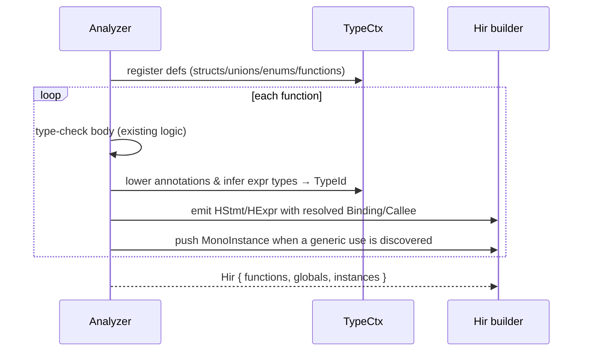

# 03 — Typed HIR (`src/hir/`)

The HIR is the AST **after type-checking and name resolution**. Its one job is to *persist everything the analyzer learned* so nothing downstream has to re-derive it. If you ever find the backend "figuring out" a type or which function a call refers to, that fact belongs in HIR.

## What HIR adds over the AST

```mermaid
flowchart LR
    subgraph AST
      a1["Identifier \"x\""]
      a2["Call \"foo\"(args)"]
      a3["BinaryExpr a + b\n(no type)"]
    end
    subgraph HIR
      h1["Var(Binding::Local(3))"]
      h2["Call{callee: Callee{def, instance, ret}}"]
      h3["HExpr{ty: int, Binary{Add, ..}}"]
    end
    a1 --> h1
    a2 --> h2
    a3 --> h3
```

Three resolutions happen at the AST→HIR boundary:

1. **Every expression gets a `TypeId`.** `HExpr { ty, kind }` — `ty` is the interned result type.
2. **Every name becomes a `Binding`.** `Local(LocalId)`, `Global(GlobalId)`, or `Func(Callee)`. No more string lookups downstream.
3. **Every call names a `Callee`.** `{ def, instance, ret }` — which definition, which monomorphized instance (if generic), and the concrete return type at *this* call site.

Control flow stays **structured** (`if`/`while`/`for`/`foreach`/`switch`). Flattening into a CFG is MIR's job — keeping it structured here makes HIR easy to produce from the analyzer and easy to read.

## The top-level container

`Hir` (`src/hir/mod.rs`) holds three lists:

```rust
pub struct Hir {
    pub functions: Vec<HFunction>,    // non-generic + already-monomorphized bodies, in emission order
    pub globals:   Vec<HGlobal>,
    pub instances: Vec<MonoInstance>, // the monomorphization worklist
}
```

`MonoInstance { def: DefId, args: Vec<TypeId> }` is the entire monomorphization story: a list of concrete `(generic def, type args)` pairs the backend must emit. No mangled names, no string parsing — the emitted WASM symbol is derived from the pair at the very end.

## Functions, params, locals

`HFunction` carries `def` (its `DefId`), the base `name`, the `instance` args (empty unless this is a monomorphized copy), typed `params`, the `ret` type, a `locals` table, the structured `body`, and `is_async`.

`LocalId(u32)` indexes locals uniquely within a function; parameters are just the first locals. `HLocal`/`HParam` record the declared `ty` so MIR's `RcInsertion` knows which locals are references and the backend knows how to allocate slots.

A `ref` parameter (`fun f(ref x: int)`) needs no dedicated HIR shape: it is boxed exactly like a captured `let`/parameter is (see `Analyzer::boxed_locals`), reusing `HirEmit::boxed`'s `.value`-redirect convention — but the *box type* depends on whether the name is also closure-captured. If it is, `hir_begin_function` gives it a `CaptureCell<T>`-typed slot (the heap, ARC-managed box a closure capture already needs, since its storage may have to outlive this function's own stack frame) and the `ref` call site reuses that exact pointer. If it is *not* captured, the box is `RefBox<T>` instead — a `struct` (value type), so the box gets its own private slot in the existing shadow-stack frame (`mir::emit::valuetype::ValueFrame`, the same mechanism a value-struct local already uses) with no heap allocation or reference counting: the box's storage only needs to be valid for the call, and the shadow stack already provides exactly that lifetime. A `ref` *parameter*'s own box-typed slot is `Borrow`-classified in the callee's `ValueFrame` (`LocalDecl::is_ref`), so the incoming pointer — the caller's box, whichever kind it is — is aliased in place rather than copied, mirroring how the `this` receiver is already handled. `Analyzer::analyze_ref_argument`/`hir_read_cell_ref` are agnostic to which box kind backs a name; both are a single `value: T` field at offset 0, so the generic `.value`-field HIR shape works unchanged either way. v1 restricts a `ref` argument to a local variable or parameter place (not yet a struct field or array element); a lambda cannot declare its own `ref` parameter (the funcbox/`call_indirect` ABI has no `ref`-slot marshaling yet); and a lambda cannot capture an enclosing function's `ref` parameter (its `RefBox<T>` slot does not outlive the call, so a lambda that escaped past the call's return would be left with a dangling address — rejected in `analyze_lambda`).

## Statements — `HStmt`

| Variant | Meaning |
|---------|---------|
| `Let { local, ty, value }` | typed binding |
| `Assign { place, value }` | store to an `HPlace` |
| `Expr(HExpr)` | evaluate for effect |
| `Return(Option<HExpr>)` | |
| `If / While / For / Foreach` | structured control flow (typed parts) |
| `Switch { scrutinee, arms, default }` | both C-style and pattern-matching forms; arms are `HArm { pattern, body }` |
| `Break / Continue (Option<label>)` | |
| `Await(HExpr)` | the only legal `await` *statement* position |

Pattern-matching `switch` lowering (analyzer):

- Flat unguarded arms — including **or-patterns** and **small int/char literal ranges** (inclusive span ≤ 256) expanded into multi-key arms — emit `HStmt::Switch` (MIR `br_table`).
- Arms with **guards** or **nested/literal sub-patterns** use a **hybrid**: outer `HStmt::Switch` on the variant tag / const key, with a residual if-chain (`Discriminant` / `UnionField` / guard tests) inside each Switch arm.
- Unexpanded ranges (or or-patterns that still need the chain after expansion) fall back to a full linear if-chain.

`HPattern` is `Const(HExpr)`, `Variant { def, variant, bindings }` (binds the payload into fresh locals), or `Wildcard`.

`HPlace` is the assignable subset: `Local`, `Global`, `Field { obj, field }` (resolved field **index**, not a name), `Index { array, index }`.

## Expressions — `HExpr` / `HExprKind`

`HExpr { ty: TypeId, kind: HExprKind }`. Every node is typed. Notable kinds:

- Literals: `IntLit`, `FloatLit`, `BoolLit`, `CharLit`, `StringLit`.
- `Var(Binding)` — resolved read.
- `Binary { op, lhs, rhs }`, `Unary { op, operand }` using the canonical `hir::BinOp`/`UnOp` (`src/hir/ops.rs`) — *not* syntax tokens.
- Calls: `Call { callee, args }`, `MethodCall { receiver, callee, args }`, `IndirectCall { target, args }`.
- Construction: `New { def, instance, args }`, `UnionNew { def, variant, args }`, `ArrayLit { elem_ty, elems }`.
- Access: `Field { obj, field }`, `Index { array, index }`, `ArrayLen`.
- `Cast` (explicit or inserted coercion to `ty`), `Ternary`, `Coalesce` (`??`), `Await`, `EnumValue(i64)` (enum member already resolved to its integer).

> The analyzer inserts `Cast` nodes for implicit numeric widening, so MIR and the backend never guess whether a coercion is needed — the `Cast` is simply present.

## How the analyzer emits HIR

The analyzer builds the `Hir` as it type-checks (in `src/semantics/analyzer/hir_emit/`):



The analyzer already computes all of this transiently during `analyze_expression` and overload selection; HIR emission **records** it on the node instead of throwing it away. Concretely:

- Where the analyzer returns a `Type` for an expression, also build the matching `HExpr` with `ty = ctx.lower(type)`.
- Where it resolves an identifier, emit `Var(Binding::…)` with the resolved id.
- Where it picks an overload, emit a `Callee { def, instance, ret }`.
- Where it instantiates a generic, push a `MonoInstance` (dedup by `(def, args)`).

Because HIR carries these facts, the backend never re-infers types or re-resolves names — which is the entire reason HIR exists.

## Invariants HIR guarantees to MIR

- `ty` on every `HExpr` is a valid interned id; no `Error`/poison survives (analysis failed otherwise).
- Every `Binding`/`Callee` is resolved; no name lookups remain.
- Implicit coercions are explicit `Cast` nodes.
- `Field`/`Index` carry resolved **indices**, not names.
- Generic uses are recorded in `instances`; `HFunction.instance` is set for monomorphized bodies.
