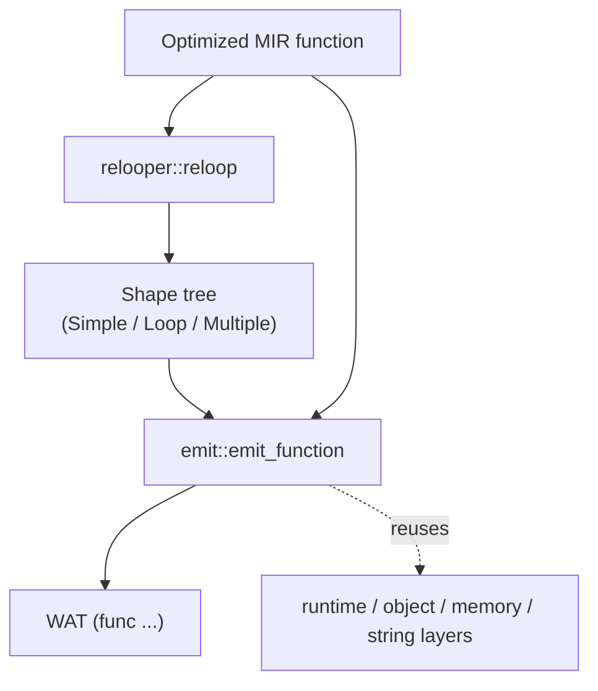
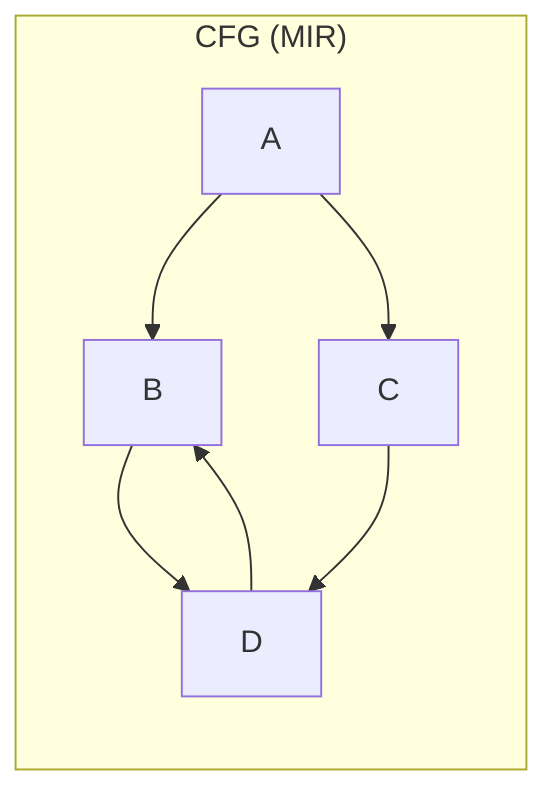
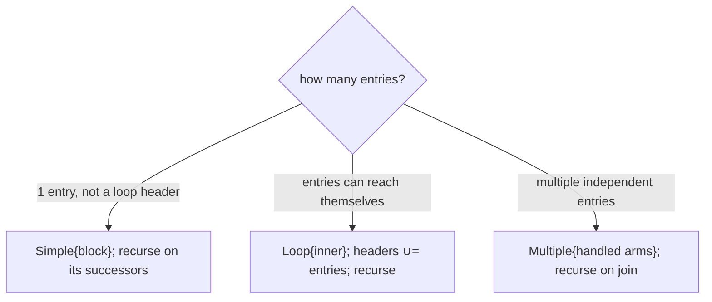
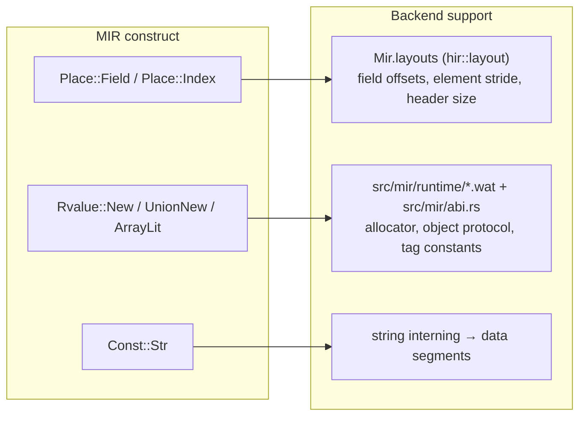

# 06 — Relooper & WAT Backend (`src/mir/relooper.rs`, `src/mir/emit/`)

The backend turns optimized MIR into WebAssembly text (WAT). The hard part is control flow: MIR is a reducible CFG, but WASM has **no `goto`** — only structured `block`/`loop`/`if` and relative branches (`br`/`br_if`/`br_table`). The relooper bridges that gap.

## The two-layer backend



- `relooper::reloop(func) -> Option<Shape>` recovers structured shapes.
- `emit::emit_program / emit_function` walks the function and writes WAT, consulting the type interner for WASM value types and reusing the runtime layers for heap layout and strings.

## The relooper

### Why it is needed



A CFG like this (a diamond whose join loops back) cannot be written directly in WASM. The relooper discovers that `B → D → B` forms a loop and that `A` branches into two arms, and produces a tree of **shapes** the emitter can translate to nested `block`/`loop`/`if`.

### Shapes — the `Shape` enum

```rust
pub enum Shape {
    Simple   { block: BlockId,      next: Option<Box<Shape>> }, // one block, then the rest
    Loop     { inner: Box<Shape>,   next: Option<Box<Shape>> }, // cyclic region in a `loop`, then rest
    Multiple { handled: Vec<Shape>, next: Option<Box<Shape>> }, // independent arms, then the join
}
```

### The algorithm (`Relooper::make`)

`make(entries, within, headers)` recursively builds the shape for the sub-CFG restricted to `within`, entered at `entries`, where `headers` are the entry blocks of *enclosing* loops:



The one subtle point — and the bug fixed during development — is **back-edges**. Inside a `Loop`, an edge back to the loop header is a `continue`, *not* forward control flow. So `succs` and `reach` **filter out `headers`**: they never traverse back into an enclosing loop's entry. Without this filter, `make_loop` re-detects the header as a fresh loop entry and recurses forever (stack overflow). This is why `headers: &BTreeSet<BlockId>` is threaded through every recursive call.

Because Dream's surface syntax only generates reducible CFGs, `reloop` always returns `Some`. It is typed `Option<Shape>` so an irreducible graph would fail loudly rather than miscompile.

## The emitter (`src/mir/emit/`)

### Today: shape-based sync emit

Sync functions call `relooper::reloop` and walk the shape tree into nested WASM `block`/`loop`/`if`
(see `src/mir/emit/emitter/shape.rs`). CFG edges become `br`/`br_if` relative to continue/break
labels; multi-exit loops nest one `block` per exit arm so each break runs the matching exit shape.

```wat
(func $f (param ...) (result ...)
  (local $__pc i32) ;; reserved; used only on PC-dispatch fallback
  (block $__brk0_0
    (loop $__cnt0
      ;; … body …
      (br $__cnt0)
    )
    ;; exit arm(s)
  )
)
```

**Async poll functions** still use a `$__pc` + `br_table` dispatch loop: suspend/resume must save and
restore a durable program counter in the `Future` frame (`src/mir/emit/emitter/async_ops.rs`).
Sync functions also fall back to PC dispatch when the relooper shape has a **multi-entry loop body**
or when the nested walker cannot resolve a branch to a structured label (rewind + dispatch).

### Statements, operands, types

- `wasm_ty(TypeId)` maps interned types to WASM value types: `i32` for ints/bools/chars/refs (pointers), `i64` for longs, `f32`/`f64` for floats. Reference types are `i32` pointers into linear memory.
- `binop_instr` picks the instruction from `(BinOp, operand type)` — e.g. `i32.add`, `f64.mul`, `i32.lt_s` vs `i32.lt_u` by signedness.
- Operands lower trivially: `Const` → `i32.const`/`f64.const`/…; `Copy(Place::Local)` → `local.get`.

### Runtime integration points

Three families of operations lean on the embedded runtime layers and the layout tables carried down from HIR:



- **Field/index access** uses the struct/array **layout** in `Mir.layouts` (built by `hir::layout`, threaded through lowering) to compute `base + offset` loads/stores with width-aware ops.
- **Allocation/construction** (`New`, `UnionNew`, `ArrayLit`) emits an inline `$malloc(size, tag)` — tag from `mir::abi` — then sets the header/refcount, initializes fields/elements, and calls the user constructor (`$Type_constructor`) when one exists. `@shared class` instances allocate **four extra bytes** past their field layout for an embedded reentrant lock word (see `HEADER_LOCK_WORD_SIZE` in `mir::abi.rs`); retain/release for `@shared` types use atomic RMW helpers (`$retain_shared`, `$release_*` with an atomic prologue) instead of the ordinary non-atomic `$retain`/`$release_*` path.
- **String constants** are interned into `[len][utf8][\0]` data segments, so identical literals share one pointer.

The allocator, string, object-protocol, float/double formatter, and async scheduler runtimes are the hand-written `.wat` files in `src/mir/runtime/`, embedded via `include_str!` and stitched into every module with their `{TAG_*}`/`{minus}` placeholders resolved from `mir::abi`.

## Determinism in the backend

The emitter must be a pure function of the MIR. Iterate `Vec`s in order; never iterate a `std::HashMap`. Any lookup tables you introduce (string pool, function index map) must be `IndexMap`/`BTreeMap` so two runs emit identical WAT. The `codegen_is_deterministic` e2e test enforces this.
