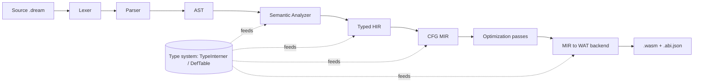
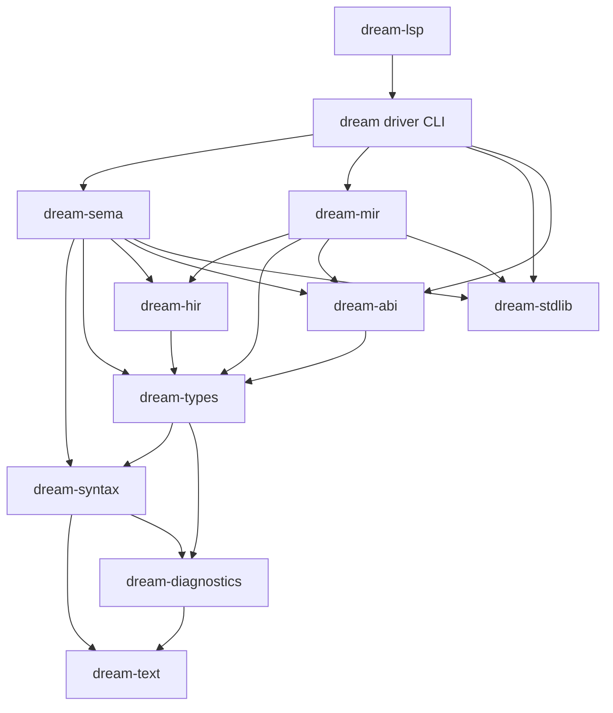

# Contributing — Compiler handbook

!!! warning "Contributors only"
    This section is the engineering handbook for people changing the Dream compiler.
    If you are learning the language, start at [Getting started](../getting-started.md) and the
    [Language](../index.md) / [Standard library](../index.md) guides instead.

This handbook covers the middle and back end. It assumes you have never seen the codebase. By the end you should be able to add a language feature, write an optimization pass, extend the type system, or wire up a new backend without guessing.

Read the chapters in order the first time; afterward, use this page as an index.

| # | Chapter | Covers |
|---|---------|--------|
| — | This page | The big picture, repo layout, crate graph, glossary |
| 01 | [Pipeline Overview](./01-pipeline-overview.md) | Every compilation stage and the data that flows between them |
| 02 | [Type System](./02-type-system.md) | `TypeInterner`, `TypeId`, `TyKind`, `DefId`, compat rules; adding a type |
| 03 | [HIR](./03-hir.md) | The typed, name-resolved High-level IR |
| 04 | [MIR](./04-mir.md) | The CFG-based Mid-level IR and how HIR lowers into it |
| 05 | [Writing Passes](./05-writing-passes.md) | The pass manager and a step-by-step tutorial |
| 06 | [Relooper & Backend](./06-relooper-and-backend.md) | Recovering structured control flow and emitting WAT |
| 07 | [Adding a Feature](./07-adding-a-language-feature.md) | A worked example touching every stage |
| 08 | [Testing & Determinism](./08-testing-and-determinism.md) | How to test, the determinism contract, conventions |
| 09 | [Nullable Purge Design Note](./09-nullable-purge-design-note.md) | Decision record for removing `T?` in favor of `Option<T>` |
| 10 | [Rejected: SSO / class `@stack` / size-class mono](./10-stack-alloc-and-mono-design-note.md) | Permanent non-goals: no small-string SSO, no `@stack` class alloc, no size-class-keyed unmanaged mono |

## Why a multi-pass architecture

The original Dream backend walked the AST directly and re-derived semantic facts (types, resolved callees, ownership) inside code generation. That works for a small language but has three structural problems:

1. **Re-derivation is fragile and duplicated.** The analyzer already computes types and resolutions; an AST-walking backend recomputes approximations of them, and the two sources of truth drift apart.
2. **No place to optimize.** Constant folding, DCE, inlining, and refcount elision need a representation with explicit control and data flow. The AST has neither.
3. **Stringly-typed types.** Types compared and keyed as strings (`"Box_int"`, `"int[]"`, `"int?"`) make equality a string compare, monomorphization string mangling, and every consumer a re-parser. Slow, error-prone, hard to extend.

The current design fixes all three with three layered representations plus a structured type system:


```mermaid
flowchart LR
    SRC[Source .dream] --> LEX[Lexer]
    LEX --> PAR[Parser]
    PAR --> AST[AST]
    AST --> SEMA[Semantic Analyzer]
    SEMA --> HIR[Typed HIR]
    HIR --> MIR[CFG MIR]
    MIR --> OPT[Optimization passes]
    OPT --> WAT[MIR to WAT backend]
    WAT --> WASM[.wasm + .abi.json]

    TYPES[(Type system: TypeInterner / DefTable)] -.feeds.-> SEMA
    TYPES -.feeds.-> HIR
    TYPES -.feeds.-> MIR
    TYPES -.feeds.-> WAT
```

Each arrow is a *total* lowering: the producer records everything the consumer needs, so the consumer never reaches backward. Types are interned once and referenced by a small integer (`TypeId`), so equality is `==` and there is no mangling.

## Repository layout (compiler-relevant)

```
Dream/
├── crates/                         IR-boundary crates (layered, enforced by Cargo)
│   ├── dream-text/                 Source primitives: TextSpan, LineText, IndentedTextWriter
│   ├── dream-diagnostics/          DiagnosticBag, Severity, rendering
│   ├── dream-syntax/               Lexer, parser, AST nodes
│   ├── dream-types/                TypeInterner, DefTable, TyKind, TypeId
│   ├── dream-hir/                  Typed High-level IR
│   ├── dream-abi/                  Attributes, intrinsics, JS ABI (shared by sema + MIR)
│   ├── dream-stdlib/               Embedded prelude + package registry
│   ├── dream-sema/                 Analyzer + tables + hir_emit (no MIR dependency)
│   └── dream-mir/                  CFG MIR, passes, relooper, WAT emit + runtime/
├── src/                            Root `dream`: driver, CLI, execution only
│   ├── driver/                     Pipeline orchestration, source loading, errors
│   └── execution/                  (feature "native") wasmtime runner
└── docs/compiler/                  ← you are here
```

The `dream-types → dream-hir → dream-mir` pipeline is the **only** backend. (An earlier AST-walking `codegen/` backend was replaced by it and deleted.)

### Module conventions

- `mod.rs` = declarations + thin re-exports (≤ ~150 LOC of logic).
- Prefer ≤ ~400 LOC production files; hard smell at ~600+.
- Analysis and HIR emit stay fused in `dream-sema`.
- No permanent middle/back-end `pub use` shims in root `dream`.

### Crate dependency graph


```mermaid
flowchart TD
    text[dream-text]
    diag[dream-diagnostics]
    syn[dream-syntax]
    types[dream-types]
    hir[dream-hir]
    abi[dream-abi]
    stdlib[dream-stdlib]
    sema[dream-sema]
    mir[dream-mir]
    dream[dream driver CLI]
    lsp[dream-lsp]

    diag --> text
    syn --> text
    syn --> diag
    types --> syn
    types --> diag
    hir --> types
    abi --> types
    sema --> syn
    sema --> types
    sema --> hir
    sema --> abi
    sema --> stdlib
    mir --> hir
    mir --> types
    mir --> abi
    mir --> stdlib
    dream --> sema
    dream --> mir
    dream --> stdlib
    dream --> abi
    lsp --> dream
```

Cargo enforces: `dream-sema` never depends on `dream-mir`, and `dream-syntax` never reaches sema/MIR. Shared constants live in `dream-abi`.

## The three IRs at a glance

| | AST (`dream-syntax`) | HIR (`dream-hir`) | MIR (`dream-mir`) |
|---|---|---|---|
| **Shape** | Tree, mirrors source | Tree, type-checked | CFG of basic blocks |
| **Types** | Syntactic (`Type` enum) | `TypeId` on every node | `TypeId` on every local |
| **Names** | Identifiers | Resolved `Binding`/`Callee` | `Local`/`Global` indices |
| **Control flow** | `if`/`while`/`for`/… | Same (structured) | `goto`/`if`/`switch` terminators |
| **Generics** | Type-parameter syntax | Explicit `MonoInstance` worklist | Already monomorphized |
| **RC / alloc** | Implicit | Implicit | Explicit `Retain`/`Release`/`New` |
| **Purpose** | Faithful parse | Kill re-derivation | Optimize + emit |

## Glossary

- **Interning / hash-consing** — storing each distinct value once and handing out a small id. The `TypeInterner` interns types, so identical types share a `TypeId` and equality is integer equality.
- **`TypeId`** — an interned type handle (a `u32` newtype). Compare with `==`.
- **`DefId`** — a handle to a *nominal declaration* (struct/union/enum/function), independent of type arguments. `Box<int>` and `Box<string>` share one `DefId`.
- **Monomorphization** — generating a concrete copy of a generic per type-argument set. Keyed by `(DefId, Vec<TypeId>)`, never a mangled string.
- **Basic block** — a straight-line run of statements ending in exactly one terminator (the only place control branches).
- **Terminator** — the control-flow instruction ending a block (`goto`, `if`, `switch`, `return`, `unreachable`).
- **Operand** — a readable value: a local/global read or a constant. All computation is an `Rvalue`.
- **Relooper** — the algorithm that turns a reducible CFG back into the structured `block`/`loop`/`if` WASM requires.
- **RC** — reference counting. Heap values carry a count; `Retain` increments, `Release` decrements and frees at zero.
- **Poison / `Error` type** — the type given to expressions after a semantic error, assignable to and from everything so one mistake doesn't cascade into a flood of diagnostics.

## Doc conventions

- File references look like `src/mir/lower/mod.rs` and, where useful, name the function.
- Mermaid diagrams are used for graphs and flows; read them top-to-bottom / left-to-right.
