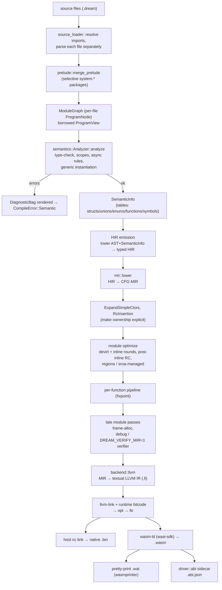
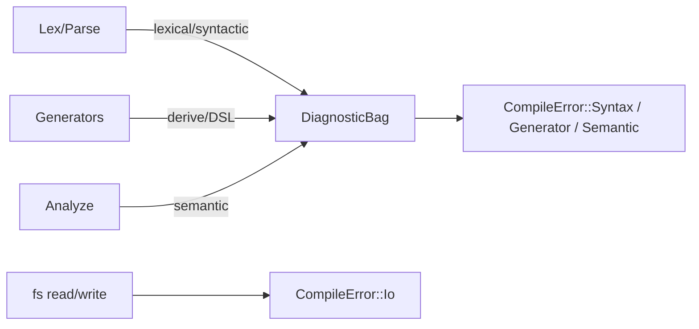

# 01 — Pipeline Overview

This chapter follows a program from its source file to its final output. For each step, it explains the input, result, source location, and promises the next step relies on.

## End-to-end flow

Generate phase: `run_generators` runs after parse (before analysis). Generators report `CompileError::Generator` when diagnostics are present.

Generator implementations live under `src/driver/generate/`. `json_gen/` separates collection
discovery, declaration snapshots, harness execution/cache and diagnostics. `rewrite/` rebuilds
expressions and statements through a shared context; generated-source parsing and source-span
mapping are independent modules. `quote.rs` uses serde_json for JSON strings in generated metadata.

The embedded stdlib's ordered package descriptors live under `crates/dream-stdlib/src/registry/`;
`packages.rs` resolves package dependencies and `symbols.rs` supplies LSP symbol discovery.

The `hir → mir → emit` pipeline is the **only** backend.

## Stage by stage

### 1. Source loading — `src/driver/source_loader.rs`, `src/driver/prelude.rs`

- **In:** an entry file path.
- **Out:** a `ModuleGraph` with per-file `ProgramNode`s, module IDs, import edges, export descriptors and content/interface hashes. `ProgramView` borrows declarations from those files; analysis does not consume a flattened AST.
- **Key types:** `ProgramAccumulator` collects `all_functions`, `all_structs`, `all_enums`, `all_extends`, `all_globals`, and `visited` (the cycle guard).
- **Guarantees:** import cycles are broken; every referenced module is parsed once.

### 2. Lexing & parsing — `crates/dream-syntax/`

- **In:** source text.
- **Out:** the AST. Entry points: `Lexer::new`, `Parser::new(...).parse()`.
- **AST shape:** `ProgramNode` → declarations (`FunctionNode`, `StructDeclarationNode`, `EnumDeclarationNode`, …); bodies are `StatementNode`/`ExpressionNode`; type annotations are the `Type` enum (`crates/dream-syntax/src/nodes/types.rs`).
- **Guarantees:** lexical/syntactic errors go into a `DiagnosticBag`. The AST is *faithful* to source — no desugaring beyond the parser's `for-each` index locals.

### 3. Semantic analysis — `crates/dream-sema/src/analyzer/`

- **In:** the module graph and its borrowed declaration view.
- **Out:** `SemanticInfo`, or a `CompileError::Semantic` after errors.
- **What it does:** name resolution, type checking, scope validation, `async`/`await` legality, overload selection, and **generic instantiation** (monomorphization discovery).
- **Tables it populates** (in `SemanticInfo`):
  - `StructTable` / `StructInfo` — field layout
  - `UnionTable` / `UnionInfo` — variant layout
  - `EnumTable` — `DefId → (member → i32)`
  - `FunctionTable` / `FunctionTableInfo` — signatures + overloads
  - symbol tables — per-scope `name → Type`
- **Type identity:** nominal definitions use `(ModuleId, local index)`. Struct/union instances and interface methods use `TypeId` keys; enum and nominal-template tables use `DefId`. Source-name resolution is module scoped. Function and generic metadata use typed definition/instance identities; source names are used for resolution and display, not backend identity. User-facing diagnostics use `display_name` (`Box<int>`), while backend symbols use structural encodings.

### 4. Type system — `crates/dream-types/src/` (cross-cutting)

Not a pipeline "stage" but the shared vocabulary of stages 3–7. See [02-type-system.md](./02-type-system.md). The `TypeCtx` (interner + def table + lowering) is threaded through analysis and lowering.

### 5. HIR emission — `crates/dream-sema/src/analyzer/hir_emit/`

- **In:** AST plus the facts the analyzer computed.
- **Out:** `Hir` — typed and name-resolved (see [03-hir.md](./03-hir.md)).
- **Why:** persist what `analyze_expression`/overload selection would otherwise discard, so the backend never re-derives types or resolutions.

### 6. MIR lowering & optimization — `crates/dream-mir/src/`

- **In:** HIR.
- **Out:** optimized MIR (a CFG per function).
- **Steps:** `mir::lower` desugars structured control flow into blocks; `ExpandSimpleCtors`, then `RcInsertion` (parameter ownership modes are already HIR facts) make ownership explicit (module-wide, before inlining); `optimize_module_opts` alternates `Devirt` with inliner rounds, then runs the post-inline RC and placement stages (`UniqueRegion`, `rc-held-by-owner`, `SroaManaged`); the per-function `PassManager` runs to a fixpoint (including bounds-check elimination and loop versioning in `Abc`); `run_late_module_passes` stack-allocates non-escaping objects (`frame-alloc`), and runs the MIR verifier in debug builds or with `DREAM_VERIFY_MIR=1`. `--emit-mir` snapshots any of these stages. See [04-mir.md](./04-mir.md) and [05-writing-passes.md](./05-writing-passes.md).

### 7. Backend — `crates/dream-mir/src/backend/llvm/` + `src/execution/llvm/`

- **In:** optimized MIR.
- **Out:** a textual LLVM IR module (`backend::llvm::emit_llvm_module`). The driver links it with the C runtime compiled to bitcode, runs the pinned `opt` + `llc`, then links with the host `cc` (native `.bin`, optionally PGO via `--profile` / `--use-profile`, `src/execution/native/pgo.rs`) or wasi-sdk `wasm-ld` (`.wasm`, pretty-printed to `.wat` via wasmprinter). The runtime bitcode is cached with a stamp listing every input's path, size, and mtime (`src/driver/rt_stamp.rs`), so switching between compiler checkouts rebuilds it instead of linking a stale one.
- **How:** every MIR block becomes one LLVM block and every local an entry `alloca`; runtime calls are typed from the runtime bitcode's own signatures. The guest runtime is C under `crates/dream-mir/src/runtime/c/`. See [06-llvm-backend.md](./06-llvm-backend.md).

### 8. Artifact emission — `src/driver/compiler/pipeline.rs` / `src/driver/abi.rs`

- **In:** linked `.wasm` plus the AST root (for ABI metadata).
- **Out:** link → `wasm-opt` → embed the ABI custom section → print `.wat` via `wasmprinter`; the `.abi.json` sidecar describes extern imports/exports for the JS runtime.

`compiler.rs` owns configuration and entry wiring. `compiler/load.rs` loads and prepares source,
`compiler/analyze.rs`, `compiler/lower.rs` and `compiler/optimize.rs` run analysis, HIR → MIR
lowering and the MIR pipelines, `compiler/emit.rs` produces LLVM IR and artifacts,
`compiler/pipeline.rs` sequences the stages, and `compiler/diagnostics.rs` renders failures.

### Build cache — `src/driver/compiler/cache.rs`

The CLI enables `Compiler::with_build_cache`. After loading, the key is computed from every
`ModuleGraph` module key and file source, the compiler binary, the C runtime tree, compile and
link options, toolchain configuration, `DREAM_*` environment variables and `dream.toml`. When
`<out>.dream-cache` holds that key and every recorded artifact still has its recorded hash, the
build returns `BuildOutcome::Cached` and analysis, emission, LLVM and linking are skipped. A
fresh build is recorded only after its final artifacts exist, and only when it printed no
diagnostics, so warnings are never hidden. Builds with native C/C++ sets, PGO or `--emit-mir`
bypass the cache because their inputs live outside the key. Analysis is whole-program
(monomorphization crosses modules), so the whole build, not a single module, is the unit of reuse.

## Where errors come from

- User-facing problems are reported as **diagnostics** during lex/parse/generate/analyze and surface as `CompileError::Syntax`, `CompileError::Generator`, or `CompileError::Semantic` (`CompileError::Io` wraps source/artifact I/O). An incompatible or stale installed runtime is `CompileError::Toolchain`, not an ICE.
- Generator-phase failures (`@json`, unexpanded syntax blocks, syntax-DSL harness errors) use **`CompileError::Generator`**.
- The backend has **no user-facing error path**: it expects a fully validated program. A promised invariant it finds violated is a compiler bug (ICE) and `panic!`s rather than returning a diagnostic.
- The backend never runs on a program that produced any diagnostic error, so poison (`Error`-typed) values never reach lowering.

## Invariants the back end relies on

1. **Analysis succeeded.** No poison types, every name resolved, every call has a callee.
2. **Types are interned.** Equality is `TypeId == TypeId`; no string parsing of type names.
3. **Generics are resolved.** Every generic use is recorded as a concrete `(DefId, args)` instance.
4. **Control flow is reducible.** Dream's surface syntax cannot express irreducible CFGs.
5. **Determinism.** Every map that influences emission preserves insertion order (`IndexMap`), so two compilations of the same input produce byte-identical output (guarded by the `codegen_is_deterministic` e2e test).
