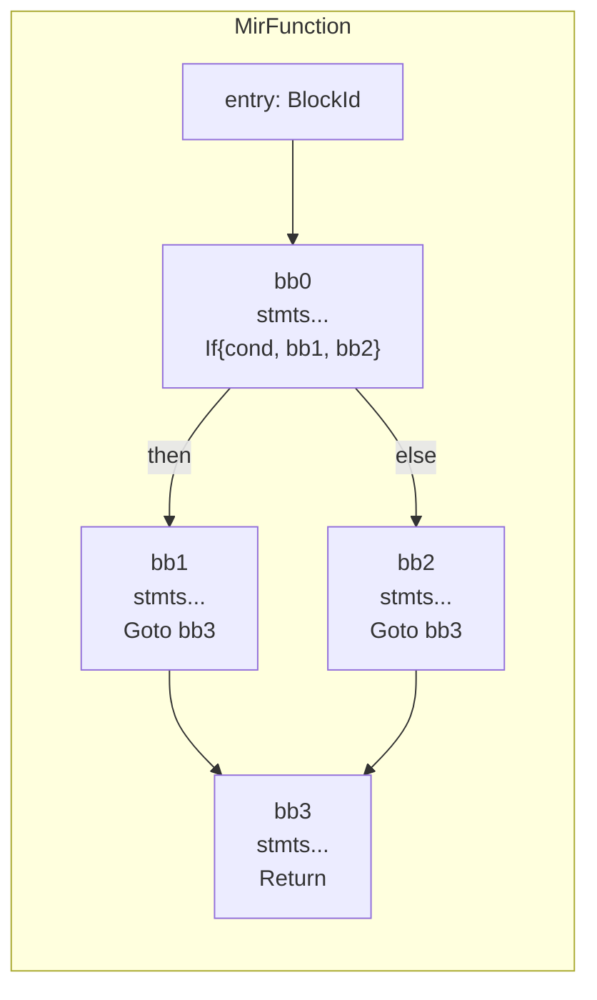
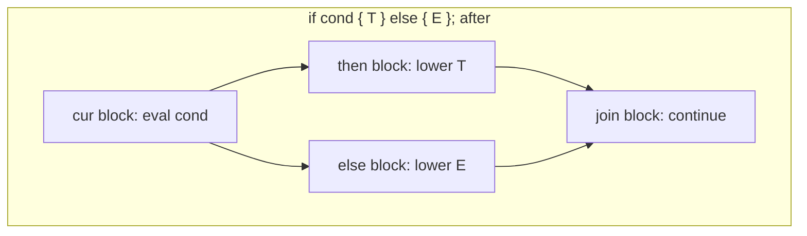
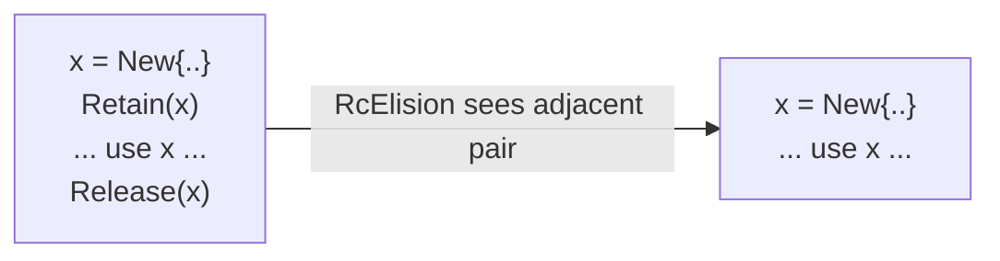

# 04 — CFG MIR (`crates/dream-mir/src/`)

MIR describes execution as blocks connected by jumps. It also records memory operations explicitly. That makes it possible to improve a program before writing its final output.

## Mental model



- A function is a list of `BasicBlock`s plus an `entry` block id.
- Each block is `stmts: Vec<Statement>` then exactly one `terminator: Terminator`. Control can branch *only* at the terminator.
- Values live in `Local`s. Every intermediate result is materialized into a local, so an `Operand` is always a local/global read or a constant — never a nested computation. This flattening is what makes passes simple.

## Core types (`crates/dream-mir/src/mod.rs`)

### Statements — straight-line, no control flow

```rust
pub enum Statement {
    Assign(Place, Rvalue),  // place = rvalue
    Retain(Operand),        // refcount++
    Release(Operand),       // refcount-- (free at zero)
    Call { callee, args },  // call for effect; return value discarded
    Nop,                    // tombstone left by passes that delete without renumbering
}
```

### Terminators — exactly one per block

```rust
pub enum Terminator {
    Goto(BlockId),
    If { cond: Operand, then_blk, else_blk },
    Switch { value: Operand, targets: Vec<(i64, BlockId)>, default: BlockId },  // → br_table
    Return(Option<Operand>),
    Unreachable,   // #[default]
}
```

`Terminator::successors()` is the one place CFG edges are defined — every traversal (passes, DCE, the backend) goes through it, so adding a terminator variant means updating exactly one function.

### Places, operands, constants

- `Place` (assignable): `Local`, `Global`, `Field { base, field }`, `Index { base, index: Box<Operand> }`. *(The `Box` breaks the `Place`→`Operand`→`Place` type cycle.)*
- `Operand` (readable): `Copy(Place)` or `Const(Const)`.
- `Const`: `Int`, `Float`, `Bool`, `Char`, `Str(String)` (interned later), `Null` (pointer-sized zero — an absent heap reference / cleared slot in MIR, **not** a source-level `null` literal; the language uses `Option<T>` / `None` for absence).

### Rvalues — all real computation

```rust
pub enum Rvalue {
    Use(Operand),
    Binary(BinOp, Operand, Operand),
    Unary(UnOp, Operand),
    Call { callee, args },
    IndirectCall { target, args },
    New { def, args },                  // allocate + construct a struct
    UnionNew { def, variant, args },
    ArrayLit { elem_ty, elems },
    ArrayLen(Operand),
    Cast(Operand, TypeId),
}
```

`Callee { def, args, ret }` carries the resolved def, the concrete type args (for monomorphization), and the site return type. The emitted symbol name is derived from `(def, args)` at the backend.

## Lowering HIR → MIR (`crates/dream-mir/src/lower/`)

`lower_program(hir, interner)` lowers each `HFunction` via `lower_function`; the `Lowerer` holds the block list and a "current block" cursor and appends statements as it walks the structured HIR.

The essential trick is that **every structured construct becomes blocks + terminators**:



| HIR | MIR shape |
|-----|-----------|
| `If` | cur → `If{cond, then, else}`; both arms `Goto` a fresh join block |
| `While` | header block tests cond → body / exit; body `Goto`s header (back-edge) |
| `For` | init in cur; then a `While`-shaped header with the step appended to the body |
| `Foreach` | desugars to an index local + bounds check + `Index` read into the elem local. `foreach` over a `List<T>` is desugared by sema (`switch_unions/foreach_list.rs`) into an index loop (`$i < $list.length`, re-read every step so mutation during iteration behaves like `ListIterator`) with `at_unchecked` element reads, so it gets the same shape. |
| `Switch` | `Switch` terminator with `(value, block)` targets + default |
| `&&` / `\|\|` | short-circuit: a branch that skips the rhs block |
| `??` (`Coalesce`) | null-test branch choosing lhs or rhs |
| `Ternary` | same as `if` but both arms assign one result local |

Expression lowering (`lower_expr`) returns an `Operand`: literals become `Const`; everything composite is assigned into a fresh temporary local and the temp is returned. `break`/`continue` consult a stack of `(break_target, continue_target)` block ids maintained around loops.

`is_reference(ty)` delegates to `interner.is_reference` — the same single source of truth used everywhere else.

## Why RC is explicit in MIR

Making `Retain`/`Release` ordinary statements (rather than implicit backend behavior) lets the optimizer treat them like any other dataflow:



- `ExpandSimpleCtors` and `RcInsertion` run module-wide before inlining. Parameter ownership has already been recorded by sema in HIR and applied by lowering. Insertion assigns each owned RC local a compile-time ownership token and emits `Retain` only on a real share and `Release` when that token dies. It consults a type-level mod-ref table (`rc/modref.rs`) so snapshots and loop-carried traversal variables (`rc/cursor_family.rs`) stay cursors when no call can overwrite the slot they came from.
- After inlining, `RcLastUseRepair` turns last-use container stores on the fused CFG into moves (null the source; drop a `Retain` that only existed to share into a now-dead store). Re-running full insertion on inlined `generated_dispatch` is too expensive. `rc-held-by-owner` (`rc/held.rs`) then drops retain/release pairs on snapshots whose owner provably outlives every read, now that the intervening calls are inlined or summarized.
- Allocation placement is decided on the post-inline module from escape analysis (`analysis/escape.rs`) and a static per-object count (`analysis/object_life.rs`): `UniqueRegion` (bump region for unique `del`-free graphs), `SroaManaged` (objects with reference fields become per-field locals), and late `frame-alloc` (non-escaping instances built in the stack frame with an immortal count).
- `RcElision` (in the per-function pipeline) cancels redundant `Retain`/`Release` pairs along Goto chains, transparent diamonds, and transparent natural loops (see [Ownership and memory performance](./11-swift-like-arc-roadmap.md)).

See [05-writing-passes.md](./05-writing-passes.md) for the module-pass order.

## Building MIR by hand — `crates/dream-mir/src/build.rs`

`FunctionBuilder` is the ergonomic constructor used by tests and anything that synthesizes MIR directly (e.g. compiler-generated trampolines). It hands out fresh `Local`s and `BlockId`s, lets you push statements into the current block, and finalizes a `MirFunction`. Use it instead of building the structs by hand — it keeps the locals/blocks vectors consistent.

## Pretty-printing and `--emit-mir` — `crates/dream-mir/src/pretty.rs`, `passes/dump.rs`

`pretty.rs` prints MIR deterministically (functions, locals, and blocks in index order; names resolved by lookup, never by iterating a hash container), so dumps diff cleanly between compiles. The compiler exposes it through a global CLI flag:

```bash
dream --release --emit-mir=after:rc-insertion app.dream   # last snapshot after that stage
dream --release --emit-mir=after:gvn,each app.dream       # every run of gvn that changed a function
dream --release --emit-mir=all --emit-mir-fn=main,parse app.dream  # every module stage, two fns
```

Snapshots land in `<output>.mir/<NN>-<pass>.mir`, numbered so lexicographic order is pipeline order. `after:<pass>` accepts every module stage (`lower`, `expand-simple-ctors`, `funcbox-abi`, `param-modes`, `ownership-args`, `rc-insertion`, `devirt`, `inline`, `rc-last-use-repair`, `unique-region`, `rc-held-by-owner`, `sroa-managed`, `fixpoint`, `strip-escaped-regions`, `frame-alloc`) and every per-function pass name; an unknown name errors with the valid list. For a per-function pass without `each`, the file holds each function's body after that pass's last run in the fixpoint. When a pass misbehaves, dump before and after it; the CFG text is far easier to read than the LLVM IR.

## Verifier — `crates/dream-mir/src/verify/`

`run_late_module_passes` checks the final module in debug builds or when `DREAM_VERIFY_MIR=1` (including release CI). Violations are ICEs. CFG targets are checked before dataflow. A finite may-dead analysis follows branches and backedges, rejecting reads or double releases after `Release` for conservative single-token locals (never retained, stored, passed, or a parameter).

The same enablement also checks explicit ownership immediately after `RcInsertion`, before
inlining and elision erase transfers. `ownership-args` first materializes taken projections
(including globals) as typed locals; lowering already materializes discarded owning results. The independent token
dataflow tracks all possible local obligations at CFG joins: borrowed/taken parameters, owning
results, retained copies, moves into locals/containers, taken arguments, returns and async result
handoffs. Overwrites and exits cannot discard a token; each taken argument occurrence consumes
one. Indirect/interface calls use the borrowed ABI. Null slots and immortal literals owe no drop.
Positive-balance cycles use a bound derived from static retains, not an iteration timeout.
Cancellation requires one token per non-null owning async frame slot at suspension.
Inline value fields use typed retain/drop glue rather than an envelope token.

Closed retained alias families with one allocation site also receive an independent exact-path
balance check. Copies, moves, null rebinding and scalar inspection preserve the family's count;
each retain adds a token, each release consumes one, and a return forwards one. Joins preserve
all incoming balances, and allocation-site re-entry requires the previous generation to be dead.
Positive-balance cycles are rejected once the live count exceeds the birth plus all static retains,
so balanced loops converge without an iteration cap. This final-stage family check excludes
parameters, cursors, calls, container handoffs, async functions and regions; their explicit
transfer balance is checked at the insertion boundary instead. Pointer equality alone cannot
recover erased ownership transfers.

Region depth must agree at every join; leaves cannot underflow, and exits or suspension cannot
carry active regions. Direct managed allocations and local copy/cast/move aliases carry region
origins across the CFG, so reads after a rewind are rejected. Niche union wrapping/extraction
preserves the payload's origin rather than inventing an allocation. Module-wide return summaries,
keyed by definition and concrete type arguments, distinguish fresh results from parameter-derived
results and propagate managed-child writes through direct calls. Recursive summaries converge on
a finite may-provenance lattice without an iteration cap. Opaque calls conservatively preserve
argument origins and potential allocations/writes/capture. Graph identities keep mutations
through aliases visible to caller/global roots even without later local reads. Reference-bearing
inline structs, unions and tuples carry child origins without inventing a heap envelope;
primitive snapshots do not inherit pointer lifetime. Field/index effects are conservative for
the whole reachable graph. This is not a proof of every optimizer rewrite or external body;
field-sensitive precision and richer post-optimization ownership facts remain follow-up work.
Managed-child publication barriers are described in [06-llvm-backend.md](./06-llvm-backend.md).

The late escaped-region guard uses the same region proof as final verification, not a separate
block-linear scanner. A detected escape is an ICE in debug builds. Release builds remove all
inferred-region markers in the affected function (preserving CFG stack balance) and log the
located findings before final verification. This containment fallback is not a leak-free repair;
Phase 7 tracks fixing the producing passes and deleting it.

## Invariants MIR guarantees to the backend

1. Every block ends in exactly one terminator; `entry` is a valid block id.
2. Operands are atomic (local/global/const) — no nested computation hides in an operand.
3. Every `Local` has a `LocalDecl` with a valid `TypeId`.
4. The CFG is **reducible** (Dream cannot express `goto` spaghetti).
5. RC is balanced after `RcInsertion`: each explicit local token is released or transferred once on every path. `verify/` checks this boundary independently, then checks conservative alias death, closed retained families and region provenance in final optimized MIR.
