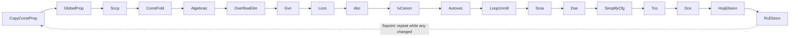

# 05 — Writing Optimization Passes (`src/mir/passes/`)

Read this when you want to **make the compiler produce better code**. It covers the pass infrastructure, the whole-module driver, the passes that ship today, and a step-by-step tutorial for adding your own. Passes operate on MIR — read [04-mir.md](./04-mir.md) first.

## Two contracts: `MirPass` and `ModulePass`

Most passes are **function-local** and implement `MirPass` (`src/mir/passes/mod.rs`):

```rust
pub trait MirPass {
    fn name(&self) -> &'static str;
    /// Transform one function. Return `true` iff anything changed.
    fn run(&self, func: &mut MirFunction, interner: &TypeInterner) -> bool;
}
```

A few passes need the **whole module** at once (inlining is the main one) and implement `ModulePass`:

```rust
pub trait ModulePass {
    fn name(&self) -> &'static str;
    fn run(&self, mir: &mut Mir, interner: &TypeInterner) -> bool;
}
```

Two rules make the system work:

1. **Scope honestly.** A `MirPass` sees one function; a `ModulePass` sees the module. Don't smuggle cross-function state into a `MirPass`.
2. **Report change honestly.** The return value drives a fixpoint loop, so returning `true` when nothing changed spins the loop (capped at `max_iterations = 16`), and returning `false` after a change means later passes miss the opportunity. Be precise.

## The whole-module driver

`optimize_module` (`src/mir/passes/mod.rs`) sequences the module-wide phases, and the order is **correctness-relevant**, not just an optimization choice:


`driver/compiler.rs` calls three entry points in order: `optimize_module_opts` (everything up to `SroaManaged`), `run_function_pipelines` (the per-function fixpoint), and `run_late_module_passes`. Every stage reports to the `--emit-mir` sink under its name (see [04-mir.md](./04-mir.md#pretty-printing-and-emit-mir-cratesdream-mirsrcprettyrs-passesdumprs)).

- `prune_module` tree-shakes unreachable functions.
- `ExpandSimpleCtors` runs **before** `RcInsertion` so field stores (including strings) get retain/move at the call site. Expanding after RC left `New` args as fake sinks and UAFed take-ctors like `JsonParser`.
- `FuncboxAbi` moves parameter retains of address-taken functions into the callee so funcbox call sites pass at +0.
- `ParamModes` flips read-only sink parameters to borrowed (callee and every direct call site) when every caller is known, so `RcInsertion` emits neither the caller's retain nor the callee's release. It is a call-graph fixpoint; see its module doc for the refusal list.
- `RcInsertion` runs **before** inlining. Callee scope-exit `Release`s stay on the original bodies (and keep inliner size budgets honest). Inserting after inlining on a fused `generated_dispatch` is too expensive. It reads a module `ModRefTable` (`rc/modref.rs`: which `(type, field)` / element / global slots each function may overwrite, closed over calls) to keep snapshot cursors and loop-carried cursor families (`rc/cursor_family.rs`) retain-free.
- `Devirt` + `Inliner` alternate for up to 8 rounds with pruning in between. `Devirt` turns an interface call direct when every implementor maps the slot to one method, or when a forward dataflow proves the receiver's exact class (so factories exposed by inlining devirtualize on the next round). Receivers with up to four known implementors stay interface calls in MIR; the C backend emits a tag switch to direct calls for them (`backend/c/iface_guard.rs`).
- `RcLastUseRepair` walks fused CFGs once: last-use `a[i] = s` / field stores become moves so inlined `split` temps do not leak.
- `UniqueRegion` wraps `x = f(); … ReleaseUnique x` in a TLS bump region when `f` only allocates `del`-free, non-escaping class graphs.
- `rc-held-by-owner` (`rc/held.rs`) removes retain/release pairs on container snapshots whose owner is live and unmodified (per `ModRefTable`) wherever the snapshot is read — the post-inline counterpart of the conservative pre-inline cursors.
- `SroaManaged` scalar-replaces non-escaping objects that the per-function `Sroa` cannot (several aliases, reference fields), spelling out the container-store RC rule from `rc_store.rs`.
- The per-function `PassManager` then cleans up the merged bodies (`RcElision` / `HopElision` only — never a second `RcInsertion`).
- `run_late_module_passes`: `strip_escaped_regions` drops inferred regions that CFG simplification made unsound (a live ref use after the leave), then `frame-alloc` builds instances that never outlive their frame in a C stack buffer (`dream_frame_object`, immortal count), and finally debug builds of the compiler run the MIR verifier (`verify.rs`).

Escape levels (`analysis/escape.rs`: alias classes, `No` / `Arg` / `Global`, callee parameter summaries over SCCs) and static object counts (`analysis/object_life.rs`) are shared analyses; `SroaManaged` and `frame-alloc` consume them.

Debug-info builds call `optimize_module_opts(.., inline = false)`: RC insertion and pruning still run (they are correctness-relevant), but devirt/inlining is off so each user function keeps its own body and call frame for the debugger.

## The per-function pipeline

`PassManager` runs a configured list of `MirPass`es **repeatedly until none reports a change** (or the cap is hit). `PassManager::default_pipeline` is ordered so cheap simplifications expose work for the later ones:



That is `default_pipeline`. The driver compiles both native and wasm32 through C, so it runs `native_c_pipeline`: the same list without `IvCanon` and `Autovec` (wasm `v128` lowering), leaving vectorization of the scalar loops to clang. `default_pipeline` remains for MIR-level tests.

The ordering principle: **cheap rewrites that expose more work run first.** Propagation turns `x = 1; y = x + 2` into `y = 1 + 2`, folding turns that into `y = 3`, which makes a branch constant, which SimplifyCfg folds, which makes a block unreachable, which DCE deletes — and the now-dead RC ops get elided. The fixpoint loop lets these cascade.

> `RcInsertion` is **not** in this pipeline — it runs once module-wide (above). The pipeline only contains `RcElision`, which removes pairs the other passes expose. `PassManager::debug_pipeline` is a minimal value-preserving pipeline (`SimplifyCfg` + `RcElision`) for debug-info builds.

## A tour of the shipped passes

Function-local `MirPass`es:

- **`CopyConstProp` (`prop.rs`)** — intra-block copy/constant propagation. Within a block, if `x = <const|local>` and `x` is not reassigned before a use, the use is rewritten to the source. Shrinks live ranges and feeds `ConstFold`.
- **`GlobalProp` (`global_prop.rs`)** — propagation across block boundaries.
- **`Sccp` (`sccp.rs`)** — sparse conditional constant propagation.
- **`ConstFold` (`const_fold.rs`)** — evaluates `Binary`/`Unary`/`CheckedBinary`/`CheckedNeg` rvalues whose operands are all `Const`, at the destination's integer type (`int_ty.rs`). Wrapping ops wrap at that width; a checked op folds only when the result fits, and division/modulo by zero is **left for the runtime to trap** (the fold returns `None`). The canonical "simplest pass" — read it first.
- **`Algebraic` (`algebraic.rs`)** — algebraic identities (`x + 0 → x`, `x * 1 → x`, `x * 0 → 0`, …).
- **`OverflowElim` (`overflow_elim.rs`)** — rewrites `CheckedBinary`/`CheckedNeg` to wrapping `Binary`/`Unary` when an interval analysis proves the result fits: single dominating definitions (constants, lengths, masks, remainders, narrowing casts) plus dominating `x < y` branch edges for loop counters not redefined since the branch.
- **`Gvn` (`gvn.rs`)** — global value numbering, removing redundant computation.
- **`Licm` (`licm.rs`)** — loop-invariant code motion.
- **`Abc` (`abc/`)** — array/string bounds-check elimination: marks an `Index` / `CharAt` / `ByteAt` unchecked when `0 <= idx < len` is proven at that exact statement. `facts.rs` holds position-precise guard facts (true on one `If` edge, in the blocks it dominates, until a reaching redefinition) and flow-insensitive facts that every definition of a local preserves (non-negative counters, sole constant-length `ArrayNew`s). A wrapping add only preserves non-negativity as a `+1` step: under wrap-by-default arithmetic a general `m = m + i` can wrap negative, so strided loops such as a sieve's marking loop keep their checks. `special.rs` handles `i * i < len` guards and affine `i * n + j` indices over `n * n` arrays. `version.rs` gives an innermost loop whose bound is not an array length a guarded clone: `bound <= a.length && start >= 0` on entry selects the unchecked copy, otherwise the original checked loop runs, so an overrun still traps. Stdlib `List`/`Queue` bypass the pass entirely: their element access uses `Buffer.get_unchecked` / `set_unchecked` on `[0, count)`, sound by the `0 <= count <= items.length` invariant plus the collection's own index check.
- **`LoopUnroll` (`loop_unroll.rs`)** — unrolls small counted loops.
- **`Sroa` (`sroa/mod.rs`)** — scalar replacement of aggregates (non-escaping instances with only non-ref field accesses). The post-inline module pass `SroaManaged` (`sroa/managed.rs`) covers objects with reference fields.
- **`Dse` (`dse.rs`)** — dead store elimination.
- **`SimplifyCfg` (`simplify_cfg.rs`)** — folds `If{cond: Const(bool), ..}` into a `Goto` and threads jumps through empty blocks, exposing unreachable blocks for DCE.
- **`Tco` (`tco.rs`)** — tail-call optimization.
- **`Dce` (`dce.rs`)** — two kinds: drop blocks unreachable from `entry` (reachability over `Terminator::successors`), and remove assignments to never-read locals *when the rvalue is pure* (a `Call`/`New` may have side effects and must stay).
- **`RcElision` / `RcInsertion` (`rc/`)** — `RcInsertion` tracks a compile-time **ownership token** per owned RC local on the CFG (not ownership-SSA) plus Unique vs Shared: birth/`New`/owning call results get a Unique token with no `Retain`; last-use assign/sink **forwards** the token (null source); `borrow` does not move it; a still-live copy **`Retain`s** and marks Shared. Last-use field/index/global stores move Unique locals without a container retain (Wasm and C). A Unique last-use destroy (`die_after` / drop-previous) is `ReleaseUnique` only when `can_unique_destroy` allows it (currently never: Unique is not object uniqueness). Block-end leftover and `Return` leftover always ordinary `Release`. Field/index snapshots may stay cursors; union-field snapshots always own. A token otherwise dies with `Release`+null at last-use destroy (every owned RC type; `Held` only via `holds_raw_borrow` / `@async_host` in `rc/lifetime.rs`), at the start of a split edge that does not need it (unbalanced `if`), at block-end when unused and dead-out, or at return for leftovers. Sharing still retains (`Debug.ref_count` of an alias is 2). `RcElision` then cancels leftover pairs along unique-predecessor **`Goto` chains**, **transparent diamonds**, and **transparent natural loops**. Correctness rule: **never make a program under-retain.** User-facing rules: [Ownership](../reference/language/ownership.md). Compiler model: [Nim-hard ARC](./11-swift-like-arc-roadmap.md).

- **`HopElision` (`rc/hop.rs`)** — slims the retain/release pattern of union-payload chain hops (`n = c as Some; …; c = n.next`) that survive as owned locals.

Module passes (`ModulePass` or module-level functions) are listed in the driver section above. The largest is **`Inliner` (`inline/`)**:

- **Eligibility:** direct calls to sync, non-recursive, non-entry callees. Size-gated: ≤64 statements and ≤16 blocks (≤128 / ≤24 when the callee has `@inline` / `prefer_inline`). Address-taken and recursive-SCC callees are skipped. Looping callees are eligible (the C backend emits `for (;;)` and uses labeled `goto` for multi-entry loop headers). Async bodies, `New`/indirect calls, interface calls that `Devirt` could not make direct, and wide-arg sites with unknown argument types are skipped. Calls into `main` / the module init function are never inlined.
- **Value types:** callees with value-struct / `ref struct` locals are inlinable. Remapped `this` / `ref` / alias temps stay borrows (`LocalDecl::is_ref`). Owning and by-value param value locals get `LocalDecl::manual_drop` and a MIR `Statement::ValueDrop` at each remapped return→continuation edge (nulling RC fields afterward so loop re-entry is safe). Locals already marked `manual_drop` from a prior inline are not dropped again when their enclosing function is inlined. Call-result dests are forced Owning (`__vret`) so the return `Assign` deep-copies instead of Borrow-rebinding. `ValueFrame` treats `manual_drop` as always-Owning so the emitter never reclassifies those slots as borrows.
- **Why this matters:** stdlib leaves like `Span.copy_from` (and callers such as `List.insert` on unmanaged `T`) collapse to open-coded `memory.copy` under `--release` once the Span call layer is erased.

## Tutorial: reconstruct the `Algebraic` pass

Dream already ships `Algebraic`; rebuilding a slice of it is the clearest way to see the full mechanics. Goal: rewrite `x + 0 → x`, `x * 1 → x`, `x * 0 → 0`.

### Step 1 — the pass file

`src/mir/passes/algebraic.rs`:

```rust
//! Algebraic identities: x+0, x-0, x*1, x*0, x/1.

use super::MirPass;
use crate::mir::{BinOp, Const, MirFunction, Operand, Rvalue, Statement};
use crate::types::TypeInterner;

pub struct Algebraic;

impl MirPass for Algebraic {
    fn name(&self) -> &'static str { "algebraic" }

    fn run(&self, func: &mut MirFunction, _interner: &TypeInterner) -> bool {
        let mut changed = false;
        for block in &mut func.blocks {
            for stmt in &mut block.stmts {
                if let Statement::Assign(_, rvalue) = stmt {
                    if let Some(simpler) = simplify(rvalue) {
                        *rvalue = simpler;
                        changed = true;
                    }
                }
            }
        }
        changed
    }
}

fn is_int(op: &Operand, n: i64) -> bool {
    matches!(op, Operand::Const(Const::Int(v)) if *v == n)
}

fn simplify(rvalue: &Rvalue) -> Option<Rvalue> {
    let Rvalue::Binary(op, a, b) = rvalue else { return None };
    match op {
        BinOp::Add if is_int(b, 0) => Some(Rvalue::Use(a.clone())),
        BinOp::Add if is_int(a, 0) => Some(Rvalue::Use(b.clone())),
        BinOp::Sub if is_int(b, 0) => Some(Rvalue::Use(a.clone())),
        BinOp::Mul if is_int(b, 1) => Some(Rvalue::Use(a.clone())),
        BinOp::Mul if is_int(a, 1) => Some(Rvalue::Use(b.clone())),
        BinOp::Mul if is_int(a, 0) || is_int(b, 0) => Some(Rvalue::Use(Operand::Const(Const::Int(0)))),
        _ => None,
    }
}
```

> **Side-effect caveat.** `x * 0 → 0` is only safe because MIR operands are *atomic* — all real computation has already been hoisted into prior statements, so dropping `x` drops a register read, never a side effect. A concrete payoff of MIR's "operands are atomic" invariant.

### Step 2 — register it

In `src/mir/passes/mod.rs`, add the `mod`/`pub use` lines and place it in the pipeline where it composes well — after `ConstFold` so folded constants feed it, and its output feeds folding on the next fixpoint iteration:

```rust
mod algebraic;
pub use algebraic::Algebraic;
// ... in default_pipeline(), between ConstFold and Gvn:
pm.add(ConstFold);
pm.add(Algebraic);
pm.add(Gvn);
```

### Step 3 — test it

Use `FunctionBuilder` (`src/mir/build.rs`) to construct a minimal function, run the pass, and assert on the result:

```rust
#[cfg(test)]
mod tests {
    use super::*;
    use crate::mir::build::FunctionBuilder;
    use crate::mir::{Operand, Place, Rvalue, Terminator};

    #[test]
    fn mul_by_one_is_identity() {
        let i = TypeInterner::new();
        let mut b = FunctionBuilder::new("f", i.int());
        let x = b.new_param(i.int());
        let t = b.new_temp(i.int());
        b.assign(
            Place::Local(t),
            Rvalue::Binary(BinOp::Mul, Operand::Copy(Place::Local(x)), Operand::Const(Const::Int(1))),
        );
        b.terminate(Terminator::Return(Some(Operand::Copy(Place::Local(t)))));
        let mut func = b.finish();
        assert!(Algebraic.run(&mut func, &i));
        assert!(matches!(&func.blocks[0].stmts[0], Statement::Assign(_, Rvalue::Use(Operand::Copy(_)))));
    }
}
```

### Step 4 — verify nothing regressed

```bash
cargo test -p dream mir::          # the MIR unit + integration tests
cargo test --workspace            # e2e + determinism
cargo clippy --workspace --all-targets -- -D warnings
```

## Checklist & pitfalls for any new pass

- [ ] `run` returns `true` **iff** it mutated the function. No false positives (infinite work), no false negatives (missed cascades).
- [ ] Iterate to a local fixpoint *within* `run` only if cheap; otherwise rely on the manager's loop.
- [ ] **Never drop a statement with side effects** to delete its result. Only pure `Rvalue`s (`Use`/`Binary`/`Unary`/`Cast`/`ArrayLen`) are removable; `Call`/`New`/`UnionNew`/`ArrayLit`/`IndirectCall` may allocate or trap.
- [ ] Respect RC balance: don't delete a `Retain`/`Release` unless you can prove the pairing.
- [ ] Use `Terminator::successors()` for CFG traversal; don't hand-match terminator variants for edges.
- [ ] Determinism: iterate blocks/stmts in `Vec` order; if you need a set/map, use `IndexMap`/`BTreeMap`, never `std::HashMap` (see [08](./08-testing-and-determinism.md)).
- [ ] Add a focused unit test with `FunctionBuilder` and keep the workspace green and clippy-clean.
