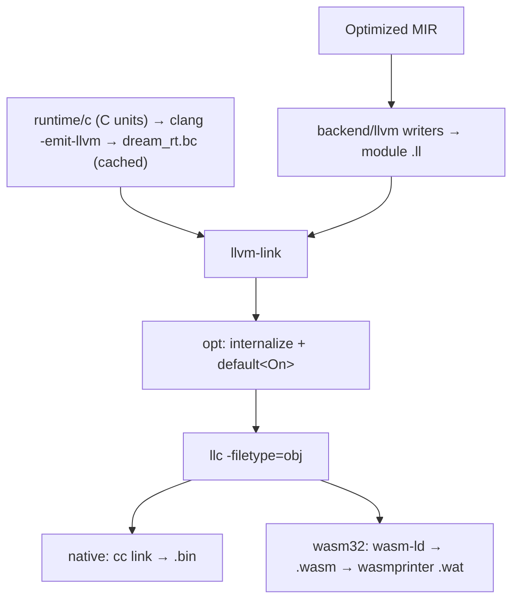

# 06 — LLVM Backend (`backend/llvm/`)

The backend lowers optimized Dream MIR straight to textual LLVM IR
(`crates/dream-mir/src/backend/llvm/`). The driver links that IR with the C runtime compiled to
bitcode, then runs the pinned LLVM toolchain (`llvm-link` → `opt` → `llc`). Native builds link the
object with the system `cc`. wasm32 builds link with wasi-sdk's `wasm-ld`, then pretty-print `.wat`
with `wasmprinter`.

Ownership is decided by MIR, and LLVM never decides it. Every `Retain`  /
`Release` / `ValueDrop` that MIR emits becomes exactly one runtime call or one inlined
glue sequence. LLVM may only optimize what those calls leave behind.

## The toolchain

Native Rust hosts live in `crates/dream-host-{core,net,gpu,webview}`, not in the compiler.
The root `dream` library is an rlib only and has no GUI/network host dependencies.
`cargo build --workspace` builds the compiler and all four native capability libraries:
`dream_host_core`, `dream_host_net`, `dream_host_gpu`, and `dream_host_webview` (with the
platform's shared-library prefix/suffix). `dream-host` is a distribution feature set, not
another host implementation: its independent `core`, `net`, `gpu`, and `webview` features
select these packages. Core-only builds do not compile networking or GUI dependencies.
For direct package builds, name the required capability packages as primary targets to put
their artifacts next to the compiler; dependency-only artifacts live in Cargo's `deps/`.
Guest callback binding and icon storage belong exclusively to the core library. Shared
`dream-host-abi` payload helpers call its C exports; `dream-host-gui` contains stateless icon
decoding/window helpers. Every other capability dynamically links core, with an adjacent-library
loader path. Build-time `@c` library discovery stays in `execution/native/c_link.rs`.

LLVM is pinned to one version (`LLVM_VERSION` in `src/execution/llvm/tools.rs`). `dream` resolves
it from `DREAM_LLVM` (a `bin/` directory or its parent), then from `dreamer toolchain install llvm`
under `~/.dream/toolchains/llvm-*`, and rejects any other major version. The installers
(`scripts/install.sh`, `install.ps1`, `use-toolchain.sh`) install it unless `DREAM_SKIP_LLVM=1`.
No crate links against LLVM: the IR is text, and the tools run as subprocesses.

The runtime bitcode (`src/execution/llvm/runtime.rs`, `wasm.rs`) is built by the pinned clang for
native targets and by wasi-sdk's clang for wasm32. It is cached per LLVM version, opt level and
`RuntimeNeed` under `target/dream-native-rt/` (in the repo) or `~/.dream/cache/native-rt/`, and
guarded by a file lock so concurrent compiles share one build.

Native `--relocatable` builds stage the four host libraries next to the executable and include
this link policy in the freshness stamp. Linux uses `$ORIGIN`; macOS libraries carry their
`@rpath/libdream_host_*.dylib` install identities from build time and executables use relative
search paths for adjacent libraries and `.app/Contents/Frameworks`. Bundled Unix libraries
are direct linker inputs rather than `-L` search directories, since Zig adds native search
directories to rpaths. Linux libraries carry filename-only SONAMEs; each non-core library finds
core through `$ORIGIN` (macOS: `@loader_path`). Windows ships the four `dream_host_*.dll` files
beside the executable, linking through their MSVC import libraries. `dreamer pack` copies the
whole family into each package layout. Normal development builds retain the validated absolute
toolchain lookup without copying libraries for every corpus case. Live-use selection is the
next distribution task; this split still links/stages the complete family.

## The writers

| Module | Role |
|--------|------|
| `ir/` | The textual IR printer: `ModuleWriter`, `FunctionWriter`, `Ty`, `Value`, attributes, numbered metadata. Every other writer builds on it; nothing else formats IR text |
| `lcx.rs` / `fx.rs` | Module-wide and per-function lowering state |
| `body.rs` | Sync functions and async (stub, poll, drop) triples |
| `statements.rs`, `rvalue.rs`, `places.rs`, `calls.rs`, `terminator.rs` | MIR statements, rvalues, places, calls and terminators |
| `int_ops.rs` | Integer arithmetic with Dream's semantics (below) |
| `types.rs`, `runtime_sigs.rs` | Dream types as LLVM types; the runtime's ABI as clang lowered it |
| `glue/` | Bodies with no MIR function: ARC `release_*`/`destroy_*`, protocol routers, function tables and itables, extern trampolines, wasm32 JS marshalers, the process entry |
| `js.rs` | Calls into JS and casts to and from `js` |
| `debug.rs`, `debug_views.rs` | DWARF |

`backend/shared/` holds codegen *policy* the writers consume: native layouts, symbol and string
tables, ARC glue selection, protocol routing, guarded devirtualization, JS marshaling rules.

Semantic layouts carry `destructor: Option<DefId>` for each nominal type. MIR pruning, region
safety, ARC effect analysis and allocation promotion consume this fact; native relayout preserves
it. Drop glue resolves the stored identity to its emitted function symbol, never a `{name}_del`
search. A generic class specialization has its own resolved destructor definition.

### Control flow

Every MIR block becomes one LLVM block, and every MIR terminator becomes one LLVM terminator, so
no control-flow recovery is needed. Every local is an entry `alloca` holding its value (for heap
and value locals, the handle is the payload address); `mem2reg`/SROA turn the slots into SSA.
Async poll functions dispatch on the durable program counter stored in the `Future` frame, then
continue in ordinary blocks.

### Reading the IR

The `.ll` next to a build is the frontend output, before any optimization, and reads like clang
`-O0`: entry `alloca`s, a load and store around every use, almost no `phi`s, guard branches on
constants, and one `abort` + `unreachable` block per MIR `Unreachable`. The build always runs
`opt` next, which promotes the slots, folds the constant guards and merges the trap blocks.
Building SSA in the printer would duplicate `mem2reg`, and replacing the `abort` with a bare
`unreachable` would turn a MIR invariant into undefined behavior.

Review performance on the optimized module instead: every build writes `<stem>.opt.ll` (the
whole program after `opt`, runtime included) and deletes the unoptimized `.ll` once linked;
`dream --emit-llvm file.dream` stops there and adds `<stem>.s`. Native `--crate-type lib` builds
keep the unoptimized `.ll`, which is their product.

### Values and handles

A reference is a `dream_ptr` handle: `i64` on native, `i32` on wasm32, converted with `inttoptr` at
each access. Pointer attributes such as `nonnull` or `dereferenceable` therefore do not apply.
Field and index access compute `base + offset` from the layouts in `Mir.layouts`
(`backend/shared/native_layout.rs` widens them for 8-byte native pointers).

Dream integer arithmetic wraps at its type's width, so the writers emit plain `add`/`mul`,
never `nsw`/`nuw`. Unsigned types compare, divide and shift unsigned. Shift counts are masked,
division by zero panics, and signed `MIN / -1` wraps. A constant divisor skips whichever of those
guards it rules out (non-zero, and not `-1` for signed types). Checked ops use the
`llvm.*.with.overflow` intrinsics and panic. `mustprogress` is never emitted, because Dream loops
may legitimately spin.

### The runtime ABI

The backend never spells a runtime signature. The driver disassembles the runtime bitcode (plus an
anchor unit that references every function the native header declares) and hands the
`define`/`declare`/`attributes`/`target` lines to `RuntimeSigs`. Every runtime call is typed from
that table, and a missing entry is an ICE.

- **Allocation** (`New`, `UnionNew`, `ArrayLit`) calls `dream_malloc(size, tag)` with the tag from
  `mir::abi`, initializes the fields or elements, and calls the user constructor when there is
  one. `shared class` instances allocate four extra bytes past their field layout for the lock
  word (`HEADER_LOCK_WORD_SIZE`), and retain/release for them use the atomic runtime helpers.
  Native allocation byte sizes and heap-header sizes use unsigned pointer-width `dream_size`
  (`size_t`); wasm32 keeps its i32 allocation ABI. Generated allocation operands are widened
  before runtime-call coercion, so native sizes never pass through an i32 truncation. Native
  headers are 32 bytes to preserve payload alignment and the live-block marker; tag/RC offsets
  relative to the payload are unchanged. Array/string element counts remain language `int`.
- **Locks** pass the object identity to the native runtime's per-object registry, whose entry is
  removed before heap recycling. WASM passes the address of the in-object lock word instead.
- **Managed stores** publish new children before installing them in shared fields or arrays.
  Inline structs and active value-union payloads use the same typed owned-reference walk as
  retain/drop glue; weak and unowned fields are excluded. Private heap owners skip the barrier.
  Raw/ref interiors and globals have no safe owning header, so their children are conservatively
  published once workers exist. Before the first worker, its initial graph handoff supplies the
  publication. This does not change MIR's retain/release or move decisions.
- **String literals** are interned into `constant` heap-object blocks (`__ds<n>_blk`: header plus
  UTF-16 payload). The runtime never writes an immortal block, so `constant` is sound.
- **Runtime units** are C under `crates/dream-mir/src/runtime/c/` (`wasm32/` for the wasm32 guest,
  shared `native/` units for every target). `TAG_*` constants and heap offsets live in `mir::abi`,
  kept in lockstep with `runtime/c/include/dream_abi.h`. `native/llvm_inline.c` holds the hot
  helpers the optimizer should see.

## Optimization record

Before the LLVM backend existed, Dream compiled through generated C. That C output of
`tests/bench/microbenches.dream` was compiled with the pinned clang 22 at
`-O3 -fsave-optimization-record`. The table counts missed-optimization remarks inside the ten
tracked bench functions (`fib_rec`, `linked_walk`, `arr_add`, `vec_add`, `matmul_64`,
`string_concat`, `string_builder`, `binary_trees`, `arc_locals`, `map_get_set`).

| Remark | Count | Cause |
|--------|-------|-------|
| `gvn:LoadClobbered`, clobbered by a call | 5681 | The runtime is opaque to clang, so every call might write any memory |
| `gvn:LoadClobbered`, clobbered by a store | 3018 | Same-typed `int32_t`/`dream_ptr` stores alias every other field of that C type |
| `licm:LoadWithLoopInvariantAddressInvalidated` | ~470 | Loop-invariant loads (array length, object fields) re-read every iteration |
| `inline:NoDefinition` | 449 | Runtime helpers live in `libdream_rt.a`, invisible to the optimizer |

Each candidate fix needed a proof source, an A/B switch and a measured gain. Every candidate was
first measured as an upper bound (applied everywhere it could possibly be applied) before any
proof was written:

| Item | Result |
|------|--------|
| Whole-program runtime | Shipped. `dream_rt.bc` is linked before `opt`, and everything except the entry points is internalized. This removes `NoDefinition` and lets LLVM infer the runtime's memory effects |
| TBAA | Not shipped. Only `map_clear_reuse` gains (0.63×). LLVM TBAA has no effective-type model, and the inlined allocator reuses a freed block for a different type, so the tags are not provably valid |
| `invariant.load` / `!range` | `invariant.load` on string lengths is unsound (`_into` rewrites the length word in place). `!range` gained nothing. Shipped instead: string literal blocks are `constant` |
| Memory effects / allocation attributes | Redundant with the whole-program runtime |
| `nsw` from a MIR no-wrap proof | Gained nothing on any kernel |
| `nonnull` | Does not apply: references are integer handles that go through `inttoptr` |
| Value-struct returns | Shipped. Internal functions returning a value struct write into a caller `alloca` passed as a trailing `ptr`. Function tables, itables and guarded interface arms point at a `name__boxed` wrapper that keeps the heap-box ABI. 6 ns → under 1 ns per call |
| Uniqueness alias scopes | Not built. The only alias-bound kernel is the one TBAA covers |

Against the C build, the LLVM build ran at 0.4–0.8× the time on most kernels (sieve 0.40×,
string_concat 0.58×, arc_locals 0.58×, binary_trees 0.74×), with char_scan and string_eq at parity.
Almost all of that came from the whole-program runtime plus MIR-level `ReleaseSink`, which lets
`_into` reuse fire.

## Debug info

`-g` / `debug-adapter` builds get DWARF from the printer (`debug.rs`):

- one `DICompileUnit`;
- a `DISubprogram` for every function whose MIR carries `DebugLine`, where an async poll function
  is named after its stub;
- a `DILocation` per `DebugLine`;
- a `#dbg_declare` per named local slot.

Every local, including a poll function's, lives in an entry `alloca`, so lldb reads values
straight from the slots. `debug_views.rs` types each reference local as a pointer to a composite
shaped like its runtime layout: `dream_Str` (length plus UTF-16 units), `dream_Arr_<elem>`, class
structs, and union views (tag plus an anonymous union of variant structs). The lldb formatters in
`dream_lldb_formatters.py` match those names.

Debug builds link the O0 runtime bitcode without DWARF. The whole program becomes a single
object, and lldb's Mach-O debug map reads one compile unit per object, so runtime units would
hide the Dream one.

## PGO

- `--profile` runs `opt` with `-pgo-kind=pgo-instr-gen-pipeline` and links through the pinned
  clang with `-fprofile-generate`. zig's linker lays out the `__llvm_prf_*` sections in a way that
  makes the profile runtime write corrupt counters.
- `--use-profile` merges the `.profraw` runs with the pinned `llvm-profdata`, then runs `opt` with
  `-pgo-kind=pgo-instr-use-pipeline`.

## wasm32

`--wasm` uses the same writers with a 32-bit handle and the `wasm32-wasip1` layout:

- **Runtime bitcode.** wasi-sdk's clang compiles `WASM32_CORE_C` plus `native/llvm_inline.c`
  with `-emit-llvm` (the `-pthread` variant for threaded modules). The pinned `llvm-link` merges
  the units, and an anchor unit over `dream_rt_wasm32.h` adds declarations for the header-only
  imports. The signature table keeps `wasm-import-module`/`wasm-import-name`, so host imports
  declared by the module match the runtime's exactly.
- **Link.** `llvm-link` merges the module `.ll` and the runtime `.bc`. `opt` then internalizes
  everything except the runtime's `wasm-export-name` functions, the module's own exports and
  `memcpy`/`memmove`/`memset`/`memcmp`, and runs `default<On>`. `llc -filetype=obj` follows, and
  wasi-sdk's `wasm-ld` links with the assembly objects and compiler-rt builtins
  (`src/driver/wasi.rs`). `wasm-opt`, the `.wat` printer and `.abi.json` follow.
- **Glue.** On wasm, `main` is exported as `dream_guest_entry`, which returns an async main's
  future to the host. The other exports are `__dream_main_report`, `dream_ft_get`,
  `__dream_drop_globals`, `__runtime_init` and the worker entry points. `g0` goes through
  `dream_g0_get`/`dream_g0_set`. Host imports take their module and field from the `extern`,
  and async imports are `void(future, params...)`, which JS settles through `__dream_resolve`.
- **JS interop.** A JS call fills 16-byte slots (tag, aux, payload) and calls the bridge import by
  name. The struct/union/array marshalers (`glue/js_marshal.rs`) follow the policy and slot layout
  in `backend/shared/js_marshal.rs`. Native builds route every JS call through the host's
  `dream_js_call`.

## Determinism

The writers must be a pure function of the MIR. Iterate `Vec`s in order and never iterate a
`std::HashMap`. Any lookup table that shapes output (string pool, metadata, function indices,
debug views) is an `IndexMap` or `BTreeMap`. Two compiles to the same output path produce
byte-identical `.ll` and `.wasm`; the output file name is part of the module, so only compare
builds written to the same path. `codegen_is_deterministic` in `tests/e2e_tests.rs` enforces this.
