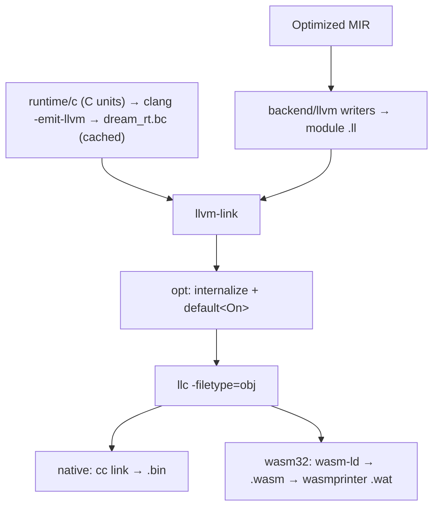

# 06 — LLVM Backend (`backend/llvm/`)

The LLVM backend turns validated MIR into textual LLVM instructions. The execution tools then combine that output with the runtime and build a native program or WebAssembly module. This chapter explains the boundary and its invariants.

Ownership is decided by MIR, and LLVM never decides it. Every `Retain`  /
`Release` / `ValueDrop` that MIR emits becomes exactly one runtime call or one inlined
glue sequence. LLVM may only optimize what those calls leave behind.

## The toolchain

The driver resolves one `Target::Llvm(TargetSpec)` and passes it through runtime
signature loading and MIR emission. Shared target data lives in `dream-abi::target`
so MIR does not depend on the driver. `target-lexicon` parses triples and determines
pointer width, including x32/ILP32 ABIs; pointer alignment is the pointer width for
the supported 32/64-bit targets. `TargetAbi` and future headers use these facts,
rather than Rust's host `usize` layout.

Native runtime clang invocations use the selected triple. Development runtime
caches are separated by triple and their stamps include that triple. Native
linking receives the same specification when loading the runtime again. Emitted
IR retains clang's canonical target spelling, including its MSVC version suffix.
macOS defaults to deployment version 11.0;
`--min-os 13.2` selects a different version for the runtime, generated module and
linker. Installed prebuilt runtimes support their packaged host specification;
other specifications require a development runtime build.

This target foundation does not yet enable cross-target native linking or unify
aggregate layouts.

Before generated IR adopts the runtime header, `RuntimeSigs` validates the parsed runtime triple
and address-space-zero pointer layout against the selected `TargetSpec`. Clang's canonical MSVC
version suffix is accepted without weakening architecture, OS, environment, width, or alignment
checks. A mismatch, malformed table, or missing runtime symbol reports `CompileError::Toolchain`
with the exact `dream_rt.sigs` cache path, so stale artifacts are actionable rather than ICEs.

Native Rust hosts live in `crates/dream-host-{core,net,gpu,webview,unicode,crypto,process,timezone}`, not in the compiler.
The root `dream` library is an rlib only and has no GUI/network host dependencies.
`cargo build --workspace` builds the compiler and all eight native capability libraries:
`dream_host_core`, `dream_host_net`, `dream_host_gpu`, `dream_host_webview`,
`dream_host_unicode`, `dream_host_crypto`, `dream_host_process`, and `dream_host_timezone` (with the
platform's shared-library prefix/suffix). `dream-host` is a distribution feature set, not
another host implementation: its independent capability features
select these packages. Core-only builds do not compile networking or GUI dependencies.
For direct package builds, name the required capability packages as primary targets to put
their artifacts next to the compiler; dependency-only artifacts live in Cargo's `deps/`.
Guest callback binding and icon storage belong exclusively to the core library. Shared
`dream-host-abi` payload helpers call its C exports; `dream-host-gui` contains stateless icon
decoding/window helpers. Every other capability dynamically links core, with an adjacent-library
loader path. Build-time `@c` library discovery stays in `execution/native/c_link.rs`.

LLVM is pinned to one version (`LLVM_VERSION` in `src/execution/llvm/tools.rs`). `dream` resolves
it from `DREAM_LLVM` (a `bin/` directory or its parent), then from `dreamer toolchain install llvm`
under `~/.dream/toolchains/llvm-*`, and rejects any other major version. The installers
(`scripts/install.sh`, `install.ps1`, `use-toolchain.sh`) install it unless `DREAM_SKIP_LLVM=1`.
No crate links against LLVM: the IR is text, and the tools run as subprocesses.

The driver captures toolchain configuration once in `driver/toolchain/environment.rs`.
One shared `ToolchainConfig` is passed through the compiler, generators, native links,
runtime builds, packing and debugger setup. LLVM/linker discovery and the macOS SDK query
are cached per configuration, not process-global. Runtime catalogs receive their source
root explicitly and never read the environment. `DREAM_HOME`, `DREAM_BIN`, `DREAM_LLVM`,
`DREAM_CC`/`CC`, `DREAM_CXX`/`CXX`, `DREAM_TOOLCHAINS` and `DREAM_RUNTIME_C` keep their
documented search roles. Windows uses `USERPROFILE` for the default install prefix.

The runtime bitcode (`src/execution/llvm/runtime.rs`, `wasm.rs`) is built by the pinned clang for
native targets and by the pinned clang with WASI headers for wasm32. It is cached per LLVM version, opt level and
`RuntimeNeed` under `target/dream-native-rt/` (in the repo) or `~/.dream/cache/native-rt/`, and
guarded by a file lock so concurrent compiles share one build.

Native links select host libraries from the ABI sidecar's `host_capabilities` inventory.
The exact native export inventory in `dream-abi::host_capability` selects libraries from live
`(module, field)` imports after MIR pruning; loading a stdlib package alone does not select a
host. Core owns only shared guest callbacks and icon state. Each optional service depends on
that single core instance. Programs with no live host imports skip core binding, library
discovery and linking, including staticlib and cdylib outputs. Native executable icon resources
remain available without a host; an icon registration constructor is emitted only when a host
capability needs core. Repacking removes obsolete host libraries in the same transaction as
publishing the new products. The linker and packager share the typed manifest reader and
canonical capability ordering.

Release measurements on macOS arm64 (2026-10-05), with no manual stripping:

- Before splitting, the core library was 1,922,512 bytes. An isolated shared-state build was
  386,448 bytes; adding one service measured Unicode at 574,304 bytes, crypto at 423,504 bytes,
  process at 474,256 bytes, and timezone at 1,611,728 bytes. These isolated builds retain the
  same shared-state implementation and release dependency settings; differences identify
  service contributions, rather than claiming independently additive bundle sizes.
- After splitting, core is 386,544 bytes, Unicode 555,408, crypto 420,912, process 472,880,
  and timezone 1,592,832. A native `-O3` Hello World is 52,984 bytes and ships no Dream library;
  its executable-plus-library bundle therefore also totals 52,984 bytes.
  Compiler binaries, debug libraries, intermediate outputs and filesystem allocation units
  are excluded from these artifact measurements.
- Separate Rust cdylibs repeat some standard-library support. Selecting all four optional
  services plus core totals 3,428,576 bytes; the split favors programs using only selected
  services and does not promise that an all-service bundle shrinks.

`scripts/check-binary-size.py` executes Hello World without a Dream library search path,
inspects PE/ELF/Mach-O dependencies, and reports release sizes for the executable,
core and each optional service. These measurements have no fixed byte limits; future service
features can grow while dependency isolation remains a hard gate.
`dreamer`'s minimal-pack regression also performs a real capability-heavy to minimal repack.

Native platform-runner measurements on 2026-10-05 use `-O3` Hello World and unstripped
release host libraries. Each Hello World has an empty capability inventory, no Dream library
imports or bundled libraries, and runs with only the system library search path:

- Windows x64/MSVC: Hello World 158,208 bytes; core 121,344; Unicode 293,376; crypto 185,344;
  process 267,264; timezone 1,395,712. The Hello World bundle shrinks from the original
  1,950,208-byte Windows baseline to 158,208 bytes (91.9%); the required core DLL is removed.
- Linux x64: Hello World 22,648 bytes; core 418,120; Unicode 598,720; crypto 489,848;
  process 550,368; timezone 2,333,424.
- macOS arm64 runner: Hello World 52,648 bytes; core 390,496; Unicode 577,888; crypto 425,392;
  process 497,728; timezone 1,612,352. Runner library measurements differ from the local
  macOS build above; compare builds within their recorded environment.

The platform reports are artifacts of [CI run 37278462482](https://github.com/sps014/dream/actions/runs/37278462482).

ABI sidecars are mandatory, including generator harnesses and `dream test` runners; harness
cache fingerprints include the ABI emitter and capability schema/registry.

Native `--relocatable` builds stage the selected host libraries next to the executable and include
this link policy in the freshness stamp. Linux uses `$ORIGIN`; macOS libraries carry their
`@rpath/libdream_host_*.dylib` install identities from build time and executables use relative
search paths for adjacent libraries and `.app/Contents/Frameworks`. Bundled Unix libraries
are direct linker inputs rather than `-L` search directories, since Zig adds native search
directories to rpaths. Linux libraries carry filename-only SONAMEs; each non-core library finds
core through `$ORIGIN` (macOS: `@loader_path`). Windows ships the selected `dream_host_*.dll` files
beside the executable, linking through their MSVC import libraries. `dreamer pack` copies the
selected libraries into each package layout, ignoring unused artifacts left by other builds.
Normal development builds retain the validated absolute toolchain lookup without copying
libraries for every corpus case. A core-only program needs only the core host library installed.

The final native link dead-strips unreachable code (`-dead_strip` on macOS, `--gc-sections`
on Linux). Linux `llc` emits separate function/data sections so collection can operate below
whole-object granularity; both policies participate in native binary cache stamps. Windows
link policy is unchanged. Native source-set runtime exports remain roots through the existing
`internalize-public-api-list`; foreign callbacks and entry points must survive collection.

CI builds the release core and optional-service libraries, then `scripts/check-binary-size.py`
compiles and runs `tests/size/hello.dream` at `-O3` in an isolated relocatable package.
It uploads raw artifact measurements as `binary-size-<OS>-<arch>` without fixed byte limits.
Debug host artifacts are not size baselines.

## The writers

| Module | Role |
|--------|------|
| `ir/` | The textual IR printer: `ModuleWriter`, `FunctionWriter`, `Ty`, `Value`, attributes, numbered metadata. Every other writer builds on it; nothing else formats IR text |
| `lcx.rs` / `fx.rs` | Module-wide and per-function lowering state |
| `body.rs` | Sync functions and async (stub, poll, drop) triples |
| `statements.rs`, `rvalue.rs`, `places.rs`, `calls.rs`, `terminator.rs` | MIR statements, rvalues, places, calls and terminators |
| `int_ops.rs` | Integer arithmetic with Dream's semantics (below) |
| `types.rs`, `runtime_sigs.rs` | Dream types as LLVM types; the runtime's ABI as clang lowered it |
| `glue/` | Bodies with no MIR function: ARC `release_*`/`destroy_*`, protocol routers, function tables and itables, extern trampolines, wasm32 JS marshalers, the process entry |
| `js.rs` | Calls into JS and casts to and from `js` |
| `debug.rs`, `debug_views.rs` | DWARF |

`backend/shared/` holds codegen *policy* the writers consume: native layouts, symbol and string
tables, ARC glue selection, protocol routing, guarded devirtualization, JS marshaling rules.

Semantic layouts carry `destructor: Option<DefId>` for each nominal type. MIR pruning, region
safety, ARC effect analysis and allocation promotion consume this fact; native relayout preserves
it. Drop glue resolves the stored identity to its emitted function symbol, never a `{name}_del`
search. A generic class specialization has its own resolved destructor definition.

### Control flow

Every MIR block becomes one LLVM block, and every MIR terminator becomes one LLVM terminator, so
no control-flow recovery is needed. Every local is an entry `alloca` holding its value (for heap
and value locals, the handle is the payload address); `mem2reg`/SROA turn the slots into SSA.
Async poll functions dispatch on the durable program counter stored in the `Future` frame, then
continue in ordinary blocks.

### Reading the IR

The `.ll` next to a build is the frontend output, before any optimization, and reads like clang
`-O0`: entry `alloca`s, a load and store around every use, almost no `phi`s, guard branches on
constants, and one `abort` + `unreachable` block per MIR `Unreachable`. The build always runs
`opt` next, which promotes the slots, folds the constant guards and merges the trap blocks.
Building SSA in the printer would duplicate `mem2reg`, and replacing the `abort` with a bare
`unreachable` would turn a MIR invariant into undefined behavior.

Review performance on the optimized module instead: every build writes `<stem>.opt.ll` (the
whole program after `opt`, runtime included) and deletes the unoptimized `.ll` once linked;
`dream --emit-llvm file.dream` stops there and adds `<stem>.s`. Native `[lib].output-type = "staticlib"` and `"cdylib"` in `dream.toml` build an archive or shared library, respectively,
plus a C header and ABI sidecar. The manifest selects one library output. There is no process
entry; `@export` definitions are reachability roots. Their private bodies have separate structural
symbols, and public wrappers use the plain ABI (including the value-box return convention), with
no caller-location argument. The wrappers initialize module globals once and check that the
calling thread is attached. Consumers serialize the first call and attach each additional thread.

Library source locations use the manifest package name and paths relative to the package root.
The library's sources supply their own panic lines; stdlib and `dream_packages/` functions forward
the library caller's location. Library builds skip MIR inlining to preserve each source body's
line markers; LLVM can inline after locations have become constant operands. LLVM disassembly
omits the input-path ModuleID comment. Prebuilt Dream-to-Dream library linking is not implemented;
its future interface metadata must describe the hidden caller-location ABI explicitly.

Static archives include compiled native sources and any vendored runtime archive. A `.link.json`
sidecar lists additional linker arguments for system libraries and required capability libraries.
Shared libraries retain exactly the explicit exports and embedding API in their dynamic symbol
list. Both kinds use PIC objects.

### Reference values and integer boundaries

Native `dream_ptr` values use LLVM opaque `ptr` and a C pointer typedef. Reference locals,
arguments, returns, nullable values, stored reference fields, closure environments and future
frames preserve that representation. Wasm32 instead retains `i32` linear-memory offsets at
its guest/runtime/JS boundary; this difference comes from the selected target's linear-memory
capability, not the host process architecture. `isize`/`usize` use a separate target-width
integer representation and are never a substitute for reference types.

Field, header, element and interior addresses use plain `getelementptr` with layout-derived
byte offsets and target-width indices. Loads/stores retain their actual element types and
proven alignment, including reference fields inside inline value aggregates. `LayoutTable`
supplies sizes/offsets/alignment once, for the selected target. Null references are pointer
null, compared as pointers on native. An integer function-table selector or worker ID does
not become a pointer merely because the operation also receives an environment reference.
Synthetic closure/string-cursor integer locals are classified by their address-producing
operations and aliases; scalar call results, lengths and comparisons do not inherit that
classification from their arguments. JS registry handles remain integer IDs.

Integer conversions are explicit at genuine boundaries: `CPtr.raw` is a `usize` raw address
whose C marshaller converts it to/from a foreign pointer; address hashes and allocator range
registries use `uintptr_t`; scheduler result words and weak discriminant transport carry
tagged scalar payload bits. Such transport does not grant ownership, extend a lifetime or
authorize dereferencing an arbitrary integer. Normal managed field/index access does not
round-trip its reference through an integer. The runtime ABI and host callback signatures
must migrate together, and rebuilt `RuntimeSigs` rejects stale signatures rather than
silently adapting the old ABI.

Pointers are not an exclusivity proof. No blanket `noalias`, TBAA, alias scopes,
`invariant.load`, `nonnull`, `dereferenceable` or `inbounds` follows from ARC, refcount one,
parameter mode or the pointer representation. Optional facts require an identified semantic
proof producer, lifetime scope, negative regression and measurement. Whole-program runtime
linking already lets LLVM infer valid facts. See
[the migration inventory and measurements](12-native-pointer-migration.md).

Dream integer arithmetic wraps at its type's width, so the writers emit plain `add`/`mul`,
never `nsw`/`nuw`. Unsigned types compare, divide and shift unsigned. Shift counts are masked,
division by zero panics, and signed `MIN / -1` wraps. A constant divisor skips whichever of those
guards it rules out (non-zero, and not `-1` for signed types). Checked ops use the
`llvm.*.with.overflow` intrinsics and panic. `mustprogress` is never emitted, because Dream loops
may legitimately spin.

### The runtime ABI

The backend never spells a runtime signature. The driver disassembles the runtime bitcode (plus an
anchor unit that references every function the native header declares) and hands the
`define`/`declare`/`attributes`/`target` lines to `RuntimeSigs`. Every runtime call is typed from
that validated table. A missing entry rejects the stale runtime cache before any IR is written.

- **Allocation** (`New`, `UnionNew`, `ArrayLit`) calls `dream_malloc(size, tag)` with the tag from
  `mir::abi`, initializes the fields or elements, and calls the user constructor when there is
  one. `shared class` instances allocate four extra bytes past their field layout for the lock
  word (`HEADER_LOCK_WORD_SIZE`), and retain/release for them use the atomic runtime helpers.
  Native allocation byte sizes and heap-header sizes use unsigned pointer-width `dream_size`
  (`size_t`); wasm32 keeps its i32 allocation ABI. Generated allocation operands are widened
  before runtime-call coercion, so native sizes never pass through an i32 truncation. Native
  headers are 32 bytes to preserve payload alignment and the live-block marker; tag/RC offsets
  relative to the payload are unchanged. Array/string element counts remain language `int`.
- **Locks** pass the object identity to the native runtime's per-object registry, whose entry is
  removed before heap recycling. WASM passes the address of the in-object lock word instead.
- **Managed stores** publish new children before installing them in shared fields or arrays.
  Inline structs and active value-union payloads use the same typed owned-reference walk as
  retain/drop glue; weak and unowned fields are excluded. Private heap owners skip the barrier.
  Raw/ref interiors and globals have no safe owning header, so their children are conservatively
  published once workers exist. Before the first worker, its initial graph handoff supplies the
  publication. This does not change MIR's retain/release or move decisions.
- **String literals** are interned into `constant` heap-object blocks (`__ds<n>_blk`: header plus
  UTF-16 payload). The runtime never writes an immortal block, so `constant` is sound.
- **Runtime units** are C under `crates/dream-mir/src/runtime/c/` (`core/` for portable logic,
  `sys/native/`, `sys/wasi/` and `sys/shared/` for platform services). `TAG_*` constants and heap offsets live in `mir::abi`,
  kept in lockstep with `runtime/c/include/dream_abi.h`. `core/inlines.c` holds the hot
  helpers the optimizer should see.

## Optimization record

Before the LLVM backend existed, Dream compiled through generated C. That C output of
`tests/bench/microbenches.dream` was compiled with the pinned clang 22 at
`-O3 -fsave-optimization-record`. The table counts missed-optimization remarks inside the ten
tracked bench functions (`fib_rec`, `linked_walk`, `arr_add`, `vec_add`, `matmul_64`,
`string_concat`, `string_builder`, `binary_trees`, `arc_locals`, `map_get_set`).

| Remark | Count | Cause |
|--------|-------|-------|
| `gvn:LoadClobbered`, clobbered by a call | 5681 | The runtime is opaque to clang, so every call might write any memory |
| `gvn:LoadClobbered`, clobbered by a store | 3018 | Same-typed `int32_t`/`dream_ptr` stores alias every other field of that C type |
| `licm:LoadWithLoopInvariantAddressInvalidated` | ~470 | Loop-invariant loads (array length, object fields) re-read every iteration |
| `inline:NoDefinition` | 449 | Runtime helpers live in `libdream_rt.a`, invisible to the optimizer |

Each candidate fix needed a proof source, an A/B switch and a measured gain. Every candidate was
first measured as an upper bound (applied everywhere it could possibly be applied) before any
proof was written:

| Item | Result |
|------|--------|
| Whole-program runtime | Shipped. `dream_rt.bc` is linked before `opt`, and everything except the entry points is internalized. This removes `NoDefinition` and lets LLVM infer the runtime's memory effects |
| TBAA | Not shipped. Only `map_clear_reuse` gains (0.63×). LLVM TBAA has no effective-type model, and the inlined allocator reuses a freed block for a different type, so the tags are not provably valid |
| `invariant.load` / `!range` | `invariant.load` on string lengths is unsound (`_into` rewrites the length word in place). `!range` gained nothing. Shipped instead: string literal blocks are `constant` |
| Memory effects / allocation attributes | Redundant with the whole-program runtime |
| `nsw` from a MIR no-wrap proof | Gained nothing on any kernel |
| `nonnull` | Not emitted as a blanket fact after native pointer migration; nullable/shared/interior inputs require separate proofs |
| Value-struct returns | Shipped. Internal functions returning a value struct write into a caller `alloca` passed as a trailing `ptr`. Function tables, itables and guarded interface arms point at a `name__abi` wrapper that keeps the heap-box ABI. 6 ns → under 1 ns per call |
| Uniqueness alias scopes | Not built. The only alias-bound kernel is the one TBAA covers |

Against the C build, the LLVM build ran at 0.4–0.8× the time on most kernels (sieve 0.40×,
string_concat 0.58×, arc_locals 0.58×, binary_trees 0.74×), with char_scan and string_eq at parity.
Almost all of that came from the whole-program runtime plus MIR-level `ReleaseSink`, which lets
`_into` reuse fire.

## Debug info

`-g` / `debug-adapter` builds get DWARF from the printer (`debug.rs`):

- one `DICompileUnit`;
- a `DISubprogram` for every function whose MIR carries `DebugLine`, where an async poll function
  is named after its stub;
- a `DILocation` per `DebugLine`;
- a `#dbg_declare` per named local slot.

Every local, including a poll function's, lives in an entry `alloca`, so lldb reads values
straight from the slots. `debug_views.rs` types each reference local as a pointer to a composite
shaped like its runtime layout: `dream_Str` (length plus UTF-16 units), `dream_Arr_<elem>`, class
structs, and union views (tag plus an anonymous union of variant structs). The lldb formatters in
`dream_lldb_formatters.py` match those names.

Debug builds link the O0 runtime bitcode without DWARF. The whole program becomes a single
object, and lldb's Mach-O debug map reads one compile unit per object, so runtime units would
hide the Dream one.

## The `@c` shim

The backend never encodes the C ABI itself. `glue/c_shim.rs` describes every `@c` import as a
`dream_abi::c_abi::shim::CShim`. Each import gets a forward shim (`dream_cs_<name>`) taking Dream's
carrier types: `bool`/`char`/`byte` as `int32_t`, a struct as a pointer to its Dream layout, and a
struct result as a leading out-pointer. Each C function-pointer wrapper (`glue/c_reverse.rs`) gets
a reverse adapter with the real C signature that calls the Dream body `<wrapper>__body`. Each
`@owned("free_fn")` import gets a getter for `free_fn`'s address. The driver renders the
description to C (`src/driver/ffi_shim/c_shim.rs`) next to the `.ll` as `<stem>.cshim.c`. The pinned
clang compiles it for the target triple (`src/execution/llvm/c_shim.rs`), and `llvm-link` merges it
before `opt`, so the forward shims (`always_inline`) disappear into their callers. Clang owns
struct classification, narrow-scalar extension and `__attribute__((stdcall))`. The `@cpp` shim
(`ffi_shim/cpp_shim.rs`) spells scalars with the same `dream_types::CScalar` vocabulary.

Every native program keeps `dream_abi::c_abi::EMBED_EXPORTS` (the `dream_embed.h` API) through
internalize, so C linked into it can call them.

## PGO

- `--profile` runs `opt` with `-pgo-kind=pgo-instr-gen-pipeline` and links through the pinned
  clang with `-fprofile-generate`. zig's linker lays out the `__llvm_prf_*` sections in a way that
  makes the profile runtime write corrupt counters.
- `--use-profile` merges the `.profraw` runs with the pinned `llvm-profdata`, then runs `opt` with
  `-pgo-kind=pgo-instr-use-pipeline`.

## wasm32

`--wasm` uses the same writers with a 32-bit handle and the `wasm32-wasip1` layout:

- **Runtime bitcode.** wasi-sdk's clang compiles shared `CORE_C` plus `WASI_SYS_C`
  with `-emit-llvm` (the `-pthread` variant for threaded modules). The pinned `llvm-link` merges
  the units, and an anchor unit over `dream_rt_wasm32.h` adds declarations for the header-only
  imports. The signature table keeps `wasm-import-module`/`wasm-import-name`, so host imports
  declared by the module match the runtime's exactly.
- **Link.** `llvm-link` merges the module `.ll` and the runtime `.bc`. `opt` then internalizes
  everything except the runtime's `wasm-export-name` functions, the module's own exports and
  `memcpy`/`memmove`/`memset`/`memcmp`, and runs `default<On>`. `llc -filetype=obj` follows, and
  wasi-sdk's `wasm-ld` links with the assembly objects and compiler-rt builtins
  (`src/driver/wasi.rs`). `wasm-opt`, the `.wat` printer and `.abi.json` follow.
- **Glue.** On wasm, `main` is exported as `dream_guest_entry`, which returns an async main's
  future to the host. The other exports are `__dream_main_report`, `dream_ft_get`,
  `__dream_drop_globals`, `__runtime_init` and the worker entry points. `g0` goes through
  `dream_g0_get`/`dream_g0_set`. Host imports take their module and field from the `extern`,
  and async imports are `void(future, params...)`, which JS settles through `__dream_resolve`.
- **JS interop.** A JS call fills 16-byte slots (tag, aux, payload) and calls the bridge import by
  name. The struct/union/array marshalers (`glue/js_marshal.rs`) follow the policy and slot layout
  in `backend/shared/js_marshal.rs`. Native builds route every JS call through the host's
  `dream_js_call`.

## Determinism

The writers must be a pure function of the MIR. Iterate `Vec`s in order and never iterate a
`std::HashMap`. Any lookup table that shapes output (string pool, metadata, function indices,
debug views) is an `IndexMap` or `BTreeMap`. Two compiles to the same output path produce
byte-identical `.ll` and `.wasm`; the output file name is part of the module, so only compare
builds written to the same path. `codegen_is_deterministic` in `tests/e2e_tests.rs` enforces this.

## Mobile packaging boundary

`dream-abi::target` accepts iOS device/simulator and Android arm64/x86_64 targets. iOS
deployment versions are stored separately from target-lexicon's OS enum and are rendered
by `TargetSpec::llvm_triple`; runtime signature validation checks deployment versions too.
Cross library object emission uses the selected target and emits its C header/ABI sidecar.
The sidecar's typed `export_functions` carries the plain ABI's C types, bridge kinds and
ownership, so mobile bridges do not parse source or C declarations.

`dreamer pack --target ios|android --slice TRIPLE=LIBRARY` consumes already linked
target-specific slices with their adjacent generated interfaces. It generates Objective-C
or JNI/Java wrappers, compiles them with Xcode or the NDK/JDK, and assembles XCFrameworks
or deterministic AAR archives. Mobile runtime/capability linking is explicit; desktop
host libraries are never substituted for mobile dependencies. SDK-backed full packaging
requires Xcode iOS SDKs or an Android NDK, independently of object-emission tests.

### WASM package interop

`wasm_sources` compiles live package C/C++ sources and generated `@cpp` adapters to target
bitcode before the combined LLVM optimization pipeline. Generated forward/reverse C shims join
the same module. ABI sidecars and shim sources are written before linking; unresolved package
functions are checked against runtime and declared JS imports after linking. Scalar ABI mismatches
are checked against clang's bitcode signatures before linking.

WASI libc and exception-enabled C++ archives remain linker inputs. Their allocator entry points
use the guest heap with aligned C payloads; stdio syscall adapters use Dream's encoded output
platform service. Package constructors run after heap initialization, and registered destructors
and stdio exit hooks run after Dream global drops.

Shared-memory packages use the `wasm32-wasip1-threads` headers and archives and compile
sources with `-pthread`. The linker exports `__tls_size`, `__tls_align` and `__wasm_init_tls`.
The JS loader initializes the heap, allocates one block containing a worker stack and a separate
aligned TLS region, calls the linker-generated initializer, then runs module initialization.
Each worker receives the TLS template independently; worker-pool calls retain that worker's TLS.
Global constructors run once for the shared module, after the primary instance's TLS is ready.
Node worker termination completes before its allocation is freed.

`tests/wasm_interop.rs` checks initialized and zero-filled TLS, 256-byte alignment, a TLS block
larger than the worker stack, WASI libc `errno`, concurrent-worker isolation, worker-pool
persistence and C++ constructor/destructor behavior. TLS tests execute at O0, O3 and `-Os`.
Threaded C++ exception handling uses WASI clock adapters backed by Dream's existing time hosts.
Selective JS runtime chunks come from the final WASM import section, including imports added
by C/C++ libraries after MIR pruning. Release runtime packaging includes both WASI sysroots.
Dream Task workers provide the threads; this does not add a WASI `pthread_create` host service.
