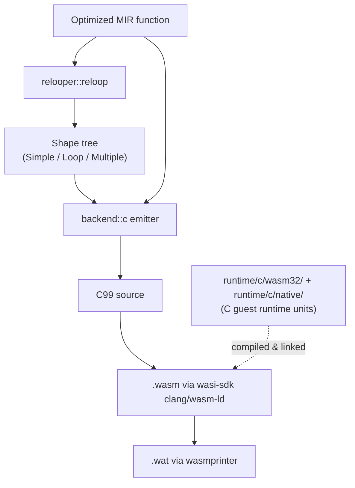
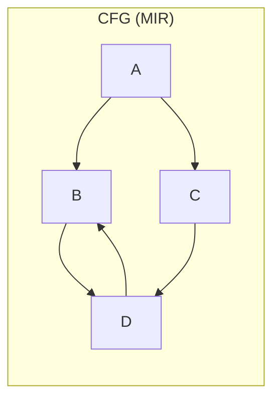
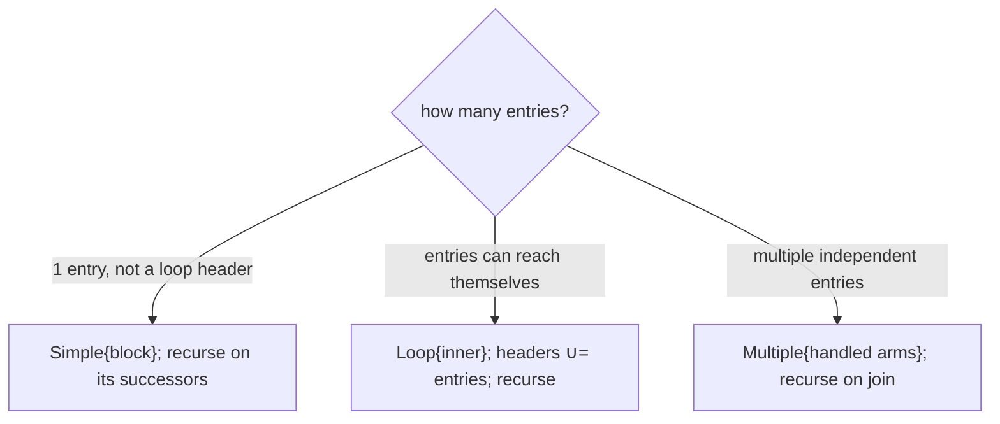
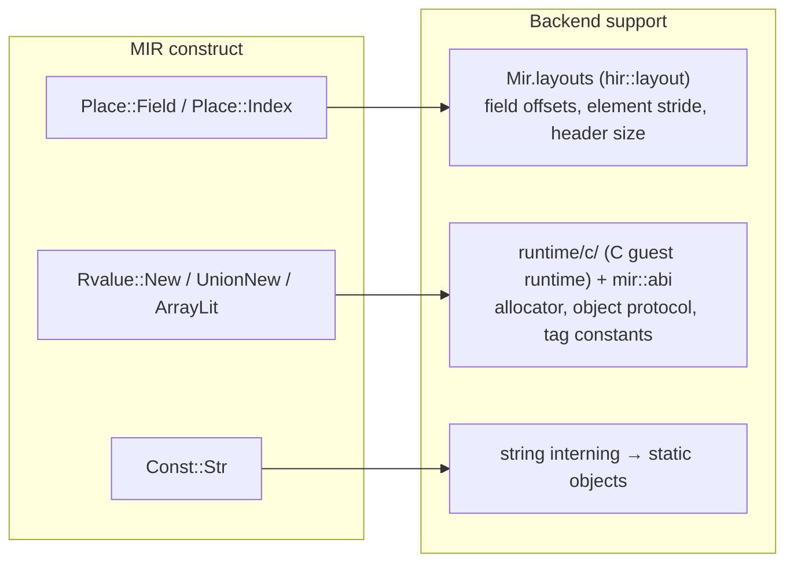

# 06 — Relooper & C99 Backend (`relooper.rs`, `backend/c/`)

The backend turns optimized MIR into **C99** (`backend/c`). For wasm32 targets that C is compiled by wasi-sdk clang/wasm-ld to `.wasm`, then pretty-printed to `.wat` with `wasmprinter`; native targets stop at the `.c` + host cc. The hard part is control flow: MIR is an unstructured CFG of basic blocks, and the relooper recovers the structured shapes (loops, diamonds) that structured emission is informed by.

## The two-layer backend



- `relooper::reloop(func) -> Option<Shape>` recovers structured shapes from the CFG.
- `backend::c::emit_c_module_for(mir, interner, target)` walks each function into C statements. Sync functions walk [`relooper::reloop`](https://github.com/sps014/dream/blob/main/crates/dream-mir/src/relooper.rs) into nested `for (;;)` / `if` / `switch` (`backend/c/shape.rs`), with `goto` only for leftover join edges. Async poll functions keep a `$__pc` program counter + dispatch `switch` for suspend/resume. Guest runtime helpers are C units under `runtime/c/wasm32/` plus shared `runtime/c/native/` (compiled by wasi-sdk — see `src/driver/c_wasm32.rs`); PCRE2 regex links `runtime/c/regex.c` + `runtime/c/pcre2/`.

## The relooper

### Why it is needed



A CFG like this (a diamond whose join loops back) is a tangle of gotos if emitted block-by-block. The relooper discovers that `B → D → B` forms a loop and that `A` branches into two arms, and produces a tree of **shapes** the emitter can translate into structured control flow (nested `while`/`if` in C) instead of raw goto spaghetti.

### Shapes — the `Shape` enum

```rust
pub enum Shape {
    Simple   { block: BlockId,      next: Option<Box<Shape>> }, // one block, then the rest
    Loop     { inner: Box<Shape>,   next: Option<Box<Shape>> }, // cyclic region in a `loop`, then rest
    Multiple { handled: Vec<Shape>, next: Option<Box<Shape>> }, // independent arms, then the join
}
```

### The algorithm (`Relooper::make`)

`make(entries, within, headers)` recursively builds the shape for the sub-CFG restricted to `within`, entered at `entries`, where `headers` are the entry blocks of *enclosing* loops:



The one subtle point — and the bug fixed during development — is **back-edges**. Inside a `Loop`, an edge back to the loop header is a `continue`, *not* forward control flow. So `succs` and `reach` **filter out `headers`**: they never traverse back into an enclosing loop's entry. Without this filter, `make_loop` re-detects the header as a fresh loop entry and recurses forever (stack overflow). This is why `headers: &BTreeSet<BlockId>` is threaded through every recursive call.

Because Dream's surface syntax only generates reducible CFGs, `reloop` always returns `Some`. It is typed `Option<Shape>` so an irreducible graph would fail loudly rather than miscompile.

## The emitter (`crates/dream-mir/src/backend/c/`)

### Sync: structured C control flow

Sync functions are emitted by walking the relooper shape tree (`backend/c/shape.rs`) when every
`Loop` has a single Simple header — nested `for (;;)` / `if` / `switch`, with labels and `goto`
only where a shape's exit cannot be a `break`/`continue`/fallthrough. Functions whose reloop tree
contains a multi-entry loop (`Loop` wrapping `Multiple`) keep the label+goto walk, which is the
safe lowering after inlining a looping callee. MIR terminators map onto C statements: fallthrough
`Goto` is omitted, a back-edge to a single-header loop is `continue` (or `goto Lheader`), a loop
exit is `break`, `If` folds into `if`/`else` when the next shape is `Multiple`, and `Switch` is a
C `switch` (dense 0..n tables still use computed `goto *`).

```c
for (;;) {
  if (!cond) break;
  /* … body; fallthrough continues the loop … */
}
/* exit arm(s) */
```

**Async poll functions** keep a `$__pc` + dispatch-`switch` resume loop: suspend/resume must save and
restore a durable program counter in the `Future` frame.

### Statements, operands, types

- Interned types map to C types via the interner: `i32`-class primitives for ints/bools/chars, `i64` for longs, `f32`/`f64` for floats, and pointers (`CTy::Ptr`) for references into the heap.
- Binops pick the C operator from `(BinOp, operand type)` — signed vs unsigned comparisons included.
- Operands lower trivially: `Const` → a literal; `Copy(Place::Local)` → the local's C name.

### Runtime integration points

Three families of operations lean on the embedded runtime layers and the layout tables carried down from HIR:



- **Field/index access** uses the struct/array **layout** in `Mir.layouts` (built by `hir::layout`, threaded through lowering) to compute `base + offset` loads/stores with width-aware ops.
- **Allocation/construction** (`New`, `UnionNew`, `ArrayLit`) emits an inline `dream_malloc(size, tag)` — tag from `mir::abi` — then sets the header/refcount, initializes fields/elements, and calls the user constructor when one exists. `@shared class` instances allocate **four extra bytes** past their field layout for an embedded reentrant lock word (see `HEADER_LOCK_WORD_SIZE` in `mir::abi.rs`); retain/release for `@shared` types go through the atomic RMW helpers in the runtime instead of the ordinary non-atomic retain/release path.
- **String constants** are interned into static heap-object definitions (header + UTF-16 payload), so identical literals share one symbol (`__ds<n>`).

The allocator, string, object-protocol, float/double formatter, and async scheduler runtimes are C units under `crates/dream-mir/src/runtime/c/` (`wasm32/` for the wasm32 guest, shared `native/` units for every target; see that README). `TAG_*` constants and heap offsets live in `mir::abi` lockstep with `runtime/c/include/dream_abi.h`. The wasm32 link list, PCRE2 sources, and `--global-base` are cataloged in `crates/dream-mir/src/runtime/modules.rs`.

## Determinism in the backend

The emitter must be a pure function of the MIR. Iterate `Vec`s in order; never iterate a `std::HashMap`. Any lookup tables you introduce (string pool, function index map) must be `IndexMap`/`BTreeMap` so two runs emit identical `.wasm` (and therefore identical printer WAT). The `codegen_is_deterministic` e2e test enforces this.
