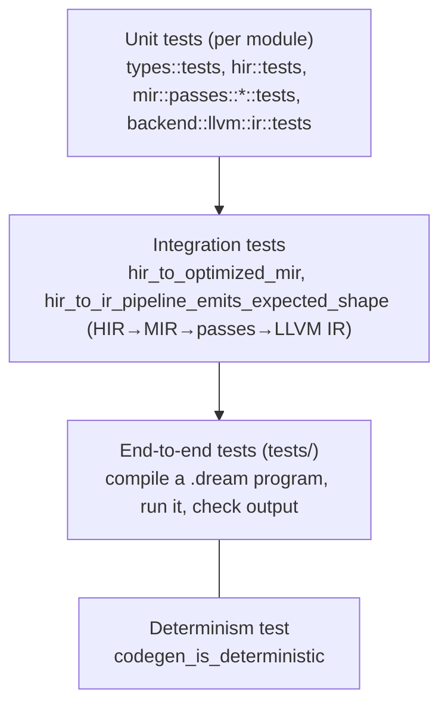
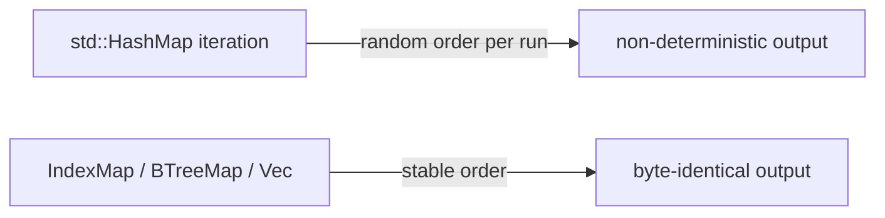
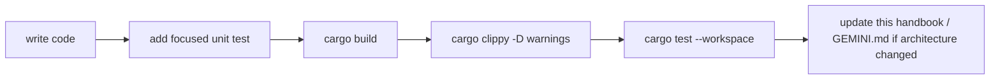

# 08 — Testing, Determinism & Conventions

This chapter explains which tests to run and how to make output repeatable. A repeated build of the same source to the same path must produce identical output bytes.

CI validates pull requests and merge-queue candidates, with manual dispatch available for
main or other refs. It does not automatically rerun the same suite after merging a validated
PR into protected main. Required checks and strict up-to-date protection remain in place;
rebasing or updating a PR can still require a new run because its tested integration changed.

Linux, macOS and Windows run workspace build, strict Clippy and default tests. Linux runs
the full native/Node corpus; Windows additionally runs the full native corpus with the
pinned MSVC-compatible clang driver and developer SDK environment. Windows Rust/probe
steps use PowerShell so Git Bash's `link` utility cannot shadow Microsoft's linker.
All three platforms inspect and execute an isolated host-free Hello World and publish
release-size measurements for core and each optional service. Artifact growth does not fail
CI; regressions are checked through imports, capability selection and clean-home execution.
The isolated compiler
receives the pinned LLVM directory explicitly, independently of host-library discovery.
Dependency caches survive failed validation; the pinned toolchain is cached immediately
after installation so later test failures do not force another download.

CI sets `CARGO_PROFILE_DEV_OPT_LEVEL=1` to match the workspace test profile. Build,
Clippy and tests can reuse dependency artifacts instead of code-generating both O0
and O1 copies. Tests retain debug assertions, overflow checks and line-table
backtraces; local development profiles and release artifact measurement builds are unchanged.
Clippy runs first to reject lint failures before expensive executable builds.

CI additionally uses sccache for Rust and C++ compiler invocations,
including Binaryen's large `wasm-opt-sys` build. Rust incremental compilation is
disabled in CI because sccache cannot cache incremental invocations. The existing
`cc` build dependency also recognizes `RUSTC_WRAPPER=sccache`, so native dependency
compilation is cached without changing Dream's guest linker configuration.
Cache statistics are reported at the end of each job;
the native and Node probes share one freshly built compiler. Corpus logs and timing
reports survive failures for seven days.

The Windows compiler executable reserves 32 MiB for its main stack. `RUST_MIN_STACK`
only applies to spawned Rust threads, so it cannot prevent stack overflow in CLI
syntax-generator compilation. Windows LLVM installers include `lld-link`, `clang++`
and `llvm-rc` and validate every required executable before accepting an installation.
Process goldens launch their own guest binary to exercise child I/O without depending
on Unix utilities being available on PATH.

Rust caches share a profile-specific key across jobs on the same OS/architecture;
workspace artifacts and incremental state are not cached. Cargo timing reports are
retained for seven days to identify remaining compilation bottlenecks. GitHub scopes
PR caches to that PR, so a new PR can still start cold: manually dispatch CI on main
after dependency/toolchain changes to seed caches reusable by subsequent PRs. Do not
restore caches from unrelated PR refs or reintroduce a full post-merge suite solely
for cache warming. The first run after changing cache/profile settings is also cold;
measure both cold and warm runs before setting a wall-clock target.

## Compiler observability

`dream -v --emit-llvm example.dream` reports closing tracing spans for parse (including
source resolution and generated source), sema, monomorphization, lowering, module
passes, per-function passes, late module passes and IR emission. Each function pipeline
also reports its symbol and each pass reports its name and fixpoint iteration. Captured
LLVM and linker invocations report their tool labels, including `opt`, `llc`, `llvm-link`
and the final native or wasm linker. Span `time.busy` is time inside that span and
`time.idle` is time outside it; their sum is its elapsed duration. Parent timings include
nested work: monomorphization measures the deferred instantiation fixpoint inside sema,
not an independent pipeline stage. Runtime signature preparation precedes IR emission
and can include separately timed tool invocations on a cold runtime cache.

Verbose builds also report `peak_resident_bytes`: the OS process-lifetime resident
high-water mark of the compiler, excluding toolchain children. Linux reports KiB, macOS
reports bytes, and Windows reports peak working-set bytes; the CLI normalizes all to
bytes. It reports before launching a guest or debugger and on compilation failure.
Normal builds emit neither timing nor memory reports. Cached builds report only executed
phases. Profiling does not alter artifacts.

Linux CI compares the candidate compiler with `compile_baseline` (default `origin/main`)
on the same generated 200-function program, including generic instantiation, loops and
branches. Both binaries use the same Cargo profile, verifier settings and pinned LLVM.
Each warms its runtime cache before five alternating fresh builds; deleted output
artifacts prevent build-cache hits. The budget uses median wall time and median resident
high-water mark from Unix child resource accounting. This benchmark includes waited-for
LLVM/linker children; its peak is the largest resident high-water mark, not the concurrent
sum of the process tree. It is distinct from the CLI's compiler-only memory report.
The candidate may use at most 1.25 times baseline time and 1.20 times baseline memory.
These relative limits and sample scale are configurable in `scripts/check_compile_budget.py`;
there are no fixed artifact-size limits. CI preserves raw trials, medians, ratios and the
source hash and both revisions in `compile-budget.json`, including on a budget failure. Run locally with:

```bash
python3 scripts/check_compile_budget.py --baseline /path/to/base/dream \
  --candidate target/debug/dream --report target/compile-budget.json
python3 scripts/test_compile_budget.py
```

## The test pyramid



### Unit tests

Each module tests its own logic with the smallest possible input. Passes use `FunctionBuilder` (`crates/dream-mir/src/build.rs`) to construct a tiny `MirFunction`, run the pass, and assert on the result. The type system tests interning, reference classification, display, and compat. Run a focused subset with a path filter:

```bash
cargo test -p dream types::
cargo test -p dream mir::passes::
cargo test -p dream-mir backend::llvm::
```

### Integration test

`crates/dream-mir/src/lib.rs::tests::hir_to_optimized_mir` builds typed HIR by hand → `lower_function` → `PassManager::default_pipeline` and asserts on the optimized MIR. `tests/mir_pipeline.rs::hir_to_ir_pipeline_emits_expected_shape` carries the same program through LLVM IR emission (typed against the pinned toolchain's runtime signatures). When you change lowering, passes, or emission, these are the fastest signals that the stages still compose. `tests/sema_emission_tests.rs` and `tests/rc_elision_goldens.rs` assert on the emitted IR of small source programs.

### End-to-end tests — `tests/`

The full golden corpus runs through `./scripts/probe_test.sh`: it compiles every `tests/cases/*.dream` with the real `dream` CLI and checks stdout against `.expected` exactly, every line of `.expected_error` against the compile diagnostics, and every line of `.expected_trap` against the failing run's output plus an `exit code N` line. It also fails any case whose leak check reports live objects. `--release` probes an optimized build and `--node` the wasm32 build.

`tests/e2e_tests.rs` compiles real `.dream` programs through the in-process driver. Default `cargo test --workspace` runs a smoke subset (`run_smoke_e2e_cases`) and a few host-parity subsets. DAP and Binaryen-every-level live behind `#[ignore]` — run them with `cargo test --workspace -- --ignored`.

The `--node` probe checks the same diagnostic fragments and panic goldens as native runs.
Panic messages and source locations must match on both targets. `exit code N` is checked when
specified; fatal panics use each host's abort status. A timeout never satisfies a panic golden.

### Source properties and target parity

`tests/compiler_properties.rs` uses proptest to generate bounded valid programs with
recursive arithmetic expressions, generic calls, branches, loops and managed object
lifetimes, alongside arbitrary Unicode and single-edit mutations. Each case runs from
lexer/parser through semantic analysis; rejected input stops at diagnostics. Accepted
input runs the production module, function and late MIR pipelines, explicitly verifies
final MIR, and emits LLVM IR. Valid programs run independently twice on each target
(native and wasm32), asserting byte-identical IR. No panic is accepted as a diagnostic.
A 120-second per-case subprocess timeout also catches hangs and aborts; proptest shrinks
failures and persists regression seeds beside the integration test. Commit a discovered
regression as a focused golden or unit test after fixing it.

The default suite runs 32 cases per property. Increase coverage or reproduce a run with:

```bash
PROPTEST_CASES=512 cargo test --test compiler_properties
PROPTEST_RNG_SEED=123 cargo test --test compiler_properties
./scripts/probe_test.sh --parity
```

The parity probe validates both targets against their goldens and directly compares
actual guest stdout, including cases without an output golden. Only subprocess text-mode
newline normalization applies to the parity comparison; leading/trailing whitespace and
program ANSI sequences remain significant. Compile-error cases validate diagnostic
fragments; expected traps also compare guest stdout and validate their diagnostic
fragments and target exit statuses. Native-only services and cases with explicit
`.expected.native` width-dependent output are reported as skips. Linux CI runs this
paired corpus check in addition to the full native probe; new corpus cases are
discovered automatically, without fixed corpus-count or output-size assertions.
Release arithmetic checks worker-export isolation and the music-player sample checks
compilation and WAT parsing; neither pins a code-section byte limit.

### Determinism test — `codegen_is_deterministic` (`tests/e2e_tests.rs`)

Compiles the same input twice and asserts byte-identical output. This guards the contract below.

## The determinism contract

> **Two compilations of the same source to the same output path must produce byte-identical `.ll`/`.wasm`/`.wat`.**

This is non-negotiable: it makes builds reproducible, caching sound, and diffs meaningful. The only realistic way to break it is **iteration order of a hash map**. Rules:

- **Never iterate `std::collections::HashMap`** in any code that influences emission (or its ordering).
- Lookup-only `HashMap`s (HIR local id → MIR `Local` in lowering, intra-block copy-prop maps) are fine: they are never walked to decide instruction or symbol order.
- Use `indexmap::IndexMap` when you need insertion-order iteration with hash lookup, or `BTreeMap` when you need sorted iteration. The emission-driving maps (struct/union/enum/symbol tables, codegen string/function/global maps) already standardize on `IndexMap`.
- The `TypeInterner` assigns ids in first-seen order and stores them in a `Vec`, so iterating types by `TypeId` is deterministic.
- When you add a lookup structure to a pass or the emitter, pick `IndexMap`/`BTreeMap` deliberately, and extend a determinism assertion if it feeds output.



## The pre-commit gate

Before considering any change done, all four must pass:

```bash
cargo build --workspace
cargo clippy --workspace --all-targets -- -D warnings
cargo test --workspace
./scripts/probe_test.sh    # golden corpus through native `dream run`
```

Clippy runs with `-D warnings`: the project's stance is **fix the root cause, do not `#[allow]`**. The only surviving `#[allow]`s annotate *external* API constraints (e.g. an `lsp-types` field deprecated upstream) and carry a comment explaining why.

## Coding conventions

### Comments

Comments explain **intent, invariants, and trade-offs** — the *why*. They must not narrate the code. Delete `// increment counter` and `/// Builds X` stub banners. Good comments look like the module headers in `crates/dream-mir/src/mod.rs` (what the IR guarantees) or the note in `src/execution/llvm/runtime.rs` on why debug builds link the runtime without DWARF (a subtle constraint).

### Errors

The driver's only typed error is `CompileError` (`src/driver/error.rs`): `Syntax` / `Semantic` (both already rendered as diagnostics) and `Io`. The back end itself has **no user-facing error path**: it runs only on a fully validated program with resolved symbols and types.

- **User-facing problems** are caught earlier as diagnostics (lex/parse/analyze). The backend never emits a compile-time error.
- **Backend invariant violations** are compiler bugs (ICE): `panic!` with a clear message. This is the one place panics are acceptable — a state the analyzer promised but the backend found violated.

### No pre-release back-compat

The compiler is unreleased. Do **not** add deprecation shims, re-export facades, or "keep the old path working" layers. When you replace something, delete the old thing (exactly what happened when the MIR backend replaced the legacy AST-walking codegen). Back-compat is debt we have not earned yet.

### Determinism by default

Reach for `IndexMap`/`BTreeMap`/`Vec` first. Only use `HashMap` for throwaway local computations whose iteration order never escapes into output.

## A good change, end to end



The runtime layering gate is `python scripts/check_freestanding.py` (clang and lld required).
It compiles every portable core unit without SDK headers and links every function without
CRT, libc, sys objects or section collection. `tests/runtime_platform.rs` separately runs
core with an injected allocator, locks, text writer and abort callback, checking allocation
exhaustion and allocation-free panic output. Native libraries are selected with a scalar
`[lib].output-type` in `dream.toml`; the CLI/library tests cover manifest discovery, both
C-consumer link modes, panic locations, moved-package determinism and invalid arrays.

`tests/runtime_wasi_platform.rs` fixes the imported memory's maximum at its initial size,
then forces a guest allocation beyond that limit. It checks the exact panic output and abort
trap while memory stays unchanged. The freestanding gate also enforces the 600-line limit
for first-party runtime C units; vendored PCRE2/SLJIT files are excluded.
