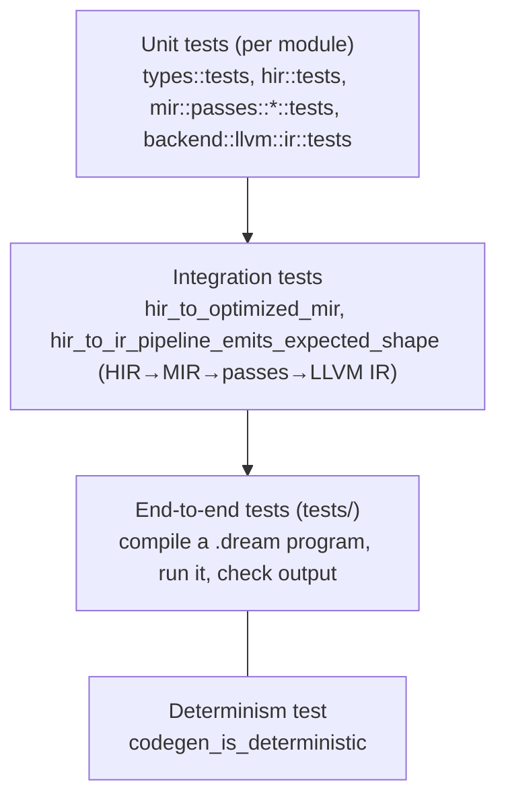
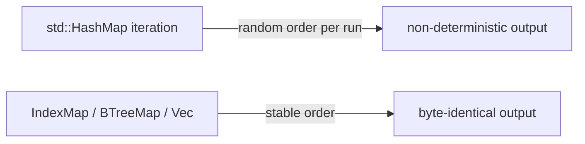
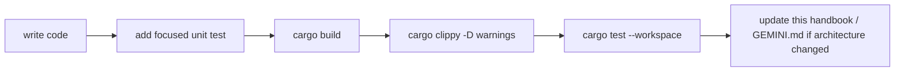

# 08 — Testing, Determinism & Conventions

This chapter covers how the compiler is tested, the determinism contract the whole back end must honor, and the conventions every contributor is expected to follow.

CI validates pull requests and merge-queue candidates, with manual dispatch available for
main or other refs. It does not automatically rerun the same suite after merging a validated
PR into protected main. Required checks and strict up-to-date protection remain in place;
rebasing or updating a PR can still require a new run because its tested integration changed.

Linux, macOS and Windows run workspace build, strict Clippy and default tests. Linux runs
the full native/Node corpus; Windows additionally runs the full native corpus with the
pinned MSVC-compatible clang driver and developer SDK environment. Windows Rust/probe
steps use PowerShell so Git Bash's `link` utility cannot shadow Microsoft's linker.
Size budgets remain Linux/macOS-only until Windows distribution baselines are measured.
Dependency caches survive failed validation; the pinned toolchain is cached immediately
after installation so later test failures do not force another download.

CI sets `CARGO_PROFILE_DEV_OPT_LEVEL=1` to match the workspace test profile. Build,
Clippy and tests can reuse dependency artifacts instead of code-generating both O0
and O1 copies. Tests retain debug assertions, overflow checks and line-table
backtraces; local development profiles and the release size-budget build are unchanged.
Clippy runs first to reject lint failures before expensive executable builds.

CI additionally uses sccache for Rust and C++ compiler invocations,
including Binaryen's large `wasm-opt-sys` build. Rust incremental compilation is
disabled in CI because sccache cannot cache incremental invocations. The existing
`cc` build dependency also recognizes `RUSTC_WRAPPER=sccache`, so native dependency
compilation is cached without changing Dream's guest linker configuration.
Cache statistics are reported at the end of each job;
the native and Node probes share one freshly built compiler. Corpus logs and timing
reports survive failures for seven days.

The Windows compiler executable reserves 32 MiB for its main stack. `RUST_MIN_STACK`
only applies to spawned Rust threads, so it cannot prevent stack overflow in CLI
syntax-generator compilation. Windows LLVM installers include `lld-link`, `clang++`
and `llvm-rc` and validate every required executable before accepting an installation.
Process goldens launch their own guest binary to exercise child I/O without depending
on Unix utilities being available on PATH.

Rust caches share a profile-specific key across jobs on the same OS/architecture;
workspace artifacts and incremental state are not cached. Cargo timing reports are
retained for seven days to identify remaining compilation bottlenecks. GitHub scopes
PR caches to that PR, so a new PR can still start cold: manually dispatch CI on main
after dependency/toolchain changes to seed caches reusable by subsequent PRs. Do not
restore caches from unrelated PR refs or reintroduce a full post-merge suite solely
for cache warming. The first run after changing cache/profile settings is also cold;
measure both cold and warm runs before setting a wall-clock target.

## The test pyramid



### Unit tests

Each module tests its own logic with the smallest possible input. Passes use `FunctionBuilder` (`src/mir/build.rs`) to construct a tiny `MirFunction`, run the pass, and assert on the result. The type system tests interning, reference classification, display, and compat. Run a focused subset with a path filter:

```bash
cargo test -p dream types::
cargo test -p dream mir::passes::
cargo test -p dream-mir backend::llvm::
```

### Integration test

`crates/dream-mir/src/lib.rs::tests::hir_to_optimized_mir` builds typed HIR by hand → `lower_function` → `PassManager::default_pipeline` and asserts on the optimized MIR. `tests/mir_pipeline.rs::hir_to_ir_pipeline_emits_expected_shape` carries the same program through LLVM IR emission (typed against the pinned toolchain's runtime signatures). When you change lowering, passes, or emission, these are the fastest signals that the stages still compose. `tests/sema_emission_tests.rs` and `tests/rc_elision_goldens.rs` assert on the emitted IR of small source programs.

### End-to-end tests — `tests/`

`tests/e2e_tests.rs` compiles real `.dream` programs through the full driver and checks behavior against each case's `.expected`. Default `cargo test --workspace` runs a smoke subset (`run_smoke_e2e_cases`). The full debug/release corpora, DAP, and Binaryen-every-level live behind `#[ignore]` — run them with `cargo test --workspace -- --ignored`.

### Determinism test — `codegen_is_deterministic` (`tests/e2e_tests.rs`)

Compiles the same input twice and asserts byte-identical output. This guards the contract below.

## The determinism contract

> **Two compilations of the same source to the same output path must produce byte-identical `.ll`/`.wasm`/`.wat`.**

This is non-negotiable: it makes builds reproducible, caching sound, and diffs meaningful. The only realistic way to break it is **iteration order of a hash map**. Rules:

- **Never iterate `std::collections::HashMap`** in any code that influences emission (or its ordering).
- Lookup-only `HashMap`s (HIR local id → MIR `Local` in lowering, intra-block copy-prop maps) are fine: they are never walked to decide instruction or symbol order.
- Use `indexmap::IndexMap` when you need insertion-order iteration with hash lookup, or `BTreeMap` when you need sorted iteration. The emission-driving maps (struct/union/enum/symbol tables, codegen string/function/global maps) already standardize on `IndexMap`.
- The `TypeInterner` assigns ids in first-seen order and stores them in a `Vec`, so iterating types by `TypeId` is deterministic.
- When you add a lookup structure to a pass or the emitter, pick `IndexMap`/`BTreeMap` deliberately, and extend a determinism assertion if it feeds output.



## The pre-commit gate

Before considering any change done, all four must pass:

```bash
cargo build --workspace
cargo clippy --workspace --all-targets -- -D warnings
cargo test --workspace
./scripts/probe_test.sh    # golden corpus through native `dream run`
```

Clippy runs with `-D warnings`: the project's stance is **fix the root cause, do not `#[allow]`**. The only surviving `#[allow]`s annotate *external* API constraints (e.g. an `lsp-types` field deprecated upstream) and carry a comment explaining why.

## Coding conventions

### Comments

Comments explain **intent, invariants, and trade-offs** — the *why*. They must not narrate the code. Delete `// increment counter` and `/// Builds X` stub banners. Good comments look like the module headers in `src/mir/mod.rs` (what the IR guarantees) or the note in `src/execution/llvm/runtime.rs` on why debug builds link the runtime without DWARF (a subtle constraint).

### Errors

The driver's only typed error is `CompileError` (`src/driver/error.rs`): `Syntax` / `Semantic` (both already rendered as diagnostics) and `Io`. The back end itself has **no user-facing error path**: it runs only on a fully validated program with resolved symbols and types.

- **User-facing problems** are caught earlier as diagnostics (lex/parse/analyze). The backend never emits a compile-time error.
- **Backend invariant violations** are compiler bugs (ICE): `panic!` with a clear message. This is the one place panics are acceptable — a state the analyzer promised but the backend found violated.

### No pre-release back-compat

The compiler is unreleased. Do **not** add deprecation shims, re-export facades, or "keep the old path working" layers. When you replace something, delete the old thing (exactly what happened when the MIR backend replaced the legacy AST-walking codegen). Back-compat is debt we have not earned yet.

### Determinism by default

Reach for `IndexMap`/`BTreeMap`/`Vec` first. Only use `HashMap` for throwaway local computations whose iteration order never escapes into output.

## A good change, end to end


