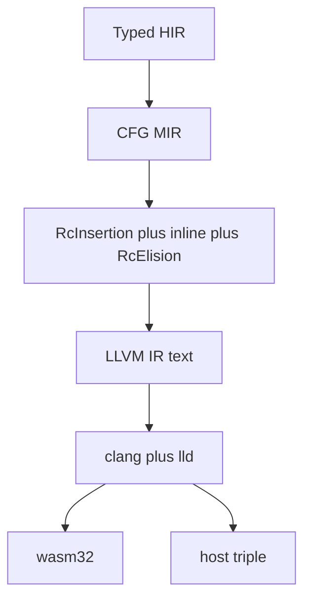

# 12 — LLVM backend (`crates/dream-llvm`, `crates/dream-rt`)

Dream keeps **ARC in slim MIR**. LLVM does instruction selection, object formats, C calling
conventions, LTO, DWARF, sanitizers, and WASM CPU features. There is **no WAT emitter, no
relooper, and no second compile path**.

## Pipeline

`dream run` compiles the host triple and executes the native binary. `--web` / `--triple
wasm32-unknown-unknown` emits LLVM wasm32 (playground / JS). `js` stays WASM/JS-only.

## Why MIR still exists

LLVM will not invent sink-param ABI, last-use move, cursor locals, or `@shared` atomics.
[`RcInsertion`](./11-swift-like-arc-roadmap.md) runs **before** LLVM. Retain/release lower to
runtime calls that are **not** `readonly` / `readnone`.

Do **not** add new generic MIR passes (GVN, LICM, unroll, algebraic, …). Clang `-O2`/`-O3` /
thin LTO already run GVN, LICM, DCE, and inlining on the LLVM IR. Keep in Dream only what LLVM
cannot see: `RcInsertion`, `RcElision`, RC-aware inlining, prune, SROA (layout/ARC), async CFG.

The MIR pipeline still contains leftover WAT-era scalar passes (`Gvn`, `Licm`, `Algebraic`, …).
Do not grow that set. Trimming it is a follow-up, not a reason to reimplement those opts in MIR.

## Host functions (`@js`)

`@js("Dream", field)` / `@js("env", field)` was the wasmtime import ABI. Native LLVM does **not**
embed a JS engine. `js` object APIs (`@node` / `@web`) are a **compile-time error** on native
(`CompileTargets::native_only()`), same as wasmtime. GPU, HTTP, files, crypto, process, and
datetime run **inside the user binary** via `libdream_rt.a` (wgpu in-process, not a JS engine).
Webview, `@c` libffi, and `WebWorker` (OS threads on the shared `dream-rt` heap) run in
`libdream_rt.a` the same way GPU/HTTP do. `js` stays WASM/JS-only.

## Emitter layout (`crates/dream-llvm/src/emit/`)

Textual IR is split by concern (`function`, `stmt`, `ops`, `place`, `call`, `intern`, `protocol`,
`names`). Do not grow a single `emit.rs` past the project file-size guideline.

WIP vs wasmtime hosts: [13 — LLVM WIP status](./13-llvm-wip-status.md).

## Pointer model

MIR layouts assume **4-byte reference slots**. Native LLVM keeps **guest `i32` offsets** into
`dream-rt`'s linear heap so field offsets, string headers, and ARC stay one protocol.
`dream_heap_base()` + GEP turns a guest pointer into a host `i8*`.

## Runtime (`dream-rt`)

C library: `malloc` / `retain` / `release` / strings / panic / print / locks / realloc. Same
`[size][tag][ref_count]` header as [`mir::abi`](../../crates/dream-mir/src/abi.rs). One protocol
for wasm32 and native.

## C ABI, LTO, DWARF, ASan, WASM attrs

- `extern` C: LLVM `ccc` (or Win64 / AAPCS via clang `--target`).
- `--lto` / `--release` thin LTO when clang supports it.
- `-g` emits DWARF (`clang -g`).
- `--sanitize=address` forwards `-fsanitize=address` to clang and `dream-rt`.
- `--mattr=+bulk-memory,+simd128` (and `+tail-call`) on wasm32.
